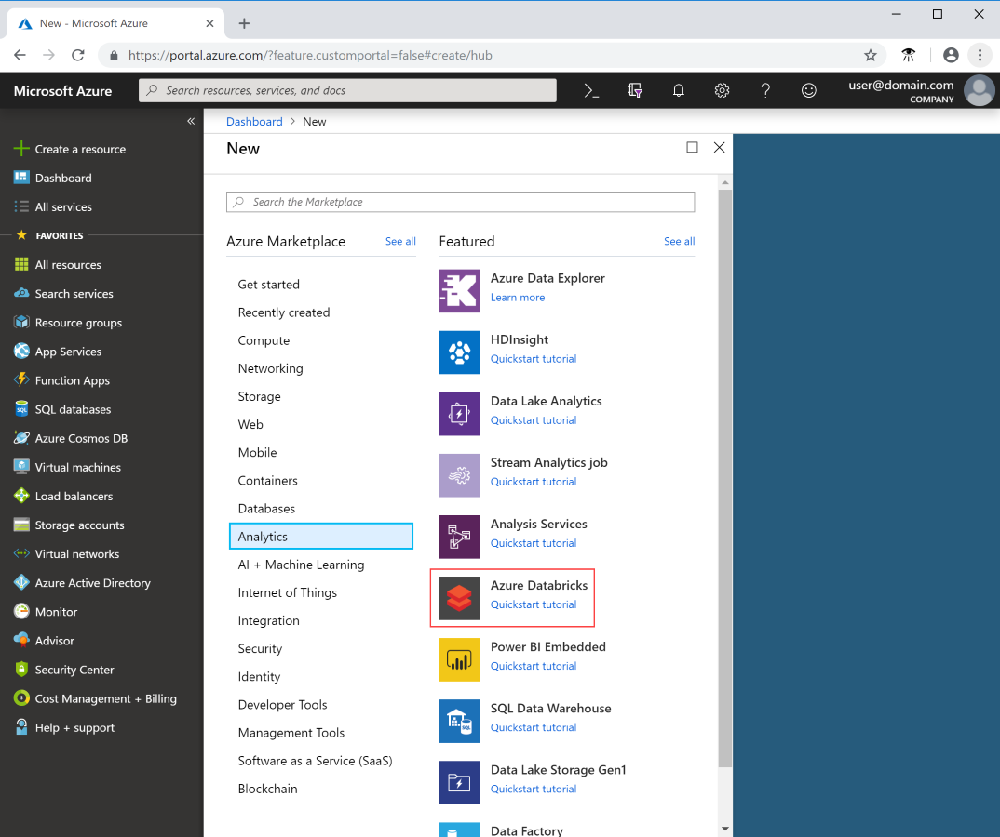
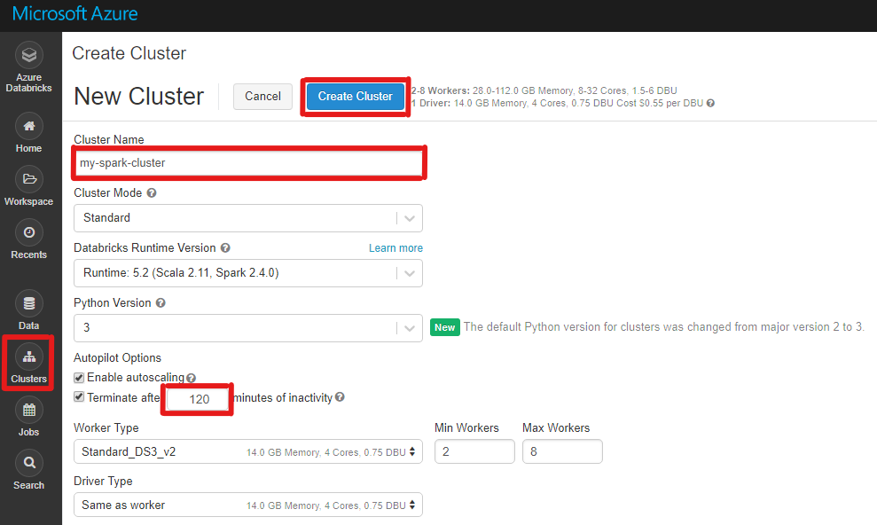

# Tutorial: Compute Author H-Index using Azure Databricks

You could set up Azure Databricks to run Analytics script on Microsoft Academic Graph. Here are the step-by-step instructions

## Prerequisites

Complete these tasks before you begin this tutorial:

* Setting up provisioning of Microsoft Academic Graph to an Azure blob storage account. See [Get Microsoft Academic Graph on Azure storage](./get-started-setup-provisioning.md.md).

## Gather the information that you need

   Before you begin, you should have these items of information:

   :heavy_check_mark:  The name of your blob storage account.

   :heavy_check_mark:  The access key of your blob storage account.

## Create an Azure Databricks service

In this section, you create an Azure Databricks service by using the Azure portal.

1. In the Azure portal, select **Create a resource** > **Analytics** > **Azure Databricks**.

    

2. Under **Azure Databricks Service**, provide the following values to create a Databricks service:

    |Property  |Description  |
    |---------|---------|
    |**Workspace name**     | Provide a name for your Databricks workspace.        |
    |**Subscription**     | From the drop-down, select your Azure subscription.        |
    |**Resource group**     | Specify whether you want to create a new resource group or use an existing one. A resource group is a container that holds related resources for an Azure solution. For more information, see [Azure Resource Group overview](../azure-resource-manager/resource-group-overview.md). |
    |**Location**     | Select **West US 2**.  For other available regions, see [Azure services available by region](https://azure.microsoft.com/regions/services/).      |
    |**Pricing Tier**     |  Select **Standard**.     |

3. Select **Pin to dashboard** and then select **Create**.

4. The account creation takes a few minutes. During account creation, the portal displays the **Submitting deployment for Azure Databricks** tile on the right. To monitor the operation status, view the progress bar at the top.

    

## Create a Spark cluster in Azure Databricks

1. In the Azure portal, go to the Databricks service that you created, and select **Launch Workspace**.

2. You're redirected to the Azure Databricks portal. From the portal, select **Cluster**.

    

3. In the **New cluster** page, provide the values to create a cluster.

    

4. Fill in values for the following fields, and accept the default values for the other fields:

    * Enter a name for the cluster.

    * For this article, create a cluster with the **5.1** runtime.

    * Make sure you select the **Terminate after \_\_ minutes of inactivity** check box. If the cluster isn't being used, provide a duration (in minutes) to terminate the cluster.

    * Select **Create cluster**. After the cluster is running, you can attach notebooks to the cluster and run Spark jobs.

## Create a file system in the Azure Data Lake Storage Gen2 account

In this section, you create a notebook in Azure Databricks workspace and then run code snippets to configure the storage account

1. In the [Azure portal](https://portal.azure.com), go to the Azure Databricks service that you created, and select **Launch Workspace**.

2. On the left, select **Workspace**. From the **Workspace** drop-down, select **Create** > **Notebook**.

    

3. In the **Create Notebook** dialog box, enter a name for the notebook. Select **Scala** as the language, and then select the Spark cluster that you created earlier.

    

4. Select **Create**.

5. Copy and paste the following code block into the first cell.

   ```scala
   spark.conf.set("fs.azure.account.auth.type.<storage-account-name>.dfs.core.windows.net", "OAuth")
   spark.conf.set("fs.azure.account.oauth.provider.type.<storage-account-name>.dfs.core.windows.net", "org.apache.hadoop.fs.azurebfs.oauth2.ClientCredsTokenProvider")
   spark.conf.set("fs.azure.account.oauth2.client.id.<storage-account-name>.dfs.core.windows.net", "<application-id>")
   spark.conf.set("fs.azure.account.oauth2.client.secret.<storage-account-name>.dfs.core.windows.net", "<authentication-key>")
   spark.conf.set("fs.azure.account.oauth2.client.endpoint.<storage-account-name>.dfs.core.windows.net", "https://login.microsoftonline.com/<tenant-id>/oauth2/token")
   spark.conf.set("fs.azure.createRemoteFileSystemDuringInitialization", "true")
   dbutils.fs.ls("abfss://<file-system-name>@<storage-account-name>.dfs.core.windows.net/")
   spark.conf.set("fs.azure.createRemoteFileSystemDuringInitialization", "false")
   ```

6. In this code block, replace the `application-id`, `authentication-id`, `tenant-id`, and `storage-account-name` placeholder values in this code block with the values that you collected while completing the prerequisites of this tutorial. Replace the `file-system-name` placeholder value with whatever name you want to give the file system.

   * The `application-id`, and `authentication-id` are from the app that you registered with active directory as part of creating a service principal.

   * The `tenant-id` is from your subscription.

   * The `storage-account-name` is the name of your Azure Data Lake Storage Gen2 storage account.

7. Press the **SHIFT + ENTER** keys to run the code in this block.

## Ingest sample data into the Azure Data Lake Storage Gen2 account

Before you begin with this section, you must complete the following prerequisites:

Enter the following code into a notebook cell:

    %sh wget -P /tmp https://raw.githubusercontent.com/Azure/usql/master/Examples/Samples/Data/json/radiowebsite/small_radio_json.json

In the cell, press **SHIFT + ENTER** to run the code.

Now in a new cell below this one, enter the following code, and replace the values that appear in brackets with the same values you used earlier:

    dbutils.fs.cp("file:///tmp/small_radio_json.json", "abfss://<file-system>@<account-name>.dfs.core.windows.net/")

In the cell, press **SHIFT + ENTER** to run the code.

## Extract data from the Azure Data Lake Storage Gen2 account

1. You can now load the sample json file as a data frame in Azure Databricks. Paste the following code in a new cell. Replace the placeholders shown in brackets with your values.

   ```scala
   val df = spark.read.json("abfss://<file-system-name>@<storage-account-name>.dfs.core.windows.net/small_radio_json.json")
   ```

   * Replace the  `file-system-name` placeholder value with the name that you gave your file system in Storage Explorer.

   * Replace the `storage-account-name` placeholder with the name of your storage account.

2. Press the **SHIFT + ENTER** keys to run the code in this block.

3. Run the following code to see the contents of the data frame:

    ```scala
    df.show()
    ```
   You see an output similar to the following snippet:

   ```bash
   +---------------------+---------+---------+------+-------------+----------+---------+-------+--------------------+------+--------+-------------+---------+--------------------+------+-------------+------+
   |               artist|     auth|firstName|gender|itemInSession|  lastName|   length|  level|            location|method|    page| registration|sessionId|                song|status|           ts|userId|
   +---------------------+---------+---------+------+-------------+----------+---------+-------+--------------------+------+--------+-------------+---------+--------------------+------+-------------+------+
   | El Arrebato         |Logged In| Annalyse|     F|            2|Montgomery|234.57914| free  |  Killeen-Temple, TX|   PUT|NextSong|1384448062332|     1879|Quiero Quererte Q...|   200|1409318650332|   309|
   | Creedence Clearwa...|Logged In|   Dylann|     M|            9|    Thomas|340.87138| paid  |       Anchorage, AK|   PUT|NextSong|1400723739332|       10|        Born To Move|   200|1409318653332|    11|
   | Gorillaz            |Logged In|     Liam|     M|           11|     Watts|246.17751| paid  |New York-Newark-J...|   PUT|NextSong|1406279422332|     2047|                DARE|   200|1409318685332|   201|
   ...
   ...
   ```

   You have now extracted the data from Azure Data Lake Storage Gen2 into Azure Databricks.

## Transform data in Azure Databricks

The raw sample data **small_radio_json.json** file captures the audience for a radio station and has a variety of columns. In this section, you transform the data to only retrieve specific columns from the dataset.

1. First, retrieve only the columns **firstName**, **lastName**, **gender**, **location**, and **level** from the dataframe that you created.

   ```scala
   val specificColumnsDf = df.select("firstname", "lastname", "gender", "location", "level")
   specificColumnsDf.show()
   ```

   You receive output as shown in the following snippet:

   ```bash
   +---------+----------+------+--------------------+-----+
   |firstname|  lastname|gender|            location|level|
   +---------+----------+------+--------------------+-----+
   | Annalyse|Montgomery|     F|  Killeen-Temple, TX| free|
   |   Dylann|    Thomas|     M|       Anchorage, AK| paid|
   |     Liam|     Watts|     M|New York-Newark-J...| paid|
   |     Tess|  Townsend|     F|Nashville-Davidso...| free|
   |  Margaux|     Smith|     F|Atlanta-Sandy Spr...| free|
   |     Alan|     Morse|     M|Chicago-Napervill...| paid|
   |Gabriella|   Shelton|     F|San Jose-Sunnyval...| free|
   |   Elijah|  Williams|     M|Detroit-Warren-De...| paid|
   |  Margaux|     Smith|     F|Atlanta-Sandy Spr...| free|
   |     Tess|  Townsend|     F|Nashville-Davidso...| free|
   |     Alan|     Morse|     M|Chicago-Napervill...| paid|
   |     Liam|     Watts|     M|New York-Newark-J...| paid|
   |     Liam|     Watts|     M|New York-Newark-J...| paid|
   |   Dylann|    Thomas|     M|       Anchorage, AK| paid|
   |     Alan|     Morse|     M|Chicago-Napervill...| paid|
   |   Elijah|  Williams|     M|Detroit-Warren-De...| paid|
   |  Margaux|     Smith|     F|Atlanta-Sandy Spr...| free|
   |     Alan|     Morse|     M|Chicago-Napervill...| paid|
   |   Dylann|    Thomas|     M|       Anchorage, AK| paid|
   |  Margaux|     Smith|     F|Atlanta-Sandy Spr...| free|
   +---------+----------+------+--------------------+-----+
   ```

2. You can further transform this data to rename the column **level** to **subscription_type**.

   ```scala
   val renamedColumnsDF = specificColumnsDf.withColumnRenamed("level", "subscription_type")
   renamedColumnsDF.show()
   ```

   You receive output as shown in the following snippet.

   ```bash
   +---------+----------+------+--------------------+-----------------+
   |firstname|  lastname|gender|            location|subscription_type|
   +---------+----------+------+--------------------+-----------------+
   | Annalyse|Montgomery|     F|  Killeen-Temple, TX|             free|
   |   Dylann|    Thomas|     M|       Anchorage, AK|             paid|
   |     Liam|     Watts|     M|New York-Newark-J...|             paid|
   |     Tess|  Townsend|     F|Nashville-Davidso...|             free|
   |  Margaux|     Smith|     F|Atlanta-Sandy Spr...|             free|
   |     Alan|     Morse|     M|Chicago-Napervill...|             paid|
   |Gabriella|   Shelton|     F|San Jose-Sunnyval...|             free|
   |   Elijah|  Williams|     M|Detroit-Warren-De...|             paid|
   |  Margaux|     Smith|     F|Atlanta-Sandy Spr...|             free|
   |     Tess|  Townsend|     F|Nashville-Davidso...|             free|
   |     Alan|     Morse|     M|Chicago-Napervill...|             paid|
   |     Liam|     Watts|     M|New York-Newark-J...|             paid|
   |     Liam|     Watts|     M|New York-Newark-J...|             paid|
   |   Dylann|    Thomas|     M|       Anchorage, AK|             paid|
   |     Alan|     Morse|     M|Chicago-Napervill...|             paid|
   |   Elijah|  Williams|     M|Detroit-Warren-De...|             paid|
   |  Margaux|     Smith|     F|Atlanta-Sandy Spr...|             free|
   |     Alan|     Morse|     M|Chicago-Napervill...|             paid|
   |   Dylann|    Thomas|     M|       Anchorage, AK|             paid|
   |  Margaux|     Smith|     F|Atlanta-Sandy Spr...|             free|
   +---------+----------+------+--------------------+-----------------+
   ```

## Load data into Azure SQL Data Warehouse

In this section, you upload the transformed data into Azure SQL Data Warehouse. You use the Azure SQL Data Warehouse connector for Azure Databricks to directly upload a dataframe as a table in a SQL data warehouse.

As mentioned earlier, the SQL Data Warehouse connector uses Azure Blob storage as temporary storage to upload data between Azure Databricks and Azure SQL Data Warehouse. So, you start by providing the configuration to connect to the storage account. You must already have already created the account as part of the prerequisites for this article.

1. Provide the configuration to access the Azure Storage account from Azure Databricks.

   ```scala
   val blobStorage = "<blob-storage-account-name>.blob.core.windows.net"
   val blobContainer = "<blob-container-name>"
   val blobAccessKey =  "<access-key>"
   ```

2. Specify a temporary folder to use while moving data between Azure Databricks and Azure SQL Data Warehouse.

   ```scala
   val tempDir = "wasbs://" + blobContainer + "@" + blobStorage +"/tempDirs"
   ```

3. Run the following snippet to store Azure Blob storage access keys in the configuration. This action ensures that you don't have to keep the access key in the notebook in plain text.

   ```scala
   val acntInfo = "fs.azure.account.key."+ blobStorage
   sc.hadoopConfiguration.set(acntInfo, blobAccessKey)
   ```

4. Provide the values to connect to the Azure SQL Data Warehouse instance. You must have created a SQL data warehouse as a prerequisite.

   ```scala
   //SQL Data Warehouse related settings
   val dwDatabase = "<database-name>"
   val dwServer = "<database-server-name>"
   val dwUser = "<user-name>"
   val dwPass = "<password>"
   val dwJdbcPort =  "1433"
   val dwJdbcExtraOptions = "encrypt=true;trustServerCertificate=true;hostNameInCertificate=*.database.windows.net;loginTimeout=30;"
   val sqlDwUrl = "jdbc:sqlserver://" + dwServer + ":" + dwJdbcPort + ";database=" + dwDatabase + ";user=" + dwUser+";password=" + dwPass + ";$dwJdbcExtraOptions"
   val sqlDwUrlSmall = "jdbc:sqlserver://" + dwServer + ":" + dwJdbcPort + ";database=" + dwDatabase + ";user=" + dwUser+";password=" + dwPass
   ```

5. Run the following snippet to load the transformed dataframe, **renamedColumnsDF**, as a table in a SQL data warehouse. This snippet creates a table called **SampleTable** in the SQL database.

   ```scala
   spark.conf.set(
       "spark.sql.parquet.writeLegacyFormat",
       "true")

   renamedColumnsDF.write
       .format("com.databricks.spark.sqldw")
       .option("url", sqlDwUrlSmall) 
       .option("dbtable", "SampleTable")
       .option( "forward_spark_azure_storage_credentials","True")
       .option("tempdir", tempDir)
       .mode("overwrite")
       .save()
   ```

6. Connect to the SQL database and verify that you see a database named **SampleTable**.

   

7. Run a select query to verify the contents of the table. The table should have the same data as the **renamedColumnsDF** dataframe.

    

## Clean up resources

After you finish the tutorial, you can terminate the cluster. From the Azure Databricks workspace, select **Clusters** on the left. For the cluster to terminate, under **Actions**, point to the ellipsis (...) and select the **Terminate** icon.


If you don't manually terminate the cluster, it automatically stops, provided you selected the **Terminate after \_\_ minutes of inactivity** check box when you created the cluster. In such a case, the cluster automatically stops if it's been inactive for the specified time.

## Next steps

In this tutorial, you learned how to:

> [!div class="checklist"]
> * Create an Azure Databricks service
> * Create a Spark cluster in Azure Databricks
> * Create a notebook in Azure Databricks
> * Extract data from a Data Lake Storage Gen2 account
> * Transform data in Azure Databricks
> * Load data into Azure SQL Data Warehouse

Advance to the next tutorial to learn about streaming real-time data into Azure Databricks using Azure Event Hubs.

> [!div class="nextstepaction"]
>[Stream data into Azure Databricks using Event Hubs](databricks-stream-from-eventhubs.md)
