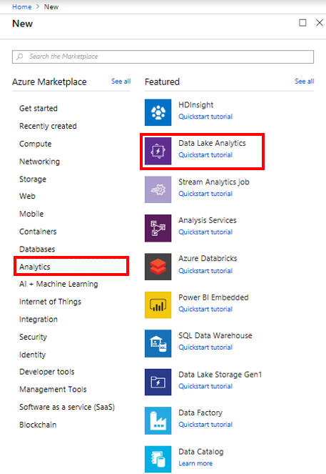
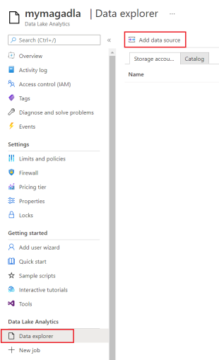
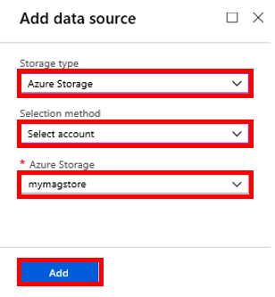

# Set up Azure Data Lake Analytics for Microsoft Academic Graph

You could set up Azure Data Lake Analytics to run U-SQL scripts on Microsoft Academic Graph. Here are the step-by-step instructions.

## Prerequisites

Complete these tasks before you begin this tutorial:

* Setting up provisioning of Microsoft Academic Graph to an Azure blob storage account. See [Get Microsoft Academic Graph on Azure storage](./get-started-setup-provisioning.md).

## Create Azure Data Lake Analytics account

1. Home > Create a resource > Analytics > Data Lake Analytics

    

1. Create new Data Lake Analytics and Data Lake Storage Gen1 accounts, following the flow indicated in figure below:

    

    > [!IMPORTANT]
    > Both accounts require a globally unique name

## Configure Azure Data Lake Analytics to use Microsoft Academic Graph

1. Navigate to the new Azure Data Lake Analytics account created in the first section and add a new data source:

   

1. On the "add data source" dialog, select storage type "azure storage", selection method "select account" and the Azure Storage account you created for MAG provisioning:

   

## Next steps

Advance to the next step to learn about analytics and visualization using Azure Data Lake Analytics.

> [!div class="nextstepaction"]
>[Analytics Author h-index sample (U-SQL)](samples-azure-data-lake-hindex.md)

> [!div class="nextstepaction"]
>[Analytics and visualization samples](samples-azure-data-lake-analytics.md)

## Resources

* [Get started with Azure Data Lake Analytics using Azure portal](https://docs.microsoft.com/en-us/azure/data-lake-analytics/data-lake-analytics-get-started-portal)
