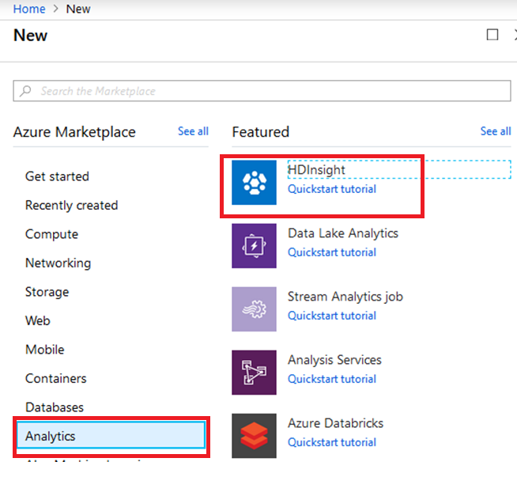
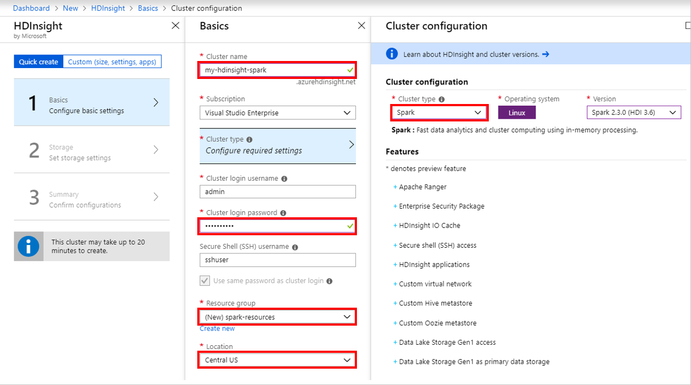
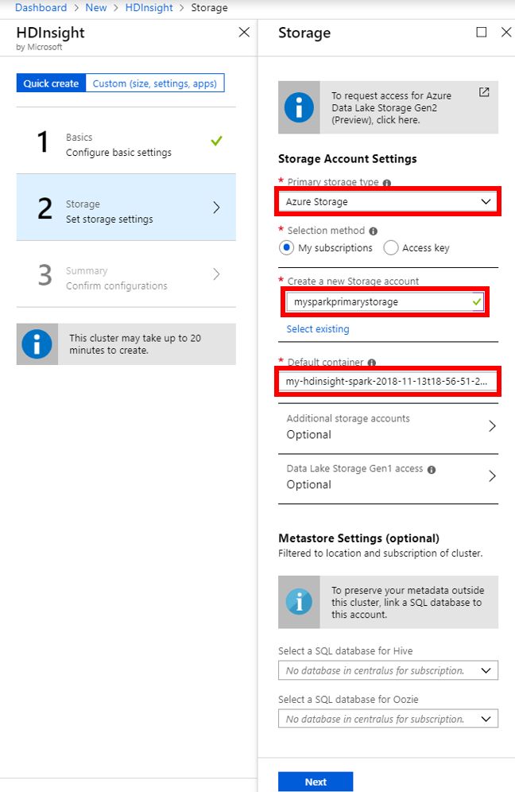
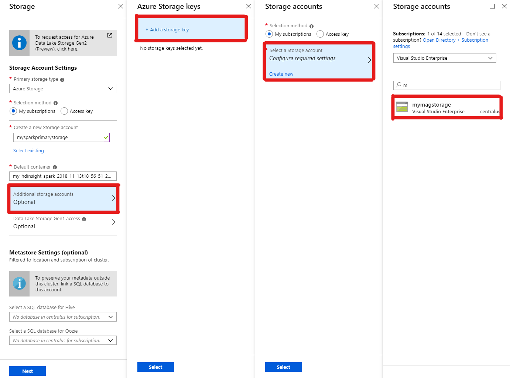
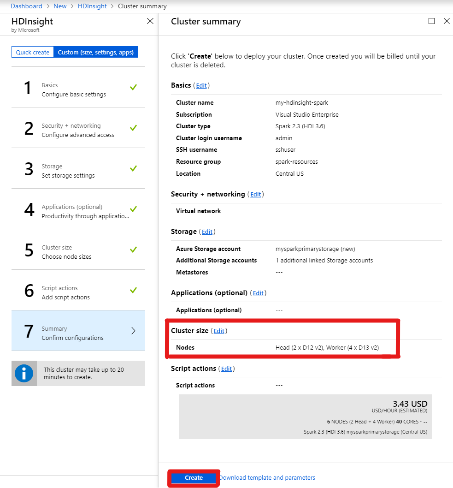

# Using Microsoft Academic Graph with PySpark on Azure HDInsight/Spark cluster

You could use PySpark to process Microsoft Academic Graph stored in Azure Storage. Here are the step-by-step instructions.

1. Create Azure HDInsight/Spark cluster.
1. Referencing MAG files in PySpark scripts.

## Create Azure HDInsight/Spark cluster

1. Create an Azure HDInsight cluster. From Azure portal Home > Create a resource > Analytics > HDInsight

    

1. Configure HDInsight/Spark cluster. Choose "Spark" as the cluster type.

    

1. Configure primary storage. Create an Azure Storage account and choose a default container as the primary storage.

    

1. Configure additional storage. Add Azure Storage account containing MAG as an additional storage account if it is not the same storage account in the previous step.

    

1. Create HDInsight/Spark cluster. Optionally change cluster size before clicking the "Create" buttom.

    

## Referencing MAG files in PySpark scripts

There are two options to use Microsoft Academic Graph in Azure HDInsight.

1. Attach the Azure storage storing Microsoft Academic Graph to Azure HDInsight (see Step 2 above) and load the graph data with load path (e.g. `/mag/Affiliations.txt`).

1. Without attaching the Azure storage storing Microsoft Academic Graph to Azure HDInsight, using the network file path to the Azure storage and pattern is `wasbs://<container-name>@<storage-name>.blob.core.windows.net/<path/to/file>` (e.g. `wasbs://mag-2018-11-09@microsoftacademicgraph.blob.core.windows.net/mag/Affiliations.txt`).
