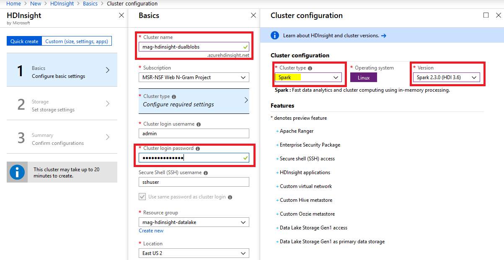
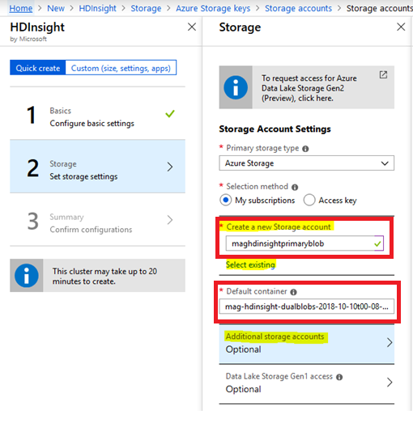

# Get started on Azure HDInsight/Spark to use Microsoft Academic Graph 

Details step-by-step instructions for setting up Azure HDInsight/Spark to process Microsoft Academic Graph.

## Create Azure HDInsight/Spark cluster

1. Home > Create a resource > Analytics > HDInsight

    

1. Create new HDInsight and Azure storage accounts, following the flow indicated in figure below:

    

    

    > [!IMPORTANT]
    > Both accounts require a globally unique name

## Configure Azure HDInsight to use Microsoft Academic Graph

There are two options to use Microsoft Academic Graph in Azure HDInsight.

1. Attach the Azure storage storing Microsoft Academic Graph to Azure HDInsight (see Step 2 above) and load the graph data with load path (e.g. `/mag/Affiliations.txt`).

1. Without attaching the Azure storage storing Microsoft Academic Graph to Azure HDInsight, using the network file path to the Azure storage and pattern is `wasbs://<container-name>@<storage-name>.blob.core.windows.net/<path/to/file>` (e.g. `wasbs://mag-2018-11-09@microsoftacademicgraph.blob.core.windows.net/mag/Affiliations.txt`).
