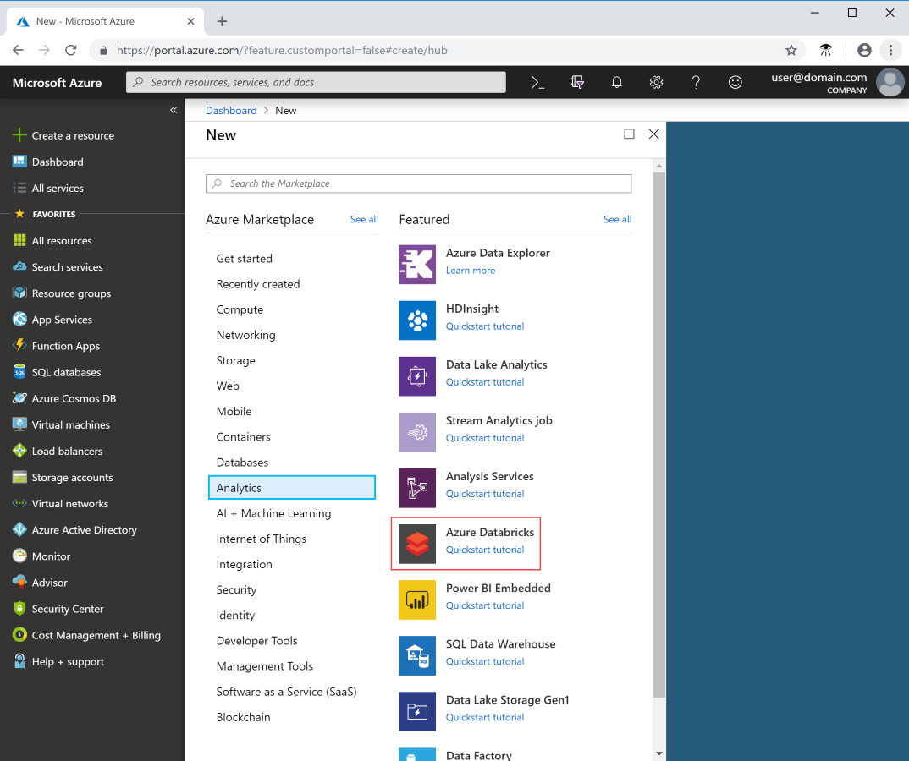
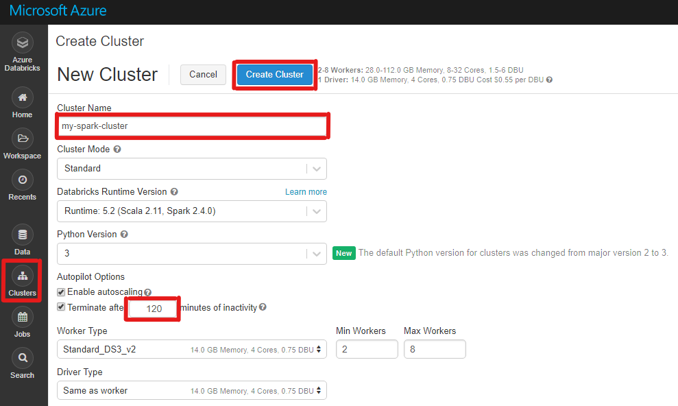

# Set up Azure Databricks for Microsoft Academic Graph

You could set up an Azure Databricks to run Analytics script on Microsoft Academic Graph. Here are the step-by-step instructions

## Prerequisites

Complete these tasks before you begin this tutorial:

* Set up provisioning of Microsoft Academic Graph to an Azure blob storage account. See [Get Microsoft Academic Graph on Azure storage](./get-started-setup-provisioning.md).

## Create an Azure Databricks service

In this section, you create an Azure Databricks service by using the Azure portal.

1. In the Azure portal, select **Create a resource** > **Analytics** > **Azure Databricks**.

    

1. Under **Azure Databricks Service**, provide the following values to create a Databricks service:

    |Property  |Description  |
    |---------|---------|
    |**Workspace name**     | Provide a name for your Databricks workspace.        |
    |**Subscription**     | From the drop-down, select your Azure subscription.        |
    |**Resource group**     | Specify whether you want to create a new resource group or use an existing one. A resource group is a container that holds related resources within an Azure subscription. For more information, see [Azure Resource Group overview](https://docs.microsoft.com/azure/azure-resource-manager/resource-group-overview). |
    |**Location**     | Select **West US 2**.  For other available regions, see [Azure services available by region](https://azure.microsoft.com/regions/services/).      |
    |**Pricing Tier**     |  Select **Standard**.     |

1. Select **Create**.

1. The account creation takes a few minutes. During account creation, the portal displays the **Submitting deployment for Azure Databricks** tile on the right. To monitor the operation status, view the progress bar at the top.

    

## Create a Spark cluster in Azure Databricks

1. In the Azure portal, go to the Databricks service that you created, and select **Launch Workspace**.

1. You're redirected to the Azure Databricks portal. From the portal, select **Cluster**.

    

1. In the **New cluster** page, provide the values to create a cluster.

    

   Fill in values for the following fields, and accept the default values for the other fields:

    * Enter a name for the cluster.

    * Make sure you select the **Terminate after \_\_ minutes of inactivity** check box. If the cluster isn't being used, provide a duration (in minutes) to terminate the cluster.

1. Select **Create cluster**. After the cluster is running, you can attach notebooks to the cluster and run Spark jobs.

## Next steps

Advance to the next section to learn about computing author h-index.

> [!div class="nextstepaction"]
>[Compute author h-index tutorial (Python/SQL)](tutorial-databricks-hindex.md)

## Resources

* [Create an Azure Databricks service](https://azure.microsoft.com/en-us/services/databricks/).
* [Create a cluster for the Azure Databricks service](https://docs.azuredatabricks.net/user-guide/clusters/create.html).
