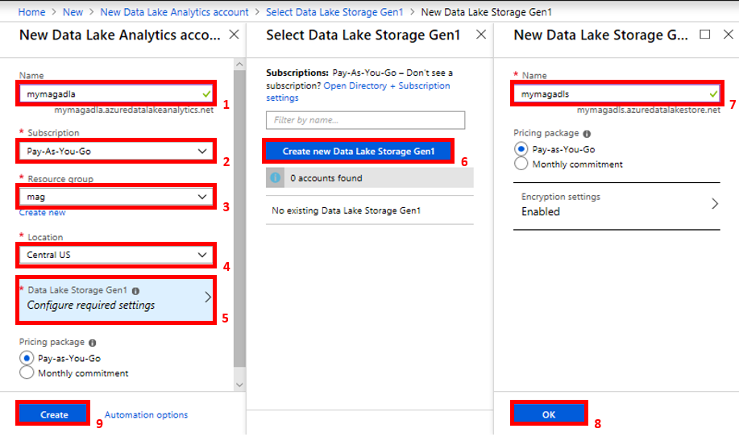

# Get started using Microsoft Academic Graph on Azure Data Lake Analytics

Details step-by-step instructions for setting up Microsoft Academic Graph to be used with Azure Data Lake Analytics.

## Create Azure Data Lake Analytics account

1. Home > Create a resource > Analytics > Data Lake Analytics

    

1. Create new Data Lake Analytics and Data Lake Storage Gen1 accounts, following the flow indicated in figure below:

    

    > Both accounts require a globally unique name

## Configure Azure Data Lake Analytics to use Microsoft Academic Graph

1. Navigate to the new Azure Data Lake Analytics account created in the first section and add a new data source:

   

1. On the "add data source" dialog, select storage type "azure storage", selection method "select account" and the Azure Storage account you created for MAG provisioning:

   