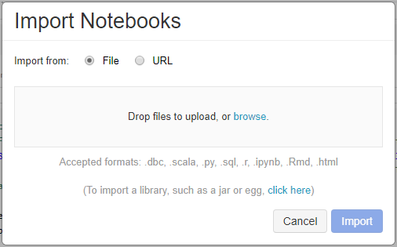

# Import MagClass (PySpark)

## Import MagClass.py notebook

In this section, you will import the MagClass.py notebook to Azure Databricks workspace.
It defines MicrosoftAcademicGraph class for accessing MAG data.
You will run this utility notebook from other notebooks later.

1. Download `samples/pyspark/MagClass.py` in MAG dataset to your local drive.

1. In the [Azure portal](https://portal.azure.com), go to the Azure Databricks service that you created, and select **Launch Workspace**.

1. On the left, select **Workspace**. From **Workspace** > **Users** > **Your folder** drop-down, select **Import**.

    
    
1. Drag and drop `MagClass.py` to the **Import Notebook** dialog box

    

1. Select **Import**. This will create a notebook with path `"./MagClass"`. No need to run this notebook.

## Resources

* [Import a notebook and attach it to the cluster](https://docs.databricks.com/user-guide/notebooks/notebook-manage.html#import-a-notebook).
