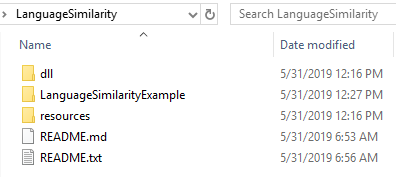

# Language Similarity Package

The Microsoft Academic Language Similarity Package provides supplementary processing functionality for use with the Microsoft Academic Graph (MAG). This package includes the LanguageSimilarity API and required resources deployed with each version of MAG. The LanguageSimilarity API provides functionality for:

1. Similarity comparison between input texts using pre-trained word embeddings which are trained on the MAG corpus, and
2. Labeling input texts with fields of study defined in MAG.

## Prerequisites

Before running these examples, you need to complete the following setups:

* Setting up provisioning of Microsoft Academic Graph to an Azure blob storage account. See [Get Microsoft Academic Graph on Azure storage](get-started-setup-provisioning.md).

* Request Language Similarity Package when requesting MAG.

  > [!NOTE]
  > Language Similarity Package is not included in basic MAG distribution. Please ask for Language Similarity Package when requesting MAG otherwise it will not be included in your distribution.

## System Requirements

1. Microsoft Windows 7 (or above) 64-bit OS
2. .NET Framework version 4.5.2+
3. Visual Studio 2015 (or above)

## Contents

The LanguageSimilarity package is distributed as a single zip file. It includes algorithms in dlls, and resources with pre‑trained models. After unzipping the package, users will see a folder structure as shown in the figure below. README.md and README.txt contain the general information about the package, system requirements, and API signature definitions.

  

We also include a C# demo project in the LanguageSimilarityExample folder. It also contains sample.txt as the sample input for the demo.
The demo is a console program that takes the resource directory and the sample.txt path file as paremeters. The resources is to initialize the LanguageSimilarity models, while sample.txt is used to provide examples for calling methods provided in this package.

## Methods

* [ComputeSimilarity](language-similarity-computesimilarity.md)
* [GetTopFieldsOfStudy](language-similarity-gettopfieldsofstudy.md)

## Example

* [LanguageSimilarityExample](language-similarity-example.md)

## Resources

* [Get started with Azure Data Lake Analytics using Azure portal](https://docs.microsoft.com/en-us/azure/data-lake-analytics/data-lake-analytics-get-started-portal)
* [Data Lake Analytics](https://azure.microsoft.com/services/data-lake-analytics/)
* [U-SQL Language Reference](https://docs.microsoft.com/u-sql/)
