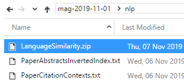

# Language Similarity Package

The Microsoft Academic Language Similarity Package provides supplementary processing functionality for use with the Microsoft Academic Graph (MAG). This package includes Language Similarity API and required resources. This API provides functionality for:

* Similarity comparison between input texts using pre-trained word embeddings which are trained on the MAG corpus, and
* Labeling text with fields of study defined in MAG.

## Prerequisites

Before running these examples, you need to complete the following setups:

* Setting up provisioning of Microsoft Academic Graph to an Azure blob storage account. See [Get Microsoft Academic Graph on Azure storage](get-started-setup-provisioning.md).

* Request Language Similarity Package when requesting MAG.

  > [!NOTE]
  > Language Similarity Package is not part of the basic MAG distribution. Please ask for Language Similarity Package when requesting MAG. Otherwise it will not be included in your distribution.

## System Requirements

* Microsoft Windows 7 (or above) 64-bit OS
* .NET Framework version 4.5.2+
* Visual Studio 2015 (or above)

## Contents

The Language Similarity package is distributed as a single zip file. It is located at **`nlp\LanguageSimilarity.zip`** in the MAG container.

  

It includes algorithms in dlls and resources with pre‑trained models. After unzipping the package, users will see a folder structure as shown in the figure below. README files contain general information about the package, system requirements, and API signatures.

  

We also include a C# demo project in the LanguageSimilarityExample folder. It contains sample.txt as input for the demo project.
The demo project is a console program which takes resource directory and the sample.txt path as paremeters. The resource directory is to initialize the language similarity models, while sample.txt is used to provide prarmeters for calling methods in this package.

## Constructors

* [LanguageSimilarity(String)](language-similarity-constructor.md)

## Methods

* [ComputeSimilarity](language-similarity-computesimilarity.md)
* [GetTopFieldsOfStudy](language-similarity-gettopfieldsofstudy.md)

## Example

* [Language Similarity Example](language-similarity-example.md)

## Resources

* [Get started with Azure Data Lake Analytics using Azure portal](https://docs.microsoft.com/azure/data-lake-analytics/data-lake-analytics-get-started-portal)
