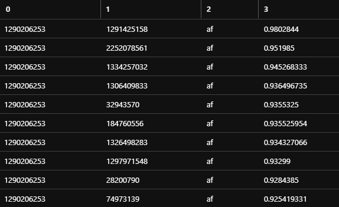
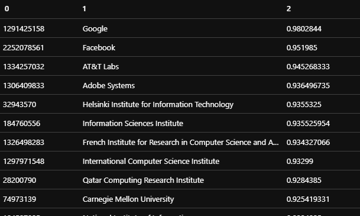

# Network Similarity Sample (Analytics)

In this tutorial, you compute network similarity score and top related affiliations in Microsoft Academic Graph (MAG) using Azure Data Analytics (U-SQL).

## Prerequisites

Complete these tasks before you begin this tutorial:

* Setting up provisioning of Microsoft Academic Graph to an Azure blob storage account. See [Get Microsoft Academic Graph on Azure storage](get-started-setup-provisioning.md).

* Setting up Azure Data Lake Analytics. See [Set up Azure Data Lake Analytics for Microsoft Academic Graph](get-started-setup-azure-data-lake-analytics.md).

## Gather the information that you need

   Before you begin, you should have these items of information:

   :heavy_check_mark:  The name of your Azure Storage (AS) account containing MAG dataset from [Get Microsoft Academic Graph on Azure storage](get-started-setup-provisioning.md#note-azure-storage-account-name-and-primary-key).

   :heavy_check_mark:  The name of your Azure Data Lake Analytics (ADLA) service from [Set up Azure Data Lake Analytics](get-started-setup-azure-data-lake-analytics.md#create-azure-data-lake-analytics-account).

   :heavy_check_mark:  The name of your Azure Data Lake Storage (ADLS) from [Set up Azure Data Lake Analytics](get-started-setup-azure-data-lake-analytics.md#create-azure-data-lake-analytics-account).

   :heavy_check_mark:  The name of the container in your Azure Storage (AS) account containing MAG dataset.

## Define functions to extract MAG data

In prerequisite [Set up Azure Data Lake Analytics](get-started-setup-azure-data-lake-analytics.md), you added the Azure Storage  (AS) created for MAG provision as a data source for the Azure Data Lake Analytics service (ADLA). In this section, you submit an ADLA job to create functions extracting MAG data from Azure Storage (AS).

1. In the [Azure portal](https://portal.azure.com), go to the Azure Data Lake Analytics (ADLA) service that you created, and select **Overview** > **New Job**.

   

1. Copy code in **`samples/CreateFunctions.usql`** and paste into the code block.
   
1. Provide a **Job name** and select **Submit**.

   

1. The job should finish successfully.

   

## Define network similarity functions

1. In the [Azure portal](https://portal.azure.com), go to the Azure Data Lake Analytics (ADLA) service that you created, and select **Overview** > **New Job**.

1. Copy code in **`ns/NetworkSimilarityFunction.usql`** and paste into the code block.
   
1. Provide a **Job name** and select **Submit**.

1. The job should finish successfully.

## Run NetworkSimilaritySample script

1. In the [Azure portal](https://portal.azure.com), go to the Azure Data Lake Analytics (ADLA) service that you created, and select **Overview** > **New Job**.

1. Copy code in **`ns/NetworkSimilaritySample.usql`** and paste into the code block.
   
1. Provide a **Job name** and select **Submit**.

1. The job should finish successfully.

### Getting similarity score between two entities

- Following script calls getSimilarity method to get similarity score between two entities

   ```U-SQL
   @score = AcademicGraph.NetworkSimilarity.GetSimilarity(@uriPrefix, @resourcePath, @entityId1, @entityId2);
   ```

- You will see output in `/Output/NetworkSimilarity/GetSimilarity.tsv` as follows

    > 1290206253	201448701	af	0.766698062

### Getting top related entities

- Following script calls getTopEntities method to get top related entities

   ```U-SQL
   @topEntities = AcademicGraph.NetworkSimilarity.GetTopEntities(@uriPrefix, @resourcePath, @entityId1, 20, (float)0);
   ```

- You will see output in `/Output/NetworkSimilarity/GetTopEntities.tsv` as follows

    

### Getting entity details

- Following script joins top entities with affiliation table to get entity details

   ```U-SQL
   @affiliations = Affiliations(@uriPrefix);

   @topEntityDetails =
       SELECT
           @topEntities.SimilarEntityId,
           @affiliations.DisplayName,
           @topEntities.Score
       FROM @topEntities
       INNER JOIN @affiliations
       ON @topEntities.SimilarEntityId == @affiliations.AffiliationId;
   ```

- You will see output in `/Output/NetworkSimilarity/TopEntityDetails.tsv` as follows

    

## Resources

* [Get started with Azure Data Lake Analytics using Azure portal](https://docs.microsoft.com/azure/data-lake-analytics/data-lake-analytics-get-started-portal)
* [Data Lake Analytics](https://azure.microsoft.com/services/data-lake-analytics/)
* [U-SQL Language Reference](https://docs.microsoft.com/u-sql/)
