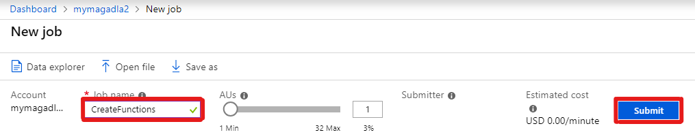
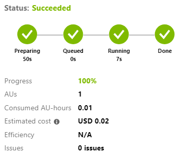

# Network Similarity Sample (Analytics)

In this tutorial, you compute network similarity score and top related affiliations in Microsoft Academic Graph (MAG) using Azure Data Analytics (U-SQL).

## Prerequisites

Complete these tasks before you begin this tutorial:

* Setting up provisioning of Microsoft Academic Graph to an Azure blob storage account. See [Get Microsoft Academic Graph on Azure storage](get-started-setup-provisioning.md).

* Setting up Azure Data Lake Analytics. See [Set up Azure Data Lake Analytics for Microsoft Academic Graph](get-started-setup-azure-data-lake-analytics.md).

## Gather the information that you need

   Before you begin, you should have these items of information:

   :heavy_check_mark:  The name of your Azure Storage (AS) account containing MAG dataset from [Get Microsoft Academic Graph on Azure storage](get-started-setup-provisioning.md#note-azure-storage-account-name-and-primary-key).

   :heavy_check_mark:  The name of your Azure Data Lake Analytics (ADLA) service from [Set up Azure Data Lake Analytics](get-started-setup-azure-data-lake-analytics.md#create-azure-data-lake-analytics-account).

   :heavy_check_mark:  The name of your Azure Data Lake Storage (ADLS) from [Set up Azure Data Lake Analytics](get-started-setup-azure-data-lake-analytics.md#create-azure-data-lake-analytics-account).

   :heavy_check_mark:  The name of the container in your Azure Storage (AS) account containing MAG dataset.

## Define functions to extract MAG data

In prerequisite [Set up Azure Data Lake Analytics](get-started-setup-azure-data-lake-analytics.md), you added the Azure Storage  (AS) created for MAG provision as a data source for the Azure Data Lake Analytics service (ADLA). In this section, you submit an ADLA job to create functions extracting MAG data from Azure Storage (AS).

1. In the [Azure portal](https://portal.azure.com), go to the Azure Data Lake Analytics (ADLA) service that you created, and select **Overview** > **New Job**.

   

1. Copy code in samples/CreateFunctions.usql and paste into the code block.
   
1. Provide a **Job name** and select **Submit**.

   

1. The job should finish successfully.

   

## Import PySparkMagClass shared notebook

In this section, you import PySparkMagClass.py as a shared notebook in Azure Databricks workspace. You will run this utility notebook from another notebook later.

1. Save samples/PySparkMagClass.py in MAG dataset to local drive.

1. In the [Azure portal](https://portal.azure.com), go to the Azure Databricks service that you created, and select **Launch Workspace**.

1. On the left, select **Workspace**. From the **Workspace** > **Shared** drop-down, select **Import**.

    
    
1. Drag and drop PySparkMagClass.py to the **Import Notebook** dialog box

    

1. Select **Import**. This will create a notebook with path `"/Shared/PySparkMagClass"`. No need to run this notebook.

   > [!NOTE]
   > When importing this notebook under **Shared** folder. The full path of this notebook is `"/Shared/PySparkMagClass"`. If you import it under other folders, note the actual full path and use it in following sections.

## Import PySparkNetworkSimilarityClass shared notebook

In this section, you import PySparkNetworkSimilarityClass.py as a shared notebook in Azure Databricks workspace. You will run this utility notebook from another notebook later.

1. Save ns/PySparkMagClass.py in MAG dataset to local drive.

1. In the [Azure portal](https://portal.azure.com), go to the Azure Databricks service that you created, and select **Launch Workspace**.

1. On the left, select **Workspace**. From the **Workspace** > **Shared** drop-down, select **Import**.

1. Drag and drop PySparkMagClass.py to the **Import Notebook** dialog box

1. Select **Import**. This will create a notebook with path `"/Shared/PySparkNetworkSimilarityClass"`. No need to run this notebook.

## Import NetworkSimilaritySample notebook

In this section, you import NetworkSimilaritySample.py as a notebook in Azure Databricks workspace.

1. Save ns/NetworkSimilaritySample.py in MAG dataset to local drive.

1. In the [Azure portal](https://portal.azure.com), go to the Azure Databricks service that you created, and select **Launch Workspace**.

1. On the left, select **Workspace**. From the **Workspace** > **Users** > **Your alias** drop-down, select **Import**.

1. Drag and drop PySparkNetworkSimilarityClass.py to the **Import Notebook** dialog box

## Run NetworkSimilaritySample notebook

In this section, you run the newly imported notebook.

- Click **Run All** button.

### Creating a NetworkSimilarity instance

- Cmd 5 creates a NetworkSimilarity instance to compute similarity

   ```python
   ns = NetworkSimilarity(container=MagContainer, account=AzureStorageAccount, key=AzureStorageAccessKe, resource=ResourcePath)
   ```

### Getting similarity score between two entities

- Cmd 6 calls getSimilarity method to get similarity score between two entities

   ```python
   score = ns.getSimilarity(EntityId1, EntityId2)
   print(score)
   ```

- You will see output as follows

    > 0.7666980387511901

### Getting top related entities

- Cmd 7 calls getTopEntities method to get top related entities

   ```python
   topEntities = ns.getTopEntities(EntityId1)
   display(topEntities)
   ```

- You will see output as follows

    

### Getting entity details

- Cmd 8 joins top entities with affiliation table to get entity details

   ```python
   # Create a MicrosoftAcademicGraph instance to access MAG dataset
   mag = MicrosoftAcademicGraph(container=MagContainer, account=AzureStorageAccount, key=AzureStorageAccessKe)

   # Get authors dataframe
   affiliations = mag.getDataframe('Affiliations')

   # Join top entities with authors to show auhtor names
   topEntitiesWithName = topEntities.join(affiliations, topEntities.EntityId == affiliations.AffiliationId, 'inner').select(topEntities.EntityId, affiliations.DisplayName, topEntities.Score).orderBy(topEntities.Score.desc())
   display(topEntitiesWithName)
   ```

- You will see output for Cmd 8 as follows

    

## Resources

* [Get started with Azure Data Lake Analytics using Azure portal](https://docs.microsoft.com/azure/data-lake-analytics/data-lake-analytics-get-started-portal)
* [Data Lake Analytics](https://azure.microsoft.com/services/data-lake-analytics/)
* [U-SQL Language Reference](https://docs.microsoft.com/u-sql/)
