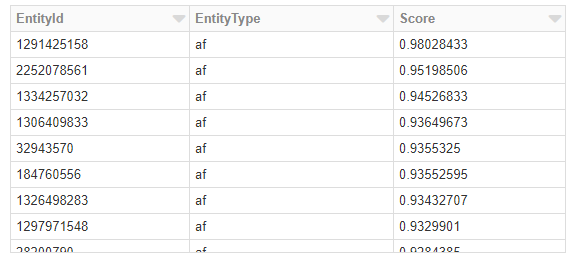

# NetworkSimilarity.getTopEntities Function

### Returns entities with top similarity scores related to an entity.

## getTopEntities(e, targetType, maxCount, minScore)

Returns a dataframe with entities of top similarity scores to an entity.
Score returned is between [-1, 1], with bigger number representing higher similarity.
If the entity ID is not available, the retrun dataframe will be empty.

**Parameters**

Name | Data Type | Description | Default | Example
--- | --- | --- | --- | ---
e | long | Id of the entity | | 1290206253
targetType | string | target entity type. If empty, include all entity types in the resource file  | '' | 'af'
maxCount | int | Maximum number of result | 20 | 10
minScore | float | Minimum score | 0.0 | 0.0

**Example**

   ```python
   topEntities = ns.getTopEntities(1290206253)
   display(topEntities)
   ```

**Output**
- You will see output as follows

    
