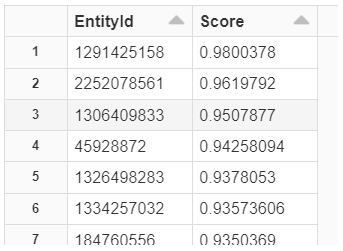

[!INCLUDE [ma-retirement](../includes/ma-retirement.md)]

# NetworkSimilarity.getTopEntities Function

Returns a dataframe containing entities with the highest similarity scores in relation to the passed in entity id.

## DataFrame getTopEntities(long, int, float)

  ```Python
  DataFrame getTopEntities(long entityId, int maxCount=20, float minScore=0)
  ```

### Parameters

| Name | Data Type | Description | Default | Example |
| --- | --- | --- | --- | --- |
| entityId | long | Id of the entity | | 1290206253 |
| maxCount | int | Maximum number of result | 20 | 10 |
| minScore | float | Minimum score | 0.0 | 0.0 |

### Return Dataframe

| Column Name | Data Type | Description | Example |
| --- | --- | --- | --- |
| EntityId | long | Id of the related entity | 1291425158 |
| Score | float | Similarity score between input entity and the related entity. <br> Score is between [-1, 1], with larger number representing higher similarity. <br> If the entity ID is not available, the return dataframe will be empty. | 0.971670866 |

### Example

   ```python
   topEntities = ns.getTopEntities(1290206253)
   display(topEntities)
   ```

### Output

* Sample output.

    
