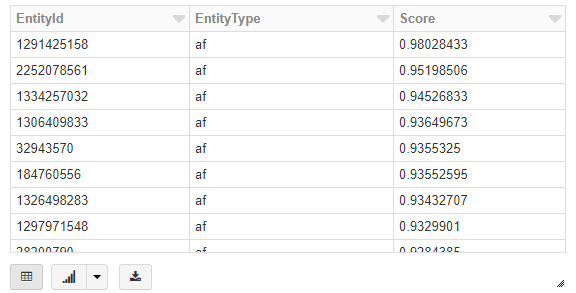
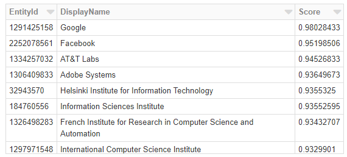

# Network Similarity Sample (Databricks)

In this tutorial, you compute network similarity score and top related affiliations in Microsoft Academic Graph (MAG) using Azure Databricks.

## Prerequisites

Complete these tasks before you begin this tutorial:

* Setting up provisioning of Microsoft Academic Graph to an Azure blob storage account. See [Get Microsoft Academic Graph on Azure storage](get-started-setup-provisioning.md).

* Setting up Azure Databricks service. See [Set up Azure Databricks](get-started-setup-databricks.md).

## Gather the information that you need

   Before you begin, you should have these items of information:

   :heavy_check_mark:  The name of your Azure Storage (AS) account containing MAG dataset from [Get Microsoft Academic Graph on Azure storage](get-started-setup-provisioning.md#note-azure-storage-account-name-and-primary-key).

   :heavy_check_mark:  The access key of your Azure Storage (AS) account from [Get Microsoft Academic Graph on Azure storage](get-started-setup-provisioning.md#note-azure-storage-account-name-and-primary-key).

   :heavy_check_mark:  The name of the container in your Azure Storage (AS) account containing MAG dataset.

## Import PySparkMagClass shared notebook

In this section, you import PySparkMagClass.py as a shared notebook in Azure Databricks workspace. You will run this utility notebook from another notebook later.

1. Save samples/PySparkMagClass.py in MAG dataset to local drive.

1. In the [Azure portal](https://portal.azure.com), go to the Azure Databricks service that you created, and select **Launch Workspace**.

1. On the left, select **Workspace**. From the **Workspace** > **Shared** drop-down, select **Import**.

    
    
1. Drag and drop PySparkMagClass.py to the **Import Notebook** dialog box

    

1. Select **Import**. This will create a notebook with path `"/Shared/PySparkMagClass"`. No need to run this notebook.

   > [!NOTE]
   > When importing this notebook under **Shared** folder. The full path of this notebook is `"/Shared/PySparkMagClass"`. If you import it under other folders, note the actual full path and use it in following sections.

## Import PySparkNetworkSimilarityClass shared notebook

In this section, you import PySparkNetworkSimilarityClass.py as a shared notebook in Azure Databricks workspace. You will run this utility notebook from another notebook later.

1. Save ns/PySparkMagClass.py in MAG dataset to local drive.

1. In the [Azure portal](https://portal.azure.com), go to the Azure Databricks service that you created, and select **Launch Workspace**.

1. On the left, select **Workspace**. From the **Workspace** > **Shared** drop-down, select **Import**.

1. Drag and drop PySparkMagClass.py to the **Import Notebook** dialog box

1. Select **Import**. This will create a notebook with path `"/Shared/PySparkNetworkSimilarityClass"`. No need to run this notebook.

## Import NetworkSimilaritySample notebook

In this section, you import NetworkSimilaritySample.py as a notebook in Azure Databricks workspace.

1. Save ns/NetworkSimilaritySample.py in MAG dataset to local drive.

1. In the [Azure portal](https://portal.azure.com), go to the Azure Databricks service that you created, and select **Launch Workspace**.

1. On the left, select **Workspace**. From the **Workspace** > **Users** > **Your alias** drop-down, select **Import**.

1. Drag and drop PySparkNetworkSimilarityClass.py to the **Import Notebook** dialog box

## Run NetworkSimilaritySample notebook

In this section, you run the newly imported notebook.

1. Click **Run All** button.

1. You will see output for Cmd 6 as follows

    > 0.7666980387511901

1. You will see output for Cmd 7 as follows

    

1. You will see output for Cmd 8 as follows

    

## Clean up resources

After you finish the tutorial, you can terminate the cluster. From the Azure Databricks workspace, select **Clusters** on the left. For the cluster to terminate, under **Actions**, point to the ellipsis (...) and select the **Terminate** icon.

If you don't manually terminate the cluster, it automatically stops, provided you selected the **Terminate after \_\_ minutes of inactivity** check box when you created the cluster. In such a case, the cluster automatically stops if it's been inactive for the specified time.

## Resources

* [Create an Azure Databricks service](https://azure.microsoft.com/services/databricks/).
* [Create a cluster for the Azure Databricks service](https://docs.azuredatabricks.net/user-guide/clusters/create.html).
* [Import this notebook and attach it to the cluster](https://docs.databricks.com/user-guide/notebooks/notebook-manage.html#import-a-notebook).
