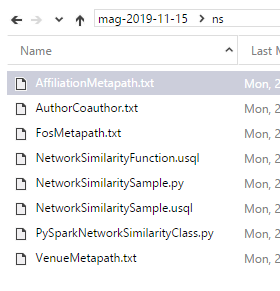

# Network Similarity Package

The Microsoft Academic Network Similarity Package provides supplementary processing functionality for use with the Microsoft Academic Graph (MAG). This package includes network embedding resources for academic entities. It also includes U-SQL functions to be used in Azure Data Lake Analytics and Python classes for Azure Databricks.

The functions/classes perform the following tasks.

1. Similarity comparison between 2 entities using pre-trained network embeddings on the MAG corpus, and
2. Compute top similar entities based on the pre-trained network embeddings.

## Prerequisites

Before running these examples, you need to complete the following setups:

* Setting up provisioning of Microsoft Academic Graph to an Azure blob storage account. See [Get Microsoft Academic Graph on Azure storage](get-started-setup-provisioning.md).

* Request Network Similarity Package when requesting MAG.

  > [!NOTE]
  > Network Similarity Package is not included in basic MAG distribution. Please ask for Network Similarity Package when requesting MAG. Otherwise it will not be included in your distribution.

## Contents

The Network Similarity package is distributed in a separate folder (ns) in MAG. Files with py extension are Python script for Azure Databricks. Files with usql extension are U-SQL scripts for Azure Data Lake Analytics. Files with txt extension are network similarity resource files for different type of entities. Here are the description of the resource files.

  |Sample File|Description|
  |---------|---------|
  |**PySparkNetworkSimilarityClass.py**|PySpark utility function for computing network similarity.|
  |**NetworkSimilaritySample.py**|PySpark  sample script for computing network similarity.|
  |**NetworkSimilarityFunction.usql**|U-SQL utility functions for computing network similarity.|
  |**NetworkSimilaritySample.usql**|U-SQL sample script for computing network similarity.|

  |Resource File|Description|
  |---------|---------|
  |**AffiliationCopaper.txt**|Two affiliations are similar if they are closed connected with each other in the weighted affiliation collaboration graph.|
  |**AffiliationCovenue.txt**|Two affiliations are similar if they publish in similar venues (journals and conferences).|
  |**AffiliationMetapath.txt**|Two affiliations are similar if they co-occur with common affiliations, venues, and fields of study.|
  |**FosCopaper.txt**|Two fields of study are similar if they appear in the same paper.|
  |**FosCovenue.txt**|Two fields of study are similar if they have papers from similar venues.|
  |**FosMetapath.txt**|Two fields of study are similar if they co-occur with common affiliations, venues, and fields of study.|
  |**VenueCoauthor.txt**|Two venues are similar if they publish papers with common authors.|
  |**VenueCofos.txt**|Two venues are similar if they publish papers with similar fields of study.|
  |**VenueMetapath.txt**|Two venues are similar if they co-occur with common affiliations, venues, and fields of study.|

  

## Samples

* [Network Similarity Sample (U-SQL)](network-similarity-analytics.md)
* [Network Similarity Sample (PySpark)](network-similarity-databricks.md)

## Resource

* [Get Microsoft Academic Graph on Azure storage](get-started-setup-provisioning.md)
