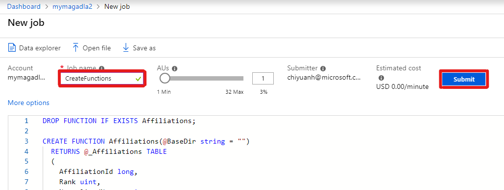
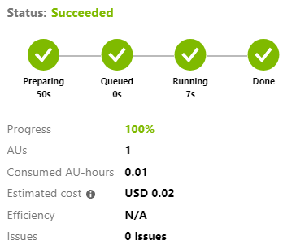
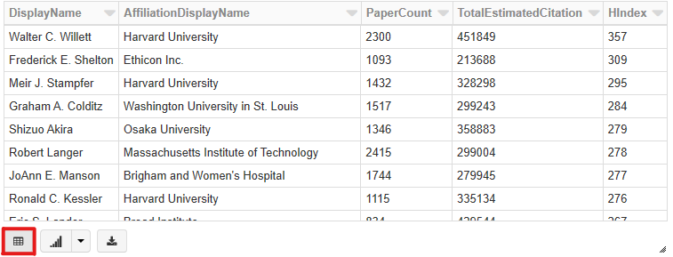
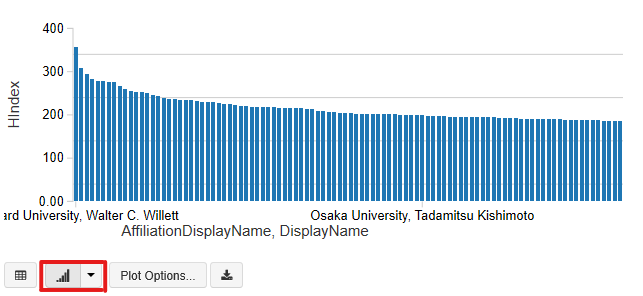

# Tutorial: Compute author h-index using Azure Data Lake Analytics (U-SQL)

In this tutorial, you compute h-index for all authors in Microsoft Academic Graph (MAG) using Azure Data Lake Analytics (U-SQL). You extract data from Azure Storage, compute h-index, and save the result in Azure Data Lake Storage.

## Prerequisites

Complete these tasks before you begin this tutorial:

* Setting up provisioning of Microsoft Academic Graph to an Azure blob storage account. See [Get Microsoft Academic Graph on Azure storage](get-started-setup-provisioning.md).

* Setting up Azure Data Lake Analytics. See [Set up Azure Data Lake Analytics for Microsoft Academic Graph](get-started-setup-azure-data-lake-analytics.md).

## Gather the information that you need

   Before you begin, you should have these items of information:

   :heavy_check_mark:  The name of your Azure Data Lake Analytics account.

   :heavy_check_mark:  The name of your Azure Storage account containing MAG dataset.

   :heavy_check_mark:  The name of the container in your Azure Storage account containing MAG dataset.

## Define functions to extract MAG data from Azure Storage

In this section, you create a notebook in Azure Databricks workspace.

1. In the [Azure portal](https://portal.azure.com), go to the Azure Data Lake Analytics service that you created, and select **Overview** > **New Job**.

   

1. Copy and paste the following code block in the script window.

   > [!NOTE]
   > To work with the latest MAG dataset schema, instead of the code block below, you could use code in samples/CreateFunctions.usql in the MAG dataset.

   ```U-SQL
   DROP FUNCTION IF EXISTS Affiliations;
   CREATE FUNCTION Affiliations(@BaseDir string = "")
     RETURNS @_Affiliations TABLE
     (
       AffiliationId long,
       Rank uint,
       NormalizedName string,
       DisplayName string,
       GridId string,
       OfficialPage string,
       WikiPage string,
       PaperCount long,
       CitationCount long,
       CreatedDate DateTime
     )
     AS BEGIN
     DECLARE @_Path string = @BaseDir + "mag/Affiliations.txt";
     @_Affiliations =
     EXTRACT
       AffiliationId long,
       Rank uint,
       NormalizedName string,
       DisplayName string,
       GridId string,
       OfficialPage string,
       WikiPage string,
       PaperCount long,
       CitationCount long,
       CreatedDate DateTime
     FROM @_Path
     USING Extractors.Tsv(silent: false, quoting: false);
     RETURN;
   END;
   
   DROP FUNCTION IF EXISTS Authors;
   CREATE FUNCTION Authors(@BaseDir string = "")
     RETURNS @_Authors TABLE
     (
       AuthorId long,
       Rank uint,
       NormalizedName string,
       DisplayName string,
       LastKnownAffiliationId long?,
       PaperCount long,
       CitationCount long,
       CreatedDate DateTime
     )
     AS BEGIN
     DECLARE @_Path string = @BaseDir + "mag/Authors.txt";
     @_Authors =
     EXTRACT
       AuthorId long,
       Rank uint,
       NormalizedName string,
       DisplayName string,
       LastKnownAffiliationId long?,
       PaperCount long,
       CitationCount long,
       CreatedDate DateTime
     FROM @_Path
     USING Extractors.Tsv(silent: false, quoting: false);
     RETURN;
   END;
   
   DROP FUNCTION IF EXISTS PaperAuthorAffiliations;
   CREATE FUNCTION PaperAuthorAffiliations(@BaseDir string = "")
     RETURNS @_PaperAuthorAffiliations TABLE
     (
       PaperId long,
       AuthorId long,
       AffiliationId long?,
       AuthorSequenceNumber uint,
       OriginalAffiliation string
     )
     AS BEGIN
     DECLARE @_Path string = @BaseDir + "mag/PaperAuthorAffiliations.txt";
     @_PaperAuthorAffiliations =
     EXTRACT
       PaperId long,
       AuthorId long,
       AffiliationId long?,
       AuthorSequenceNumber uint,
       OriginalAffiliation string
     FROM @_Path
     USING Extractors.Tsv(silent: false, quoting: false);
     RETURN;
   END;
   
   DROP FUNCTION IF EXISTS Papers;
   CREATE FUNCTION Papers(@BaseDir string = "")
     RETURNS @_Papers TABLE
     (
       PaperId long,
       Rank uint,
       Doi string,
       DocType string,
       PaperTitle string,
       OriginalTitle string,
       BookTitle string,
       Year int?,
       Date DateTime?,
       Publisher string,
       JournalId long?,
       ConferenceSeriesId long?,
       ConferenceInstanceId long?,
       Volume string,
       Issue string,
       FirstPage string,
       LastPage string,
       ReferenceCount long,
       CitationCount long,
       EstimatedCitation long,
       OriginalVenue string,
       CreatedDate DateTime
     )
     AS BEGIN
     DECLARE @_Path string = @BaseDir + "mag/Papers.txt";
     @_Papers =
     EXTRACT
       PaperId long,
       Rank uint,
       Doi string,
       DocType string,
       PaperTitle string,
       OriginalTitle string,
       BookTitle string,
       Year int?,
       Date DateTime?,
       Publisher string,
       JournalId long?,
       ConferenceSeriesId long?,
       ConferenceInstanceId long?,
       Volume string,
       Issue string,
       FirstPage string,
       LastPage string,
       ReferenceCount long,
       CitationCount long,
       EstimatedCitation long,
       OriginalVenue string,
       CreatedDate DateTime
     FROM @_Path
     USING Extractors.Tsv(silent: false, quoting: false);
     RETURN;
   END;
   ```
   
1. Provide a **Job name** and select **Submit**.

   

1. The job should finish successfully.

   

## Compute author h-index

1. In the [Azure portal](https://portal.azure.com), go to the Azure Data Lake Analytics service that you created, and select **Overview** > **New Job**.

   

1. Copy and paste the following code block in the script window.
   
   ```U-SQL
   DECLARE @dataVersion string = "<MagContainer>";
   DECLARE @blobAccount string = "<AzureStorageAccount>";
   DECLARE @uriPrefix   string = "wasb://" + @dataVersion + "@" + @blobAccount + "/";
   DECLARE @OutAuthorHindex string = "/Output/AuthorHIndex.tsv";
   
   @Affiliations = Affiliations(@uriPrefix);
   @Authors = Authors(@uriPrefix);
   @Papers = Papers(@uriPrefix);
   @PaperAuthorAffiliations = PaperAuthorAffiliations(@uriPrefix);
   
   // Get Affiliations
   @Affiliations =
       SELECT
           AffiliationId,
           DisplayName
       FROM @Affiliations;
   
   // Get Authors
   @Authors =
       SELECT
           AuthorId,
           DisplayName,
           LastKnownAffiliationId,
           PaperCount
       FROM @Authors;
   
   // Get (Author, Paper) pairs
   @AuthorPaper =
       SELECT DISTINCT
           AuthorId,
           PaperId
       FROM @PaperAuthorAffiliations;
   
   // Get Papers
   @PaperCitation =
       SELECT
           PaperId,
           EstimatedCitation
       FROM @Papers
       WHERE EstimatedCitation > 0;
   
   // Generate author, paper, citation view
   @AuthorPaperCitation =
       SELECT
           A.AuthorId,
           A.PaperId,
           P.EstimatedCitation
       FROM @AuthorPaper AS A
       INNER JOIN @PaperCitation AS P
           ON A.PaperId == P.PaperId;
   
   // Order author, paper, citation view by citation
   @AuthorPaperOrderByCitation =
       SELECT
           AuthorId,
           PaperId,
           EstimatedCitation,
           ROW_NUMBER() OVER(PARTITION BY AuthorId ORDER BY EstimatedCitation DESC) AS Rank
       FROM @AuthorPaperCitation;
   
   // Generate author hindex
   @AuthorHIndexTemp =
       SELECT
           AuthorId,
           SUM(EstimatedCitation) AS TotalEstimatedCitation,
           MAX(CASE WHEN EstimatedCitation >= Rank THEN Rank ELSE 0 END) AS HIndex
       FROM @AuthorPaperOrderByCitation 
       GROUP BY AuthorId;
   
   // Get author detail information
   @AuthorHIndex =
       SELECT
           I.AuthorId,
           A.DisplayName,
           AF.DisplayName AS AffiliationDisplayName,
           A.PaperCount,
           I.TotalEstimatedCitation,
           I.HIndex
       FROM @AuthorHIndexTemp AS I
       INNER JOIN @Authors AS A
           ON A.AuthorId == I.AuthorId
       LEFT OUTER JOIN @Affiliations AS AF
           ON A.LastKnownAffiliationId == AF.AffiliationId;
   
   // Filter authors with top hindex
   SELECT
       DisplayName,
       AffiliationDisplayName,
       PaperCount,
       TotalEstimatedCitation,
       HIndex
   FROM @AuthorHIndex 
   ORDER BY HIndex DESC, AuthorId
   LIMIT 100;

   OUTPUT @AuthorHIndex
   TO @OutAuthorHindex
   USING Outputters.Tsv(quoting : false);
   ```

1. In this code block, replace `<AzureStorageAccount>`, and `<MagContainer>` placeholder values with the values that you collected while completing the prerequisites of this sample.

   |Value  |Description  |
   |---------|---------|
   |**`<AzureStorageAccount>`** | The name of your Azure Storage account containing MAG dataset. |
   |**`<MagContainer>`** | The container name in Azure Storage account containing MAG dataset, Usually in the form of **mag-yyyy-mm-dd**. |

1. Provide a **Job name** and select **Submit**.

   

1. The job should finish successfully. Output goes "/Output/AuthorHIndex.tsv" in your Azure Data Lake Storage (ADLS).

   

## View output data

In this section, you query top authors by h-index and visualize the result.

1. Query top authors with highest h-index. Paste the following code in a new cell. Press the **SHIFT + ENTER** keys to run the code in this block.

   ```sql
   %sql
   -- Filter authors with top hindex
   SELECT
       DisplayName,
       AffiliationDisplayName,
       PaperCount,
       TotalEstimatedCitation,
       HIndex
   FROM AuthorHIndex 
   ORDER BY HIndex DESC, AuthorId
   LIMIT 100;
   ```

1. Select the **table** icon to see result in table form.

   

1. Select the **graph** icon to see result in graph form.

   

## Next steps

Advance to the next step to learn about analytics and visualization using Azure Data Lake Analytics.

> [!div class="nextstepaction"]
>[Analytics and visualization samples](samples-azure-data-lake-analytics.md)

## Resources

* [Get started with Azure Data Lake Analytics using Azure portal](https://docs.microsoft.com/en-us/azure/data-lake-analytics/data-lake-analytics-get-started-portal)
* [H-index](https://en.wikipedia.org/wiki/H-index)
