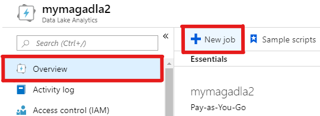
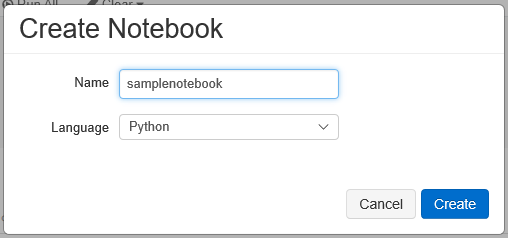
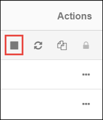

# Tutorial: Compute Author H-Index using Azure Data Lake Analytics (U-SQL)

In this tutorial, you compute H-Index for all authors in Microsoft Academic Graph (MAG) using Azure Data Lake Analytics (U-SQL). You extract data from Azure Storage, compute H-Index, and save the result in Azure Data Lake Storage.

## Prerequisites

Complete these tasks before you begin this tutorial:

* Setting up provisioning of Microsoft Academic Graph to an Azure blob storage account. See [Get Microsoft Academic Graph on Azure storage](get-started-setup-provisioning.md).

* Setting up Azure Data Lake Analytics. See [Set up Azure Data Lake Analytics for Microsoft Academic Graph](get-started-setup-azure-data-lake-analytics.md).

## Gather the information that you need

   Before you begin, you should have these items of information:

   :heavy_check_mark:  The name of your blob storage account.

   :heavy_check_mark:  The access key of your blob storage account.
   
   :heavy_check_mark:  The name of your blob storage container containing MAG dataset.

   :heavy_check_mark:  The name of your Azure Data Lake Analytics account.

## Create a notebook in Azure Databricks

In this section, you create a notebook in Azure Databricks workspace.

1. In the [Azure portal](https://portal.azure.com), go to the Azure Data Lake Analytics service that you created, and select **Overview** > **New Job**.

  

1. Copy and paste the following code block in the script window.

```
DROP FUNCTION IF EXISTS Affiliations;

CREATE FUNCTION Affiliations(@BaseDir string = "")
  RETURNS @_Affiliations TABLE
  (
    AffiliationId long,
    Rank uint,
    NormalizedName string,
    DisplayName string,
    GridId string,
    OfficialPage string,
    WikiPage string,
    PaperCount long,
    CitationCount long,
    CreatedDate DateTime
  )
  AS BEGIN
  DECLARE @_Path string = @BaseDir + "mag/Affiliations.txt";
  @_Affiliations =
  EXTRACT
    AffiliationId long,
    Rank uint,
    NormalizedName string,
    DisplayName string,
    GridId string,
    OfficialPage string,
    WikiPage string,
    PaperCount long,
    CitationCount long,
    CreatedDate DateTime
  FROM @_Path
  USING Extractors.Tsv(silent: false, quoting: false);
  RETURN;
END;


DROP FUNCTION IF EXISTS Authors;

CREATE FUNCTION Authors(@BaseDir string = "")
  RETURNS @_Authors TABLE
  (
    AuthorId long,
    Rank uint,
    NormalizedName string,
    DisplayName string,
    LastKnownAffiliationId long?,
    PaperCount long,
    CitationCount long,
    CreatedDate DateTime
  )
  AS BEGIN
  DECLARE @_Path string = @BaseDir + "mag/Authors.txt";
  @_Authors =
  EXTRACT
    AuthorId long,
    Rank uint,
    NormalizedName string,
    DisplayName string,
    LastKnownAffiliationId long?,
    PaperCount long,
    CitationCount long,
    CreatedDate DateTime
  FROM @_Path
  USING Extractors.Tsv(silent: false, quoting: false);
  RETURN;
END;


DROP FUNCTION IF EXISTS ConferenceInstances;

CREATE FUNCTION ConferenceInstances(@BaseDir string = "")
  RETURNS @_ConferenceInstances TABLE
  (
    ConferenceInstanceId long,
    NormalizedName string,
    DisplayName string,
    ConferenceSeriesId long,
    Location string,
    OfficialUrl string,
    StartDate DateTime?,
    EndDate DateTime?,
    AbstractRegistrationDate DateTime?,
    SubmissionDeadlineDate DateTime?,
    NotificationDueDate DateTime?,
    FinalVersionDueDate DateTime?,
    PaperCount long,
    CitationCount long,
    CreatedDate DateTime
  )
  AS BEGIN
  DECLARE @_Path string = @BaseDir + "mag/ConferenceInstances.txt";
  @_ConferenceInstances =
  EXTRACT
    ConferenceInstanceId long,
    NormalizedName string,
    DisplayName string,
    ConferenceSeriesId long,
    Location string,
    OfficialUrl string,
    StartDate DateTime?,
    EndDate DateTime?,
    AbstractRegistrationDate DateTime?,
    SubmissionDeadlineDate DateTime?,
    NotificationDueDate DateTime?,
    FinalVersionDueDate DateTime?,
    PaperCount long,
    CitationCount long,
    CreatedDate DateTime
  FROM @_Path
  USING Extractors.Tsv(silent: false, quoting: false);
  RETURN;
END;


DROP FUNCTION IF EXISTS ConferenceSeries;

CREATE FUNCTION ConferenceSeries(@BaseDir string = "")
  RETURNS @_ConferenceSeries TABLE
  (
    ConferenceSeriesId long,
    Rank uint,
    NormalizedName string,
    DisplayName string,
    PaperCount long,
    CitationCount long,
    CreatedDate DateTime
  )
  AS BEGIN
  DECLARE @_Path string = @BaseDir + "mag/ConferenceSeries.txt";
  @_ConferenceSeries =
  EXTRACT
    ConferenceSeriesId long,
    Rank uint,
    NormalizedName string,
    DisplayName string,
    PaperCount long,
    CitationCount long,
    CreatedDate DateTime
  FROM @_Path
  USING Extractors.Tsv(silent: false, quoting: false);
  RETURN;
END;


DROP FUNCTION IF EXISTS FieldOfStudyChildren;

CREATE FUNCTION FieldOfStudyChildren(@BaseDir string = "")
  RETURNS @_FieldOfStudyChildren TABLE
  (
    FieldOfStudyId long,
    ChildFieldOfStudyId long
  )
  AS BEGIN
  DECLARE @_Path string = @BaseDir + "advanced/FieldOfStudyChildren.txt";
  @_FieldOfStudyChildren =
  EXTRACT
    FieldOfStudyId long,
    ChildFieldOfStudyId long
  FROM @_Path
  USING Extractors.Tsv(silent: false, quoting: false);
  RETURN;
END;


DROP FUNCTION IF EXISTS FieldsOfStudy;

CREATE FUNCTION FieldsOfStudy(@BaseDir string = "")
  RETURNS @_FieldsOfStudy TABLE
  (
    FieldOfStudyId long,
    Rank uint,
    NormalizedName string,
    DisplayName string,
    MainType string,
    Level int,
    PaperCount long,
    CitationCount long,
    CreatedDate DateTime
  )
  AS BEGIN
  DECLARE @_Path string = @BaseDir + "mag/FieldsOfStudy.txt";
  @_FieldsOfStudy =
  EXTRACT
    FieldOfStudyId long,
    Rank uint,
    NormalizedName string,
    DisplayName string,
    MainType string,
    Level int,
    PaperCount long,
    CitationCount long,
    CreatedDate DateTime
  FROM @_Path
  USING Extractors.Tsv(silent: false, quoting: false);
  RETURN;
END;


DROP FUNCTION IF EXISTS Journals;

CREATE FUNCTION Journals(@BaseDir string = "")
  RETURNS @_Journals TABLE
  (
    JournalId long,
    Rank uint,
    NormalizedName string,
    DisplayName string,
    Issn string,
    Publisher string,
    Webpage string,
    PaperCount long,
    CitationCount long,
    CreatedDate DateTime
  )
  AS BEGIN
  DECLARE @_Path string = @BaseDir + "mag/Journals.txt";
  @_Journals =
  EXTRACT
    JournalId long,
    Rank uint,
    NormalizedName string,
    DisplayName string,
    Issn string,
    Publisher string,
    Webpage string,
    PaperCount long,
    CitationCount long,
    CreatedDate DateTime
  FROM @_Path
  USING Extractors.Tsv(silent: false, quoting: false);
  RETURN;
END;


DROP FUNCTION IF EXISTS PaperAbstractsInvertedIndex;

CREATE FUNCTION PaperAbstractsInvertedIndex(@BaseDir string = "")
  RETURNS @_PaperAbstractsInvertedIndex TABLE
  (
    PaperId long,
    IndexedAbstract string
  )
  AS BEGIN
  DECLARE @_Path string = @BaseDir + "nlp/PaperAbstractsInvertedIndex.txt";
  @_PaperAbstractsInvertedIndex =
  EXTRACT
    PaperId long,
    IndexedAbstract string
  FROM @_Path
  USING Extractors.Tsv(silent: false, quoting: false);
  RETURN;
END;


DROP FUNCTION IF EXISTS PaperAuthorAffiliations;

CREATE FUNCTION PaperAuthorAffiliations(@BaseDir string = "")
  RETURNS @_PaperAuthorAffiliations TABLE
  (
    PaperId long,
    AuthorId long,
    AffiliationId long?,
    AuthorSequenceNumber uint,
    OriginalAffiliation string
  )
  AS BEGIN
  DECLARE @_Path string = @BaseDir + "mag/PaperAuthorAffiliations.txt";
  @_PaperAuthorAffiliations =
  EXTRACT
    PaperId long,
    AuthorId long,
    AffiliationId long?,
    AuthorSequenceNumber uint,
    OriginalAffiliation string
  FROM @_Path
  USING Extractors.Tsv(silent: false, quoting: false);
  RETURN;
END;


DROP FUNCTION IF EXISTS PaperCitationContexts;

CREATE FUNCTION PaperCitationContexts(@BaseDir string = "")
  RETURNS @_PaperCitationContexts TABLE
  (
    PaperId long,
    PaperReferenceId long,
    CitationContext string
  )
  AS BEGIN
  DECLARE @_Path string = @BaseDir + "nlp/PaperCitationContexts.txt";
  @_PaperCitationContexts =
  EXTRACT
    PaperId long,
    PaperReferenceId long,
    CitationContext string
  FROM @_Path
  USING Extractors.Tsv(silent: false, quoting: false);
  RETURN;
END;


DROP FUNCTION IF EXISTS PaperFieldsOfStudy;

CREATE FUNCTION PaperFieldsOfStudy(@BaseDir string = "")
  RETURNS @_PaperFieldsOfStudy TABLE
  (
    PaperId long,
    FieldOfStudyId long,
    Score float
  )
  AS BEGIN
  DECLARE @_Path string = @BaseDir + "advanced/PaperFieldsOfStudy.txt";
  @_PaperFieldsOfStudy =
  EXTRACT
    PaperId long,
    FieldOfStudyId long,
    Score float
  FROM @_Path
  USING Extractors.Tsv(silent: false, quoting: false);
  RETURN;
END;


DROP FUNCTION IF EXISTS PaperLanguages;

CREATE FUNCTION PaperLanguages(@BaseDir string = "")
  RETURNS @_PaperLanguages TABLE
  (
    PaperId long,
    LanguageCode string
  )
  AS BEGIN
  DECLARE @_Path string = @BaseDir + "nlp/PaperLanguages.txt";
  @_PaperLanguages =
  EXTRACT
    PaperId long,
    LanguageCode string
  FROM @_Path
  USING Extractors.Tsv(silent: false, quoting: false);
  RETURN;
END;


DROP FUNCTION IF EXISTS PaperRecommendations;

CREATE FUNCTION PaperRecommendations(@BaseDir string = "")
  RETURNS @_PaperRecommendations TABLE
  (
    PaperId long,
    RecommendedPaperId long,
    Score float
  )
  AS BEGIN
  DECLARE @_Path string = @BaseDir + "advanced/PaperRecommendations.txt";
  @_PaperRecommendations =
  EXTRACT
    PaperId long,
    RecommendedPaperId long,
    Score float
  FROM @_Path
  USING Extractors.Tsv(silent: false, quoting: false);
  RETURN;
END;


DROP FUNCTION IF EXISTS PaperReferences;

CREATE FUNCTION PaperReferences(@BaseDir string = "")
  RETURNS @_PaperReferences TABLE
  (
    PaperId long,
    PaperReferenceId long
  )
  AS BEGIN
  DECLARE @_Path string = @BaseDir + "mag/PaperReferences.txt";
  @_PaperReferences =
  EXTRACT
    PaperId long,
    PaperReferenceId long
  FROM @_Path
  USING Extractors.Tsv(silent: false, quoting: false);
  RETURN;
END;


DROP FUNCTION IF EXISTS PaperResources;

CREATE FUNCTION PaperResources(@BaseDir string = "")
  RETURNS @_PaperResources TABLE
  (
    PaperId long,
    ResourceType int,
    ResourceUrl string,
    SourceUrl string,
    RelationshipType int
  )
  AS BEGIN
  DECLARE @_Path string = @BaseDir + "mag/PaperResources.txt";
  @_PaperResources =
  EXTRACT
    PaperId long,
    ResourceType int,
    ResourceUrl string,
    SourceUrl string,
    RelationshipType int
  FROM @_Path
  USING Extractors.Tsv(silent: false, quoting: false);
  RETURN;
END;


DROP FUNCTION IF EXISTS PaperUrls;

CREATE FUNCTION PaperUrls(@BaseDir string = "")
  RETURNS @_PaperUrls TABLE
  (
    PaperId long,
    SourceType int?,
    SourceUrl string
  )
  AS BEGIN
  DECLARE @_Path string = @BaseDir + "mag/PaperUrls.txt";
  @_PaperUrls =
  EXTRACT
    PaperId long,
    SourceType int?,
    SourceUrl string
  FROM @_Path
  USING Extractors.Tsv(silent: false, quoting: false);
  RETURN;
END;


DROP FUNCTION IF EXISTS Papers;

CREATE FUNCTION Papers(@BaseDir string = "")
  RETURNS @_Papers TABLE
  (
    PaperId long,
    Rank uint,
    Doi string,
    DocType string,
    PaperTitle string,
    OriginalTitle string,
    BookTitle string,
    Year int?,
    Date DateTime?,
    Publisher string,
    JournalId long?,
    ConferenceSeriesId long?,
    ConferenceInstanceId long?,
    Volume string,
    Issue string,
    FirstPage string,
    LastPage string,
    ReferenceCount long,
    CitationCount long,
    EstimatedCitation long,
    OriginalVenue string,
    CreatedDate DateTime
  )
  AS BEGIN
  DECLARE @_Path string = @BaseDir + "mag/Papers.txt";
  @_Papers =
  EXTRACT
    PaperId long,
    Rank uint,
    Doi string,
    DocType string,
    PaperTitle string,
    OriginalTitle string,
    BookTitle string,
    Year int?,
    Date DateTime?,
    Publisher string,
    JournalId long?,
    ConferenceSeriesId long?,
    ConferenceInstanceId long?,
    Volume string,
    Issue string,
    FirstPage string,
    LastPage string,
    ReferenceCount long,
    CitationCount long,
    EstimatedCitation long,
    OriginalVenue string,
    CreatedDate DateTime
  FROM @_Path
  USING Extractors.Tsv(silent: false, quoting: false);
  RETURN;
END;


DROP FUNCTION IF EXISTS RelatedFieldOfStudy;

CREATE FUNCTION RelatedFieldOfStudy(@BaseDir string = "")
  RETURNS @_RelatedFieldOfStudy TABLE
  (
    FieldOfStudyId1 long,
    Type1 string,
    FieldOfStudyId2 long,
    Type2 string,
    Rank float
  )
  AS BEGIN
  DECLARE @_Path string = @BaseDir + "advanced/RelatedFieldOfStudy.txt";
  @_RelatedFieldOfStudy =
  EXTRACT
    FieldOfStudyId1 long,
    Type1 string,
    FieldOfStudyId2 long,
    Type2 string,
    Rank float
  FROM @_Path
  USING Extractors.Tsv(silent: false, quoting: false);
  RETURN;
END;
```

1. Provide a **Job name** and select **Submit**.

  

1. On the left, select **Workspace**. From the **Workspace** drop-down, select **Create** > **Notebook**.

    

1. In the **Create Notebook** dialog box, enter a name for the notebook. Select **Python** as the language.

    

1. Select **Create**.

## Define configration variables

In this section, you create the first notebook cell and define configration variables.

1. Copy and paste following code block into the first cell.

   ```python
   AzureStorageAccount = '<AzureStorageAccount>'     # Azure Storage account containing MAG dataset
   AzureStorageAccessKey = '<AzureStorageAccessKey>' # Access Key of the Azure Storage account
   MagContainer = '<MagContainer>'                   # The container name in Azure Storage account containing MAG dataset, Usually in forms of mag-yyyy-mm-dd

   MagDir = '/mnt/mag'
   ```

1. In this code block, replace `AzureStorageAccount`, `AzureStorageAccessKey`, and `MagContainer` placeholder values with the values that you collected while completing the prerequisites of this sample.

   * The `AzureStorageAccount` is the name of your Azure Storage account.

   * The `AzureStorageAccessKey` is the access key of the Azure Storage account.

   * The `MagContainer` is the container name in Azure Storage account containing MAG dataset, Usually in the form of **mag-yyyy-mm-dd**.

1. Press the **SHIFT + ENTER** keys to run the code in this block.

## Mount Azure Storage as a file system of the cluster

In this section, you mount MAG dataset in Azure Storage as a file system of the cluster.

1. Press the **SHIFT + ENTER** keys to run the code in this block.

   You see an output similar to the following snippet:

   ```
   Out[3]: 
   [FileInfo(path='dbfs:/mnt/mag/advanced/', name='advanced/', size=0),
    FileInfo(path='dbfs:/mnt/mag/mag/', name='mag/', size=0),
    FileInfo(path='dbfs:/mnt/mag/nlp/', name='nlp/', size=0),
    FileInfo(path='dbfs:/mnt/mag/samples/', name='samples/', size=0)]
   ``` 

## Create MAG data frames and temporary views

In this section you will create data frames and temporary views for several different MAG entity types. These views will be used later on in the tutorial. Note that some of the cells might take several minutes to run.

1. Get **Affiliations**. Paste the following code in a new cell.

   ```python
   AffiliationsPath = 'mag/Affiliations.txt' 
   AffiliationsFields = ['AffiliationId', 'Rank', 'NormalizedName', 'DisplayName', 'GridId', 'OfficialPage', 'WikiPage', 'PaperCount', 'CitationCount', 'CreatedDate']
   Affiliations = spark.read.format('csv').options(header='false', inferSchema='true', delimiter='\t').load(('%s/%s' % (MagDir, AffiliationsPath))).toDF(*AffiliationsFields)

   Affiliations = Affiliations.select(Affiliations.AffiliationId, Affiliations.DisplayName)
   Affiliations.show(10)
   Affiliations.createOrReplaceTempView('Affiliations')
   ```

   Press the **SHIFT + ENTER** keys to run the code in this block. You see an output similar to the following snippet:

   ```
   +-------------+--------------------+
   |AffiliationId|         DisplayName|
   +-------------+--------------------+
   |     20455151|         Air Liquide|
   |     24386293|Hellenic National...|
   |     32956416|Catholic Universi...|
   ...
   ...
   ``` 

1. Get **Authors**. Paste the following code in a new cell.

   ```python
   AuthorsPath = 'mag/Authors.txt'
   AuthorsFields = ['AuthorId', 'Rank', 'NormalizedName', 'DisplayName', 'LastKnownAffiliationId', 'PaperCount', 'CitationCount', 'CreatedDate']
   Authors = spark.read.format('csv').options(header='false', inferSchema='true', delimiter='\t').load(('%s/%s' % (MagDir, AuthorsPath))).toDF(*AuthorsFields)

   Authors = Authors.select(Authors.AuthorId, Authors.DisplayName, Authors.LastKnownAffiliationId, Authors.PaperCount)
   Authors.show(10)
   Authors.createOrReplaceTempView('Authors')
   ```

   Press the **SHIFT + ENTER** keys to run the code in this block. You see an output similar to the following snippet:

   ```
   +--------+--------------------+----------------------+----------+
   |AuthorId|         DisplayName|LastKnownAffiliationId|PaperCount|
   +--------+--------------------+----------------------+----------+
   |     584|Gözde Özdikmenli-...|              79946792|         2|
   |     859|          Gy. Tolmár|                  null|         2|
   |     978|      Ximena Faúndez|             162148367|        18|
   ...
   ``` 

1. Get **(Author, Paper) pairs**. Paste the following code in a new cell.

   ```python
   PaperAuthorAffiliationsPath = 'mag/PaperAuthorAffiliations.txt'
   PaperAuthorAffiliationsFields = ['PaperId', 'AuthorId', 'AffiliationId', 'AuthorSequenceNumber', 'OriginalAffiliation']
   PaperAuthorAffiliations = spark.read.format('csv').options(header='false', inferSchema='true', delimiter='\t').load(('%s/%s' % (MagDir, PaperAuthorAffiliationsPath))).toDF(*PaperAuthorAffiliationsFields)

   AuthorPaper = PaperAuthorAffiliations.select(PaperAuthorAffiliations.AuthorId, PaperAuthorAffiliations.PaperId).distinct()
   AuthorPaper.show(10)
   AuthorPaper.createOrReplaceTempView('AuthorPaper')
   ```

   Press the **SHIFT + ENTER** keys to run the code in this block. You see an output similar to the following snippet:

   ```
   +----------+--------+
   |  AuthorId| PaperId|
   +----------+--------+
   |2121966975|94980387|
   |2502082315|94984326|
   |2713129682|94984597|
   ...
   ...
   ``` 

1. Get **Papers**. Paste the following code in a new cell.

   ```python
   PapersPath = 'mag/Papers.txt'
   PapersFields = ['PaperId', 'Rank', 'Doi', 'DocType', 'PaperTitle', 'OriginalTitle', 'BookTitle', 'Year', 'Date', \
                   'Publisher', 'JournalId', 'ConferenceSeriesId', 'ConferenceInstanceId', 'Volume', 'Issue', 'FirstPage', \
                   'LastPage', 'ReferenceCount', 'CitationCount', 'EstimatedCitation', 'OriginalVenue', 'CreatedDate']
   Papers = spark.read.format('csv').options(header='false', inferSchema='true', delimiter='\t').load(('%s/%s' % (MagDir, PapersPath))).toDF(*PapersFields)

   PaperCitation = Papers.select(Papers.PaperId, Papers.EstimatedCitation).where(Papers.EstimatedCitation > 0)
   PaperCitation.show(10)
   PaperCitation.createOrReplaceTempView('PaperCitation')
   ```

   Press the **SHIFT + ENTER** keys to run the code in this block. You see an output similar to the following snippet:

   ```
   +----------+-----------------+
   |   PaperId|EstimatedCitation|
   +----------+-----------------+
   |2088151486|               61|
   |2864100843|                1|
   |2260674751|                5|
   ...
   ...
   ``` 

   You have now extracted MAG data from Azure Storage into Azure Databricks and created temporary views to use later.

## Compute Author H-Index

In this section, you compute h-index for all authors.

1. **Create an author-paper-citation view**. Paste the following code in a new cell.

   ```sql
   %sql
   -- Generate author, paper, citation view
   CREATE OR REPLACE TEMPORARY VIEW AuthorPaperCitation
       AS SELECT
           A.AuthorId,
           A.PaperId,
           P.EstimatedCitation
       FROM AuthorPaper AS A
       INNER JOIN PaperCitation AS P
           ON A.PaperId == P.PaperId;
   ```

   Press the **SHIFT + ENTER** keys to run the code in this block. You see following output:

   ```
   OK
   ```

1. **Order AuthorPaperCitation view by citation**. Paste the following code in a new cell.

   ```sql
   %sql
   -- Order author, paper, citation view by citation
   CREATE OR REPLACE TEMPORARY VIEW AuthorPaperOrderByCitation
       AS SELECT
           AuthorId,
           PaperId,
           EstimatedCitation,
           ROW_NUMBER() OVER(PARTITION BY AuthorId ORDER BY EstimatedCitation DESC) AS Rank
       FROM AuthorPaperCitation;
   ```

   Press the **SHIFT + ENTER** keys to run the code in this block. You see following output:

   ```
   OK
   ```

1. **Compute h-index for all authors**. Paste the following code in a new cell.

   ```sql
   %sql
   -- Generate author hindex
   CREATE OR REPLACE TEMPORARY VIEW AuthorHIndexTemp
       AS SELECT
           AuthorId,
           SUM(EstimatedCitation) AS TotalEstimatedCitation,
           MAX(CASE WHEN EstimatedCitation >= Rank THEN Rank ELSE 0 END) AS HIndex
       FROM AuthorPaperOrderByCitation 
       GROUP BY AuthorId;
   ```

   Press the **SHIFT + ENTER** keys to run the code in this block. You see following output:

   ```
   OK
   ```

1. **Get author detail information**. Paste the following code in a new cell.

   ```sql
   %sql
   -- Get author detail information
   CREATE OR REPLACE TEMPORARY VIEW AuthorHIndex
       AS SELECT
           I.AuthorId,
           A.DisplayName,
           AF.DisplayName AS AffiliationDisplayName,
           A.PaperCount,
           I.TotalEstimatedCitation,
           I.HIndex
       FROM AuthorHIndexTemp AS I
       INNER JOIN Authors AS A
           ON A.AuthorId == I.AuthorId
       LEFT OUTER JOIN Affiliations AS AF
           ON A.LastKnownAffiliationId == AF.AffiliationId;
   ```

   Press the **SHIFT + ENTER** keys to run the code in this block. You see following output:

   ```
   OK
   ```

## Query and visualize result 

In this section, you query top authors by h-index and visualize the result.

1. Query top authors with highest h-index. Paste the following code in a new cell. Press the **SHIFT + ENTER** keys to run the code in this block.

   ```sql
   %sql
   -- Filter authors with top hindex
   SELECT
       DisplayName,
       AffiliationDisplayName,
       PaperCount,
       TotalEstimatedCitation,
       HIndex
   FROM AuthorHIndex 
   ORDER BY HIndex DESC, AuthorId
   LIMIT 100;
   ```

1. Select the **table** icon to see result in table form.

   

1. Select the **graph** icon to see result in graph form.

   

## Clean up resources

After you finish the tutorial, you can terminate the cluster. From the Azure Databricks workspace, select **Clusters** on the left. For the cluster to terminate, under **Actions**, point to the ellipsis (...) and select the **Terminate** icon.



If you don't manually terminate the cluster, it automatically stops, provided you selected the **Terminate after \_\_ minutes of inactivity** check box when you created the cluster. In such a case, the cluster automatically stops if it's been inactive for the specified time.

## Resources

* [Get started with Azure Data Lake Analytics using Azure portal](https://docs.microsoft.com/en-us/azure/data-lake-analytics/data-lake-analytics-get-started-portal)
* [H-index](https://en.wikipedia.org/wiki/H-index)
