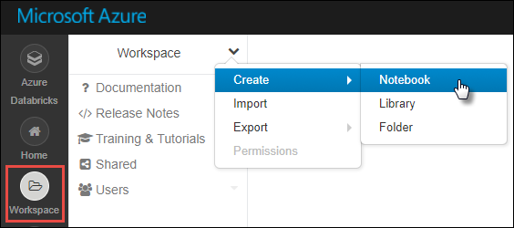

# PySpark analytics samples for Microsoft Academic Graph

Illustrates how to perform analytics for Microsoft Academic Graph using PySpark on Azure Databricks.

## Sample projects

* [Extract Affiliation ID for an Affiliation](https://github.com/Azure-Samples/microsoft-academic-graph-pyspark-samples/blob/master/src/Lab1_ExtractAffiliation.py)
* [Join Conferences and Journals as Venues](https://github.com/Azure-Samples/microsoft-academic-graph-pyspark-samples/blob/master/src/Lab2_UnionVenues.py)
* [Get publications from an Affiliation](https://github.com/Azure-Samples/microsoft-academic-graph-pyspark-samples/blob/master/src/Lab3_JoinPaperAuthorAffiliation.py)
* [Get authors from an Affiliation and the publication details](https://github.com/Azure-Samples/microsoft-academic-graph-pyspark-samples/blob/master/src/Lab4_CreateTable_Extract.py)
* [Get Field-Of-Studies for an Affiliation](https://github.com/Azure-Samples/microsoft-academic-graph-pyspark-samples/blob/master/src/Lab5_CreateTableByTvf.py)
* [Get collaborated affiliations of an Affiliation using its publications](https://github.com/Azure-Samples/microsoft-academic-graph-pyspark-samples/blob/master/src/Lab6_GetPartnerData.py)
* [Get publication and citation counts by year](https://github.com/Azure-Samples/microsoft-academic-graph-pyspark-samples/blob/master/src/Lab7_GroupByYear.py)

## Prerequisites

Before running these examples, you need to complete the following setups:

* Setting up provisioning of Microsoft Academic Graph to an Azure blob storage account. See [Get Microsoft Academic Graph on Azure storage](get-started-setup-provisioning.md).

* Setting up Azure Databricks service. See [Set up Azure Databricks](get-started-setup-databricks.md).

* Download or clone the [samples repository](https://github.com/Azure-Samples/microsoft-academic-graph-pyspark-samples)

## Gather the information that you need

Before you begin, you should have these items of information:

   :heavy_check_mark:  The name of your Azure Storage (AS) account containing MAG dataset from [Get Microsoft Academic Graph on Azure storage](get-started-setup-provisioning.md#note-azure-storage-account-name-and-primary-key).

   :heavy_check_mark:  The access key of your Azure Storage (AS) account from [Get Microsoft Academic Graph on Azure storage](get-started-setup-provisioning.md#note-azure-storage-account-name-and-primary-key).

   :heavy_check_mark:  The name of the container in your Azure Storage (AS) account containing MAG dataset.

   :heavy_check_mark:  The name of the output container in your Azure Storage (AS) account.

## Create a notebook in Azure Databricks

In this section, you create a notebook in Azure Databricks workspace.

1. In the [Azure portal](https://portal.azure.com), go to the Azure Databricks service that you created, and select **Launch Workspace**.

1. On the left, select **Workspace**. From the **Workspace** drop-down, select **Create** > **Notebook**.

    

1. In the **Create Notebook** dialog box, enter a name for the notebook. Select **Python** as the language.

    

1. Select **Create**.

## Define configration variables

In this section, you create the first notebook cell and define configration variables.

1. Copy and paste following code block into the first cell.

   ```python
   AzureStorageAccount = '<AzureStorageAccount>'     # Azure Storage (AS) account containing MAG dataset
   AzureStorageAccessKey = '<AzureStorageAccessKey>' # Access Key of the Azure Storage (AS) account
   MagContainer = '<MagContainer>'                   # The container name in Azure Storage (AS) account containing MAG dataset, Usually in forms of mag-yyyy-mm-dd
   OutputContainer = '<OutputContainer>'             # The container name in Azure Storage (AS) account where the output goes to

   MagDir = '/mnt/mag'
   OutputDir = '/mnt/output'
   ```

1. In this code block, replace `<AzureStorageAccount>`, `<AzureStorageAccessKey>`, and `<MagContainer>` placeholder values with the values that you collected while completing the prerequisites of this sample.

   |Value  |Description  |
   |---------|---------|
   |**`<AzureStorageAccount>`** | The name of your Azure Storage account. |
   |**`<AzureStorageAccessKey>`** | The access key of your Azure Storage account. |
   |**`<MagContainer>`** | The container name in Azure Storage account containing MAG dataset, Usually in the form of **mag-yyyy-mm-dd**. |
   |**`<OutputContainer>`** | The container name in Azure Storage (AS) account where the output goes to |

1. Press the **SHIFT + ENTER** keys to run the code in this block.

## Mount Azure Storage as a file system of the cluster

In this section, you mount MAG dataset in Azure Storage as a file system of the cluster.

1. Copy and paste the following code block in a new cell.

   ```
   if (any(mount.mountPoint == MagDir for mount in dbutils.fs.mounts())):
     dbutils.fs.unmount(MagDir)

   if (any(mount.mountPoint == OutputDir for mount in dbutils.fs.mounts())):
     dbutils.fs.unmount(OutputDir)

   dbutils.fs.mount(
     source = ('wasbs://%s@%s.blob.core.windows.net' % (MagContainer, AzureStorageAccount)),
     mount_point = MagDir,
     extra_configs = {('fs.azure.account.key.%s.blob.core.windows.net' % AzureStorageAccount) : AzureStorageAccessKey})

   dbutils.fs.mount(
     source = ('wasbs://%s@%s.blob.core.windows.net' % (OutputContainer, AzureStorageAccount)),
     mount_point = OutputDir,
     extra_configs = {('fs.azure.account.key.%s.blob.core.windows.net' % AzureStorageAccount) : AzureStorageAccessKey})

   dbutils.fs.ls('/mnt')
   ```

1. Press the **SHIFT + ENTER** keys to run the code in this block.

   You see an output similar to the following snippet:

   ```
   /mnt/mag has been unmounted.
   /mnt/output has been unmounted.
   Out[3]: 
   [FileInfo(path='dbfs:/mnt/mag/', name='mag/', size=0),
    FileInfo(path='dbfs:/mnt/output/', name='output/', size=0)]   Out[4]:
   ``` 

## Define functions to extract MAG data

In this section, you define functions to extract MAG data from Azure Storage (AS).

1. Copy content in script `samples/CreatePySparkFunctions.py` in MAG dataset. Paste the code into a new cell.

1. Press the **SHIFT + ENTER** keys to run the code in this block.

## Run lab scripts

1. Copy content in a lab script and paste into a new cell.

1. Press the **SHIFT + ENTER** keys to run the code in this block. Please note taht some scripts take more than 10 minutes to complete.

## View results with Microsoft Azure Storage Explorer


## Resources

* [Create an Azure Databricks service](https://azure.microsoft.com/services/databricks/).
* [Create a cluster for the Azure Databricks service](https://docs.azuredatabricks.net/user-guide/clusters/create.html).
* [Import this notebook and attach it to the cluster](https://docs.databricks.com/user-guide/notebooks/notebook-manage.html#import-a-notebook).
* [Get started with Storage Explorer](https://docs.microsoft.com/en-us/azure/vs-azure-tools-storage-manage-with-storage-explorer)
