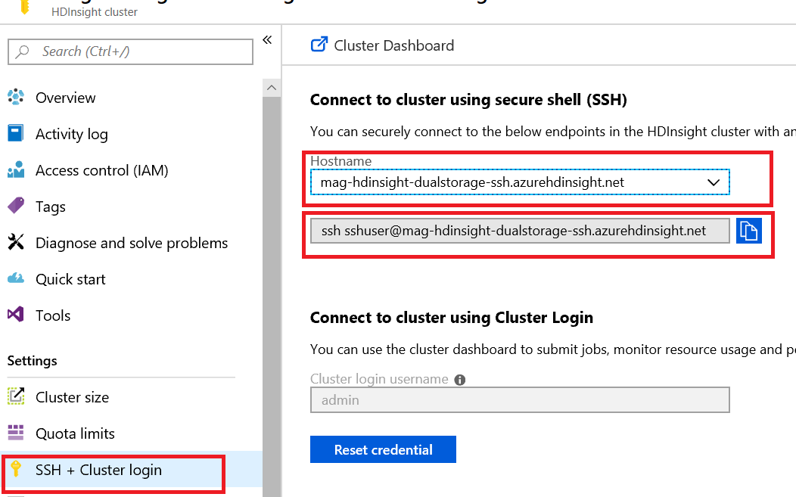
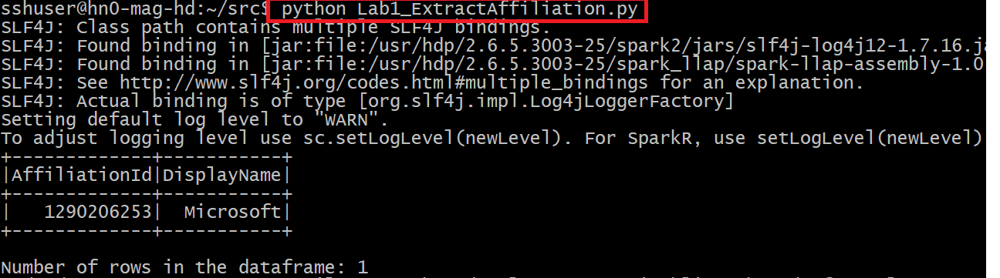

# PySpark analytics samples for Microsoft Academic Graph

Illustrates how to perform analytics for Microsoft Academic Graph using PySpark on HDInsight/Spark cluster.

## Sample projects

* [Extract Affiliation ID for an Affiliation](https://github.com/Azure-Samples/microsoft-academic-graph-pyspark-samples/blob/master/src/Lab1_ExtractAffiliation.py)
* [Join Conferences and Journals as Venues](https://github.com/Azure-Samples/microsoft-academic-graph-pyspark-samples/blob/master/src/Lab2_UnionVenues.py)
* [Get publications from an Affiliation](https://github.com/Azure-Samples/microsoft-academic-graph-pyspark-samples/blob/master/src/Lab3_JoinPaperAuthorAffiliation.py)
* [Get authors from an Affiliation and the publication details](https://github.com/Azure-Samples/microsoft-academic-graph-pyspark-samples/blob/master/src/Lab4_CreateTable_Extract.py)
* [Get Field-Of-Studies for an Affiliation](https://github.com/Azure-Samples/microsoft-academic-graph-pyspark-samples/blob/master/src/Lab5_CreateTableByTvf.py)
* [Get collaborated affiliations of an Affiliation using its publications](https://github.com/Azure-Samples/microsoft-academic-graph-pyspark-samples/blob/master/src/Lab6_GetPartnerData.py)
* [Get publication and citation counts by year](https://github.com/Azure-Samples/microsoft-academic-graph-pyspark-samples/blob/master/src/Lab7_GroupByYear.py)

## Getting started with sample projects

### Pre-requisites

* [Get Microsoft Academic Graph on Azure storage](get-started-setup-provisioning.md)
* [Use Microsoft Academic Graph with PySpark on Azure HDInsight/Spark](get-started-setup-azure-hdinsight.md)

### Quick-start

1. Download or clone the [samples repository](https://github.com/Azure-Samples/microsoft-academic-graph-pyspark-samples)
4. For each tutorial there should be: A Python script(.py).

## Working with PySpark scripts on Azure HDInsight/Spark

* How to run PySpark scripts
  * Login HDInsigth/Spark with ssh

    

  * Make sure the script file is available on HDInsight/Spark cluster. Run the script with python command.

    

* View results with Microsoft Azure Storage Explorer

    

## Resources

* [Apache Spark in Azure HDInsight](https://docs.microsoft.com/en-us/azure/hdinsight/spark/apache-spark-overview
)
* [Analyze Spark data using Power BI in HDInsight](https://docs.microsoft.com/en-us/azure/hdinsight/spark/apache-spark-overview
)
* [Apache Spark Documentation](https://spark.apache.org/docs/2.3.0/)
