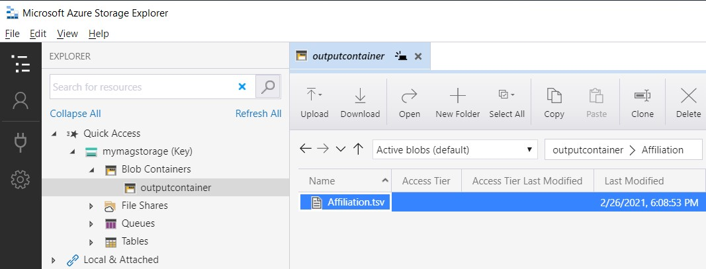

# PySpark analytics samples for Microsoft Academic Graph

Illustrates how to perform analytics for Microsoft Academic Graph using PySpark on Azure Databricks.

## Sample projects

* [Affiliation and Partner Affiliations Analysis](https://github.com/Azure-Samples/microsoft-academic-graph-pyspark-samples/blob/master/src/AffiliationSample.ipynb)
* [Repository Publications Analysis](https://github.com/Azure-Samples/microsoft-academic-graph-pyspark-samples/blob/master/src/RepositorySample.ipynb)

## Prerequisites

Before running these examples, you need to complete the following setups:

* Set up provisioning of Microsoft Academic Graph to an Azure blob storage account. See [Get Microsoft Academic Graph on Azure storage](get-started-setup-provisioning.md).

* Set up an Azure Databricks service. See [Set up Azure Databricks](get-started-setup-databricks.md).

* Download or clone the [samples repository](https://github.com/Azure-Samples/microsoft-academic-graph-pyspark-samples)

## Gather the information that you need

Before you begin, you should have these items of information:

   :heavy_check_mark:  The name of your Azure Storage (AS) account containing MAG dataset from [Get Microsoft Academic Graph on Azure storage](get-started-setup-provisioning.md#note-azure-storage-account-name-and-primary-key).

   :heavy_check_mark:  The access key of your Azure Storage (AS) account from [Get Microsoft Academic Graph on Azure storage](get-started-setup-provisioning.md#note-azure-storage-account-name-and-primary-key).

   :heavy_check_mark:  The name of the container in your Azure Storage (AS) account containing MAG dataset.

   :heavy_check_mark:  The name of the output container in your Azure Storage (AS) account.

## Import MagClass notebook

In this section, you will import the `MagClass` notebook to Azure Databricks workspace. You will run this utility notebook from other notebooks later.

Follow instructions in [Import MagClass Notebook](import-MagClass.md).

## Import and run sample notebooks

In this section, you will import and run sample notebooks.

1. Download one of the notebooks below to your local drive.

   * [Affiliation and Partner Affiliations Analysis](https://github.com/Azure-Samples/microsoft-academic-graph-pyspark-samples/blob/master/src/AffiliationSample.ipynb)
   * [Repository Publications Analysis](https://github.com/Azure-Samples/microsoft-academic-graph-pyspark-samples/blob/master/src/RepositorySample.ipynb)
   * [MAG Stanford AI Index](https://github.com/Azure-Samples/microsoft-academic-graph-pyspark-samples/blob/master/src/AIIndex.ipynb)

1. Import the notebooks to Azure Databricks workspace under the same folder as the `MagClass` notebook.

1. Attach a cluster to the notebook.

1. Press the **Run All** icon to run the notebook. Please note that some notebooks take more than 10 minutes to complete.

## Access results with Microsoft Azure Storage Explorer

You can access the output files using [Microsoft Azure Storage Explorer](https://docs.microsoft.com/azure/vs-azure-tools-storage-manage-with-storage-explorer).

## Resources

* [Create an Azure Databricks service](https://azure.microsoft.com/services/databricks/)
* [Create a cluster for the Azure Databricks service](https://docs.azuredatabricks.net/user-guide/clusters/create.html)
* [Import a Databrick notebook](https://docs.databricks.com/user-guide/notebooks/notebook-manage.html#import-a-notebook)
* [Get started with Storage Explorer](https://docs.microsoft.com/azure/vs-azure-tools-storage-manage-with-storage-explorer)
