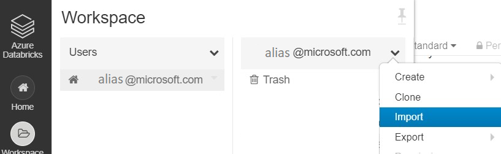

# Tutorial: Compute author h-index using Azure Databricks

In this tutorial, you compute h-index for all authors in Microsoft Academic Graph (MAG) using Azure Databricks. You extract data from Azure Storage into data frames, compute h-index, and visualize the result in table and graph forms.

## Prerequisites

Complete these tasks before you begin this tutorial:

* Setting up provisioning of Microsoft Academic Graph to an Azure blob storage account. See [Get Microsoft Academic Graph on Azure storage](get-started-setup-provisioning.md).

* Setting up Azure Databricks service. See [Set up Azure Databricks](get-started-setup-databricks.md).

## Gather the information that you need

   Before you begin, you should have these items of information:

   :heavy_check_mark:  The name of your Azure Storage (AS) account containing MAG dataset from [Get Microsoft Academic Graph on Azure storage](get-started-setup-provisioning.md#note-azure-storage-account-name-and-primary-key).

   :heavy_check_mark:  The access key of your Azure Storage (AS) account from [Get Microsoft Academic Graph on Azure storage](get-started-setup-provisioning.md#note-azure-storage-account-name-and-primary-key).

   :heavy_check_mark:  The name of the container in your Azure Storage (AS) account containing MAG dataset.

## Import MagClass notebook

In this section, you import MagClass notebook into Azure Databricks workspace. You will include this notebook in this sample later.

Follow instructions in [Import MagClass Notebook](import-magclass.md).

## Import HIndexDatabricksSample notebook

In this section, you import HIndexDatabricksSample notebook into Azure Databricks workspace and run the notebook.

1. Save **`sample/HIndexDatabricksSample.py`** in MAG dataset to local drive.

1. In Azure Databricks workspace portal, from the **Workspace** > **Users** > **Your folder** drop-down, select **Import**.

    

1. Drag and drop NetworkSimilaritySample.py to the **Import Notebook** dialog box.

    

1. Select **Import**.

1. Click **Run All** button.

## Notebook description

### Initialize storage account and container details

  | Variable  | Value | Description  |
  | --------- | --------- | --------- |
  | AzureStorageAccount | Replace **`<AzureStorageAccount>`**. | This is the Azure Storage account containing MAG dataset. |
  | AzureStorageAccessKey | Replace **`<AzureStorageAccessKey>`**. | This is the Access Key of the Azure Storage account. |
  | MagContainer | Replace **`<MagContainer>`**. | This is the container name in Azure Storage account containing MAG dataset, usually in the form of mag-yyyy-mm-dd. |
  | OutputContainer | Replace **`<OutputContainer>`**. | This is the container name in Azure Storage account where the output goes to. |

### Define MicrosoftAcademicGraph class

Run MagClass notebook to define MicrosoftAcademicGraph class.

   ```python
   %run "./MagClass"
   ```

### Create a MicrosoftAcademicGraph instance to access MAG dataset
Use account=AzureStorageAccount, key=AzureStorageAccessKey, container=MagContainer.

   ```python
   MAG = MicrosoftAcademicGraph(account=AzureStorageAccount, key=AzureStorageAccessKey, container=MagContainer
   ```

### Import python libraries

   ```python
   from pyspark.sql import functions as F
   from pyspark.sql.window import Window
   ```

### Get affiliations

   ```python
   Affiliations = MAG.getDataframe('Affiliations')
   Affiliations = Affiliations.select(Affiliations.AffiliationId, Affiliations.DisplayName)
   Affiliations.show(3)
   ```

   ```
   +-------------+--------------------+
   |AffiliationId|         DisplayName|
   +-------------+--------------------+
   |     20455151|         Air Liquide|
   |     24386293|Hellenic National...|
   |     32956416|Catholic Universi...|
   +-------------+--------------------+
   only showing top 3 rows
   ``` 

### Get authors

   ```python
   Authors = MAG.getDataframe('Authors')
   Authors = Authors.select(Authors.AuthorId, Authors.DisplayName, Authors.LastKnownAffiliationId, Authors.PaperCount)
   Authors.show(3)
   ```

   ```
   +--------+--------------------+----------------------+----------+
   |AuthorId|         DisplayName|LastKnownAffiliationId|PaperCount|
   +--------+--------------------+----------------------+----------+
   |     584|Gözde Özdikmenli-...|              79946792|         2|
   |     859|          Gy. Tolmár|                  null|         2|
   |     978|      Ximena Faúndez|             162148367|        18|
   +--------+--------------------+----------------------+----------+
   only showing top 3 rows
   ``` 
### Get (author, paper) pairs

   ```python
   PaperAuthorAffiliations = MAG.getDataframe('PaperAuthorAffiliations')
   AuthorPaper = PaperAuthorAffiliations.select(PaperAuthorAffiliations.AuthorId, PaperAuthorAffiliations.PaperId).distinct()
   AuthorPaper.show(3)
   ```

   ```
   +----------+--------+
   |  AuthorId| PaperId|
   +----------+--------+
   |2121966975|94980387|
   |2502082315|94984326|
   |2713129682|94984597|
   +----------+--------+
   only showing top 3 rows
   ``` 

### Get papers and estimated citation

Treat papers with same FamilyId as a single paper and sum EstimatedCitation for all papers wiht the same FamilyId

   ```python
   Papers = MAG.getDataframe('Papers')

   p = Papers.where(Papers.EstimatedCitation > 0) \
      .select(F.when(Papers.FamilyId.isNull(), Papers.PaperId) \
      .otherwise(Papers.FamilyId).alias('PaperId'), Papers.EstimatedCitation) \
      .alias('p')

   PaperCitation = p \
      .groupBy(p.PaperId) \
      .agg(F.sum(p.EstimatedCitation).alias('EstimatedCitation'))
   ```

### Generate author, paper, citation dataframe

   ```python
   AuthorPaperCitation = AuthorPaper \
      .join(PaperCitation, AuthorPaper.PaperId == PaperCitation.PaperId, 'inner') \
      .select(AuthorPaper.AuthorId, AuthorPaper.PaperId, PaperCitation.EstimatedCitation)
   ```

### Order by citation

   ```python
   ap = AuthorPaperOrderByCitation.alias('ap')
   AuthorHIndexTemp = ap \
      .groupBy(ap.AuthorId) \
      .agg(F.sum(ap.EstimatedCitation).alias('TotalEstimatedCitation'), \
            F.max(F.when(ap.EstimatedCitation >= ap.Rank, ap.Rank).otherwise(0)).alias('HIndex'))
   ```

### Get author detail information

   ```python
   i = AuthorHIndexTemp.alias('i')
   a = Authors.alias('a')
   af = Affiliations.alias('af')

   AuthorHIndex = i \
      .join(a, a.AuthorId == i.AuthorId, 'inner') \
      .join(af, a.LastKnownAffiliationId == af.AffiliationId, 'outer') \
      .select(i.AuthorId, a.DisplayName, af.DisplayName.alias('AffiliationDisplayName'), a.PaperCount, i.TotalEstimatedCitation, i.HIndex)
   ```

### Display top authors and visualize the result

   ```python
   TopAuthorHIndex = AuthorHIndex \
      .select(AuthorHIndex.DisplayName, AuthorHIndex.AffiliationDisplayName, AuthorHIndex.PaperCount, AuthorHIndex.TotalEstimatedCitation, AuthorHIndex.HIndex) \
      .orderBy(F.desc('HIndex')) \
      .limit(100)
   display(TopAuthorHIndex)
   ```

1. Select the **table** icon to see result in table form.

   

1. Select the **graph** icon to see result in graph form.

   

## Clean up resources

After you finish the tutorial, you can terminate the cluster. From the Azure Databricks workspace, select **Clusters** on the left. For the cluster to terminate, under **Actions**, point to the ellipsis (...) and select the **Terminate** icon.


If you don't manually terminate the cluster, it automatically stops, provided you selected the **Terminate after \_\_ minutes of inactivity** check box when you created the cluster. In such a case, the cluster automatically stops if it's been inactive for the specified time.

## Resources

* [Create an Azure Databricks service](https://azure.microsoft.com/services/databricks/).
* [Create a cluster for the Azure Databricks service](https://docs.azuredatabricks.net/user-guide/clusters/create.html).
* [Import this notebook and attach it to the cluster](https://docs.databricks.com/user-guide/notebooks/notebook-manage.html#import-a-notebook).
* [H-index](https://en.wikipedia.org/wiki/H-index)
