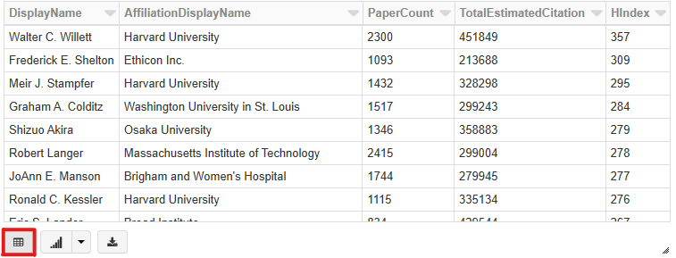

# Tutorial: Compute author h-index using Azure Databricks

In this tutorial, you compute h-index for all authors in Microsoft Academic Graph (MAG) using Azure Databricks. You extract data from Azure Storage into data frames, compute h-index, and visualize the result in table and graph forms.

## Prerequisites

Complete these tasks before you begin this tutorial:

* Setting up provisioning of Microsoft Academic Graph to an Azure blob storage account. See [Get Microsoft Academic Graph on Azure storage](get-started-setup-provisioning.md).

* Setting up Azure Databricks service. See [Set up Azure Databricks](get-started-setup-databricks.md).

## Gather the information that you need

   Before you begin, you should have these items of information:

   :heavy_check_mark:  The name of your Azure Storage (AS) account containing MAG dataset from [Get Microsoft Academic Graph on Azure storage](get-started-setup-provisioning.md#note-azure-storage-account-name-and-primary-key).

   :heavy_check_mark:  The access key of your Azure Storage (AS) account from [Get Microsoft Academic Graph on Azure storage](get-started-setup-provisioning.md#note-azure-storage-account-name-and-primary-key).

   :heavy_check_mark:  The name of the container in your Azure Storage (AS) account containing MAG dataset.

## Import PySparkMagClass.py as a notebook

In this section, you import PySparkMagClass.py as a shared notebook in Azure Databricks workspace. You could run this utility notebook from other notebooks later.

1. Save samples\PySparkMagClass.py in MAG dataset to local drive.

1. In the [Azure portal](https://portal.azure.com), go to the Azure Databricks service that you created, and select **Launch Workspace**.

1. On the left, select **Workspace**. From the **Workspace** > **Shared** drop-down, select **Import**.

    
    
1. Drag and drop PySparkMagClass.py to the **Import Notebook** dialog box

    

1. Select **Import**. This will create a notebook with path `"/Shared/PySparkMagClass"`. No need to run this notebook.

   > [!NOTE]
   > When importing this notebook under **Shared** folder. The full path of this notebook is `"/Shared/PySparkMagClass"`. If you import it under other folders, note the actual full path and use it in following sections.

## Create a new notebook

In this section, you create a new notebook in Azure Databricks workspace.

1. On the left, select **Workspace**. From the **Workspace** drop-down, select **Create** > **Notebook**. Optionally, you could create this notebook in **Users** level.

    

1. In the **Create Notebook** dialog box, enter a name for the notebook. Select **Python** as the language.

    

1. Select **Create**.

## Create first notebook cell

In this section, you create the first notebook cell to run PySparkMagClass notebook.

1. Copy and paste following code block into the first cell.

   ```python
   %run "/Shared/PySparkMagClass"
   ```

1. Press the **SHIFT + ENTER** keys to run the code in this block. It defines MicrosoftAcademicGraph class.

## Define configration variables

In this section, you add a new notebook cell and define configration variables.

1. Copy and paste following code block into the first cell.

   ```python
   # Define configration variables
   AzureStorageAccount = '<AzureStorageAccount>'     # Azure Storage (AS) account containing MAG dataset
   AzureStorageAccessKey = '<AzureStorageAccessKey>' # Access Key of the Azure Storage (AS) account
   MagContainer = '<MagContainer>'                   # The container name in Azure Storage (AS) account containing MAG dataset, Usually in forms of mag-yyyy-mm-dd
   ```

1. In this code block, replace `<AzureStorageAccount>`, `<AzureStorageAccessKey>`, and `<MagContainer>` placeholder values with the values that you collected while completing the prerequisites of this sample.

   |Value  |Description  |
   |---------|---------|
   |**`<AzureStorageAccount>`** | The name of your Azure Storage account. |
   |**`<AzureStorageAccessKey>`** | The access key of your Azure Storage account. |
   |**`<MagContainer>`** | The container name in Azure Storage account containing MAG dataset, Usually in the form of **mag-yyyy-mm-dd**. |

1. Press the **SHIFT + ENTER** keys to run the code in this block.

## Create a MicrosoftAcademicGraph instance

In this section, you create a MicrosoftAcademicGraph instance to access MAG dataset.

1. Copy and paste the following code block in a new cell.

   ```python
   # Create a MicrosoftAcademicGraph instance to access MAG dataset
   MAG = MicrosoftAcademicGraph(container=MagContainer, account=AzureStorageAccount, key=AzureStorageAccessKey)
   ```

1. Press the **SHIFT + ENTER** keys to run the code in this block.

## Import functions

In this section, you import pyspark sql functions.

1. Copy and paste the following code block in a new cell. Press the **SHIFT + ENTER** keys to run the code in this block.

   ```python
   from pyspark.sql import functions as F
   from pyspark.sql.window import Window
   ```

## Create data frames for MAG entities

In this section you will create data frames for several different MAG entities. These data frames will be used later on in the tutorial. Note that some of the cells might take several minutes to run.

1. Get **Affiliations**. Paste the following code in a new cell.

   ```python
   # Get affiliations
   Affiliations = MAG.getDataframe('Affiliations')
   Affiliations = Affiliations.select(Affiliations.AffiliationId, Affiliations.DisplayName)
   Affiliations.show(3)
   ```

   Press the **SHIFT + ENTER** keys to run the code in this block. You see an output similar to the following snippet:

   ```
   +-------------+--------------------+
   |AffiliationId|         DisplayName|
   +-------------+--------------------+
   |     20455151|         Air Liquide|
   |     24386293|Hellenic National...|
   |     32956416|Catholic Universi...|
   +-------------+--------------------+
   only showing top 3 rows
   ``` 

1. Get **Authors**. Paste the following code in a new cell.

   ```python
   # Get authors
   Authors = MAG.getDataframe('Authors')
   Authors = Authors.select(Authors.AuthorId, Authors.DisplayName, Authors.LastKnownAffiliationId, Authors.PaperCount)
   Authors.show(3)
   ```

   Press the **SHIFT + ENTER** keys to run the code in this block. You see an output similar to the following snippet:

   ```
   +--------+--------------------+----------------------+----------+
   |AuthorId|         DisplayName|LastKnownAffiliationId|PaperCount|
   +--------+--------------------+----------------------+----------+
   |     584|Gözde Özdikmenli-...|              79946792|         2|
   |     859|          Gy. Tolmár|                  null|         2|
   |     978|      Ximena Faúndez|             162148367|        18|
   +--------+--------------------+----------------------+----------+
   only showing top 3 rows
   ``` 

1. Get **(Author, Paper) pairs**. Paste the following code in a new cell.

   ```python
   # Get (author, paper) pairs
   PaperAuthorAffiliations = MAG.getDataframe('PaperAuthorAffiliations')
   AuthorPaper = PaperAuthorAffiliations.select(PaperAuthorAffiliations.AuthorId, PaperAuthorAffiliations.PaperId).distinct()
   AuthorPaper.show(3)
   ```

   Press the **SHIFT + ENTER** keys to run the code in this block. You see an output similar to the following snippet:

   ```
   +----------+--------+
   |  AuthorId| PaperId|
   +----------+--------+
   |2121966975|94980387|
   |2502082315|94984326|
   |2713129682|94984597|
   +----------+--------+
   only showing top 3 rows
   ``` 

1. Get **(Paper, EstimatedCitation) pairs**. Paste the following code in a new cell. Press the **SHIFT + ENTER** keys to run the code in this block.

   ```python
   # Get (Paper, EstimatedCitation). Treat papers with same FamilyId as a single paper and sum the EstimatedCitation
   Papers = MAG.getDataframe('Papers')
   p = Papers.where(Papers.EstimatedCitation > 0) \
     .select(F.when(Papers.FamilyId.isNull(), Papers.PaperId).otherwise(Papers.FamilyId).alias('PaperId'), \
             Papers.EstimatedCitation) \
     .alias('p')

   PaperCitation = p \
     .groupBy(p.PaperId) \
     .agg(F.sum(p.EstimatedCitation).alias('EstimatedCitation'))
   ```

   You have now extracted MAG data from Azure Storage into Azure Databricks.

## Compute author h-index

In this section, you compute h-index for all authors.

1. **Create an author-paper-citation view**. Paste the following code in a new cell. Press the **SHIFT + ENTER** keys to run the code in this block.

   ```python
   # Generate author, paper, citation view
   AuthorPaperCitation = AuthorPaper \
       .join(PaperCitation, AuthorPaper.PaperId == PaperCitation.PaperId, 'inner') \
       .select(AuthorPaper.AuthorId, AuthorPaper.PaperId, PaperCitation.EstimatedCitation)
   ```

1. **Order AuthorPaperCitation view by citation**. Paste the following code in a new cell. Press the **SHIFT + ENTER** keys to run the code in this block.

   ```python
   # Order author, paper, citation view by citation
   AuthorPaperOrderByCitation = AuthorPaperCitation \
     .withColumn('Rank', F.row_number().over(Window.partitionBy('AuthorId').orderBy(F.desc('EstimatedCitation'))))
   ```

1. **Compute h-index for all authors**. Paste the following code in a new cell. Press the **SHIFT + ENTER** keys to run the code in this block.

   ```python
   # Generate author hindex
   ap = AuthorPaperOrderByCitation.alias('ap')
   AuthorHIndexTemp = ap \
     .groupBy(ap.AuthorId) \
     .agg(F.sum(ap.EstimatedCitation).alias('TotalEstimatedCitation'), \
          F.max(F.when(ap.EstimatedCitation >= ap.Rank, ap.Rank).otherwise(0)).alias('HIndex'))
   ```

1. **Get author detail information**. Paste the following code in a new cell. Press the **SHIFT + ENTER** keys to run the code in this block.

   ```python
   # Get author detail information
   i = AuthorHIndexTemp.alias('i')
   a = Authors.alias('a')
   af = Affiliations.alias('af')

   AuthorHIndex = i \
     .join(a, a.AuthorId == i.AuthorId, 'inner') \
     .join(af, a.LastKnownAffiliationId == af.AffiliationId, 'outer') \
     .select(i.AuthorId, a.DisplayName, af.DisplayName.alias('AffiliationDisplayName'), a.PaperCount, i.TotalEstimatedCitation, i.HIndex)

   AuthorHIndex.createOrReplaceTempView('AuthorHIndex')
   ```

## Query and visualize result 

In this section, you query top authors by h-index and visualize the result.

1. Query top authors with highest h-index. Paste the following code in a new cell. Press the **SHIFT + ENTER** keys to run the code in this block.

   ```sql
   %sql
   -- Filter authors with top hindex
   SELECT
       DisplayName,
       AffiliationDisplayName,
       PaperCount,
       TotalEstimatedCitation,
       HIndex
   FROM AuthorHIndex 
   ORDER BY HIndex DESC, AuthorId
   LIMIT 100;
   ```

1. Select the **table** icon to see result in table form.

   

1. Select the **graph** icon to see result in graph form.

   

## Clean up resources

After you finish the tutorial, you can terminate the cluster. From the Azure Databricks workspace, select **Clusters** on the left. For the cluster to terminate, under **Actions**, point to the ellipsis (...) and select the **Terminate** icon.


If you don't manually terminate the cluster, it automatically stops, provided you selected the **Terminate after \_\_ minutes of inactivity** check box when you created the cluster. In such a case, the cluster automatically stops if it's been inactive for the specified time.

## Resources

* [Create an Azure Databricks service](https://azure.microsoft.com/services/databricks/).
* [Create a cluster for the Azure Databricks service](https://docs.azuredatabricks.net/user-guide/clusters/create.html).
* [Import this notebook and attach it to the cluster](https://docs.databricks.com/user-guide/notebooks/notebook-manage.html#import-a-notebook).
* [H-index](https://en.wikipedia.org/wiki/H-index)
