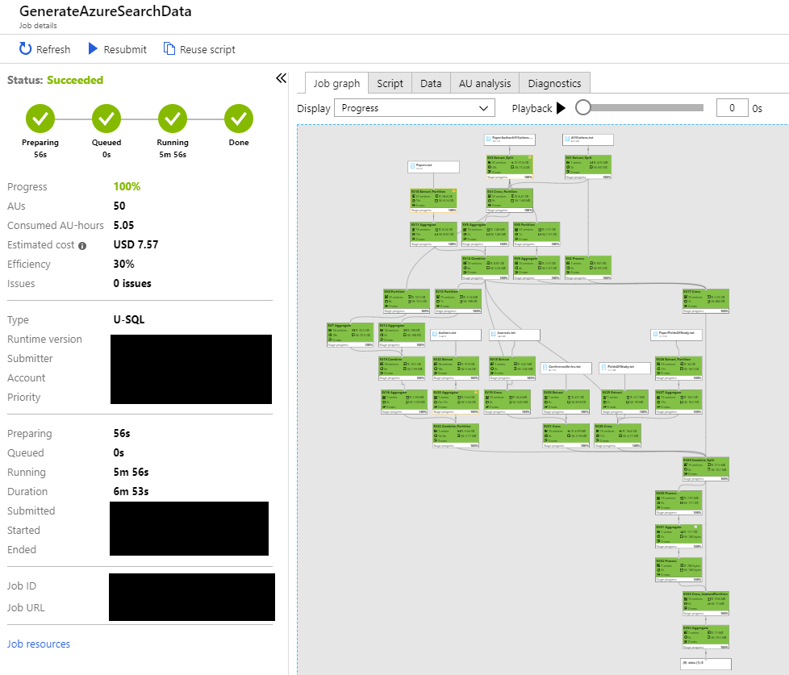
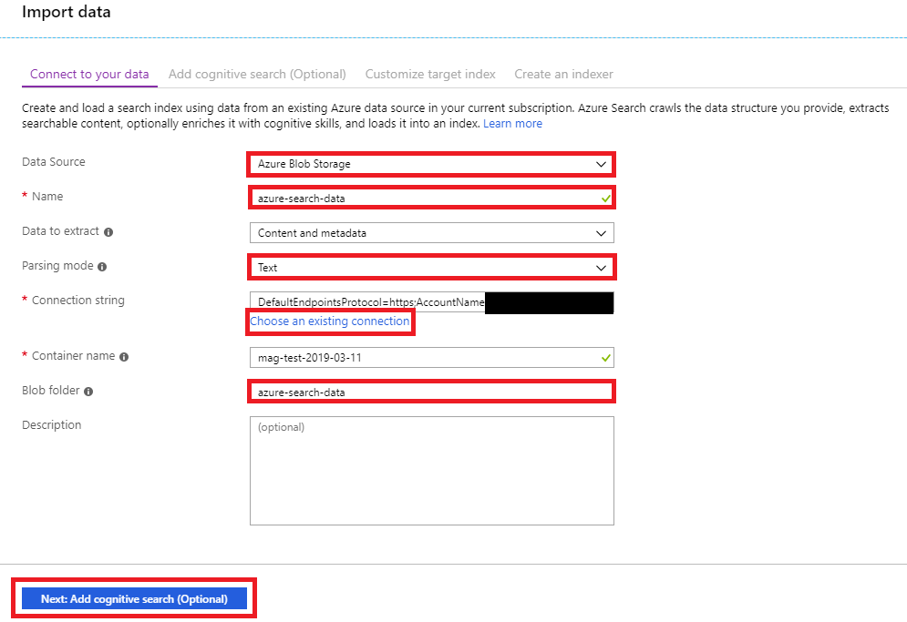
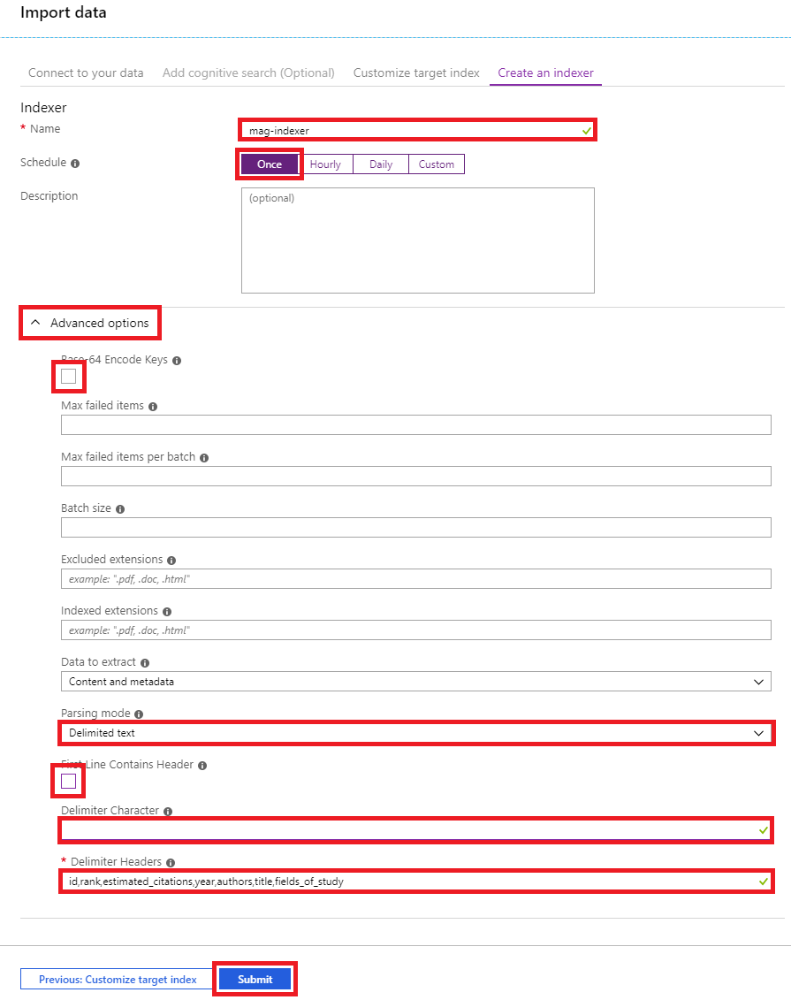
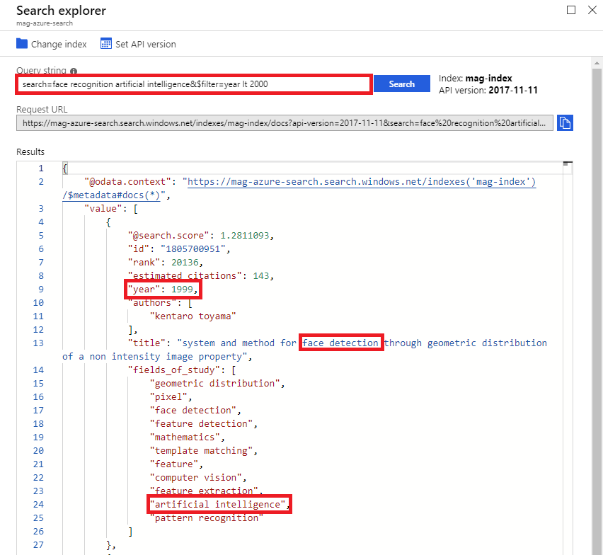

# Tutorial: Set up organizational patent search with Azure Search

Step-by-step instructions for setting up an Azure Search service to do organizational patent search using the Microsoft Academic Graph.

## Prerequisites

Complete these tasks before beginning this tutorial:

* [Set up provisioning of Microsoft Academic Graph to an Azure blob storage account](get-started-setup-provisioning.md)
* [Set up Azure Data Lake Analytics for Microsoft Academic Graph](get-started-setup-azure-data-lake-analytics.md).

## Gather the information that you need

   Before you begin, you should have these items of information:

   :heavy_check_mark:  The name of your Azure Storage (AS) account containing MAG dataset from [Get Microsoft Academic Graph on Azure storage](get-started-setup-provisioning.md).

   :heavy_check_mark:  The name of your Azure Data Lake Analytics (ADLA) service from [Set up Azure Data Lake Analytics](get-started-setup-azure-data-lake-analytics.md).

   :heavy_check_mark:  The name of your Azure Data Lake Storage (ADLS) from [Set up Azure Data Lake Analytics](get-started-setup-azure-data-lake-analytics.md).

   :heavy_check_mark:  The name of the container in your Azure Storage (AS) account containing MAG dataset.

## Generate text documents for academic data

In prerequisite [Set up Azure Data Lake Analytics](get-started-setup-azure-data-lake-analytics.md), you added the Azure Storage (AS) created for MAG provision as a data source for the Azure Data Lake Analytics service (ADLA). In this section, you submit an ADLA job to generate text files containing academic data that will be used to create an Azure Search service.

1. In the [Azure portal](https://portal.azure.com), go to the Azure Data Lake Analytics (ADLA) service that you created, and select **Overview** > **New Job**.

   

1. Copy and paste the following code block in the script window.

```U-SQL
SET @@FeaturePreviews = "DataPartitionedOutput:on";

// Make sure to run CreateFunctions script from common scripts first!

DECLARE @azureSearchIndexerCount int = 1;
DECLARE @dataPartitionCount int = 10;

DECLARE @blobAccount string = "<AzureStorageAccount>";
DECLARE @dataVersion string = "<MagContainer>";

DECLARE @uriPrefix string = "wasb://" + @dataVersion + "@" + @blobAccount + "/";
DECLARE @output = "wasb://" + @dataVersion + "@" + @blobAccount + "/azure-search-data/{PartitionNumber}-data.{ForIndexerNumber}";

//
// Load academic data
//
@papers =
    Papers
    (
        @uriPrefix
    );

@papers =
    SELECT *,
           (JournalId == null? (long) - 1 : JournalId.Value) AS JId,
           (ConferenceSeriesId == null? (long) - 1 : ConferenceSeriesId.Value) AS CId
    FROM @papers;

@paperAuthorAffiliations =
    PaperAuthorAffiliations
    (
        @uriPrefix
    );

@paperAuthorAffiliations =
    SELECT *,
           (AffiliationId == null? (long) - 1 : AffiliationId.Value) AS AfId
    FROM @paperAuthorAffiliations;

@authors =
    Authors
    (
        @uriPrefix
    );

@affiliations =
    Affiliations
    (
        @uriPrefix
    );

@paperFieldsOfStudy =
    PaperFieldsOfStudy
    (
        @uriPrefix
    );

@fieldsOfStudy =
    FieldsOfStudy
    (
        @uriPrefix
    );

//
// Filter academic data to only include patents published in affiliation with Microsoft
//
@papers =
    SELECT DISTINCT P.*
    FROM @papers AS P
         INNER JOIN
             @paperAuthorAffiliations AS Paa
         ON P.PaperId == Paa.PaperId
         INNER JOIN
             @affiliations AS A
         ON Paa.AfId == A.AffiliationId
    WHERE A.NormalizedName == "microsoft" AND P.DocType == "Patent";

//
// Filter paper affiliations, authors and fields of study using filtered papers, then flatten into string associated with each paper
//
@paperAuthorsDistinct =
    SELECT DISTINCT A.PaperId,
                    A.AuthorId,
                    A.AuthorSequenceNumber
    FROM @paperAuthorAffiliations AS A
    INNER JOIN @papers AS P
        ON A.PaperId == P.PaperId;

@paperAuthors =
    SELECT P.PaperId,
           A.NormalizedName AS AuthorName,
           P.AuthorSequenceNumber
    FROM @paperAuthorsDistinct AS P
         INNER JOIN
             @authors AS A
         ON P.AuthorId == A.AuthorId;

@paperAuthorsAggregated =
    SELECT PaperId,
           "[" + string.Join(",", MAP_AGG("\"" + AuthorName + "\"", AuthorSequenceNumber).OrderBy(a => a.Value).Select(a => a.Key)) + "]" AS Authors
    FROM @paperAuthors
    GROUP BY PaperId;

@paperFieldsOfStudyDistinct =
    SELECT DISTINCT A.PaperId,
                    A.FieldOfStudyId
    FROM @paperFieldsOfStudy AS A
    INNER JOIN @papers AS P
        ON A.PaperId == P.PaperId;

@paperFieldsOfStudyDistinct =
    SELECT P.PaperId,
           F.NormalizedName AS FieldOfStudyName
    FROM @paperFieldsOfStudyDistinct AS P
         INNER JOIN
             @fieldsOfStudy AS F
         ON P.FieldOfStudyId == F.FieldOfStudyId;

@paperFieldsOfStudyAggregated =
    SELECT PaperId,
           "[" + string.Join(",", ARRAY_AGG("\"" + FieldOfStudyName + "\"")) + "]" AS FieldsOfStudy
    FROM @paperFieldsOfStudyDistinct
    GROUP BY PaperId;

//
// Generate tab delimited text files containing the partitioned academic data we filtered/flattened above
//
@paperDocumentFields =
    SELECT P.PaperId,
           P.Rank,
           P.EstimatedCitation,
           P.Year,
           A.Authors,
           P.PaperTitle,
           F.FieldsOfStudy,
           (int) (P.PaperId % @azureSearchIndexerCount) AS ForIndexerNumber,
           (int) (P.PaperId % @dataPartitionCount) AS PartitionNumber
    FROM @papers AS P
         LEFT OUTER JOIN
             @paperAuthorsAggregated AS A
         ON P.PaperId == A.PaperId
         LEFT OUTER JOIN
             @paperFieldsOfStudyAggregated AS F
         ON P.PaperId == F.PaperId;

//
// Generates partitioned files based on the values in the ForIndexerNumber and PartitionNumber columns
//
OUTPUT @paperDocumentFields
TO @output
USING Outputters.Tsv(quoting : false);

```

1. In this code block, replace `<AzureStorageAccount>`, and `<MagContainer>` placeholder values with the values that you collected while completing the prerequisites of this sample

   |Value  |Description  |
   |---------|---------|
   |**`<AzureStorageAccount>`** | The name of your Azure Storage (AS) account containing MAG dataset. |
   |**`<MagContainer>`** | The container name in Azure Storage (AS) account containing MAG dataset, Usually in the form of **mag-yyyy-mm-dd**. |

    > [!TIP]
    > This tutorial uses Microsoft as an organization by default. You can target any organization by finding its NormalizedName in the Microsoft Academic Graph and then changing 'WHERE A.NormalizedName == "microsoft" AND P.DocType == "Patent"' to 'WHERE A.NormalizedName == "org_name" AND P.DocType == "Patent"'.
    >
    > Please note that doing this may impact time estimates for script execution and index generation later on in this tutorial.

1. Provide a **Job name**, change **AUs** to 50, and select **Submit**

   

1. The job should finish successfully in about 5 minutes

   

## Create Azure Search service for academic data

1. Go to the Azure Management Portal and create a new Azure Search service

   

1. Enter information for a new service then click the create button

    

    1. Enter a unique name for the service
    1. Create a new resource group for the service with the same name as the service
    1. To ensure the best performance, use the same location as the Azure storage account containing the Microsoft Academic Graph data
    1. Use the "basic" price tier

1. Once the new service has been created, navigate to the overview section of the service and click "import data"

   

1. Enter details to connect the Azure storage account containing the text documents generated earlier

   

    1. Select "Azure Blob Storage" as a data source
    1. Enter "azure-search-data" for the data source name
    1. Change parsing mode to "Text"
    1. Click the "Choose an existing connection" link to select the Azure storage account and container containing the Microsoft Academic Graph data used when generating the text documents earlier
    1. Enter "azure-search" for the blob folder
    1. Click the "Next: Add cognitive search (Optional)" button

1. This tutorial does not cover adding cognitive skills, so simply click the "Skip to: Customize target index" button

   

1. Customize the target index using information below

   

    1. Enter "mag-index" for the index name
    1. Add the fields created in the text documents, their type and how they should be indexed

        Field name | Type | Retrievable | Filterable | Sortable | Facetable | Searchable
        --- | --- | --- | --- | --- | --- | ---
        id | Edm.String | Yes | No | No | No | No
        rank | Edm.Int32 | Yes | Yes | Yes | No | N/A
        estimated_citations | Edm.Int32 | Yes | Yes | Yes | No | N/A
        year | Edm.Int32 | Yes | Yes | Yes | No | N/A
        authors | Collection(Edm.String) | Yes | No | N/A | No | Yes
        title | Edm.String | Yes | No | No | No | Yes
        fields_of_study | Collection(Edm.String) | Yes | No | N/A | No | Yes

    1. Change the key from "metadata_storage_path" to "id"
    1. Click each of the pre-generated field names and then click the "delete" button

       

    1. Click the "Next: Create an indexer" button

1. Set up an indexer to index the text documents generated earlier

    

    1. Enter "mag-indexer" for the indexer name
    1. Set the indexer schedule to only run a single time by clicking "once"
    1. Expand the "Advanced options" section
    1. Deselect the "Base 64 Encode Keys" check box
    1. Change parsing mode to "Delimited text"
    1. Deselect the "First Line Contains Headers" check box
    1. Enter a tab character for the delimiter character
        > [!TIP]
        > Unfortunately you can't press the "tab" key to have it insert a tab character. Instead highlight the space between the following quotation marks and copy/paste the character into the delimiter character field: "&#9;"
    1. Enter "id,rank,estimated_citations,year,authors,title,fields_of_study" for the delimiter headers
    1. Click the "Submit" button

After clicking the "submit" button, a new data source, indexer and index are generated in the Azure Search service. Assuming you used the default "microsoft" filter specified in the U-SQL script template, the indexing process should take between 5-15 minutes.

Once completed, the indexer should show a "success" status:


## Querying the Azure Search service

Once the indexer has completed, you can immediately begin querying the service by clicking the "Search explorer" button from the overview section:


### Example: Patents about search indexers


### Example: Patents about face recognition and AI created before 2000



> [!NOTE]
> This example makes use of filter expressions to restrict which content is considered before looking for the search terms. See the [Azure Search filter expression](https://docs.microsoft.com/en-us/azure/search/search-explorer#filter-expressions-greater-than-less-than-equal-to) documentation for more details.

## Next steps

If you're interested in creating a more comprehensive Azure Search service using the full Microsoft Academic Graph, take a look at our reference parsing tutorial.

> [!div class="nextstepaction"]
>[Academic citation parsing](tutorial-azure-search-citation-parsing.md)

## Resources

* [Get started with Azure Data Lake Analytics using Azure portal](https://docs.microsoft.com/azure/data-lake-analytics/data-lake-analytics-get-started-portal)
* [Data Lake Analytics](https://azure.microsoft.com/services/data-lake-analytics/)
* [U-SQL Language Reference](https://docs.microsoft.com/u-sql/)
* [Azure Search](https://docs.microsoft.com/en-us/azure/search/)
