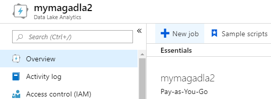
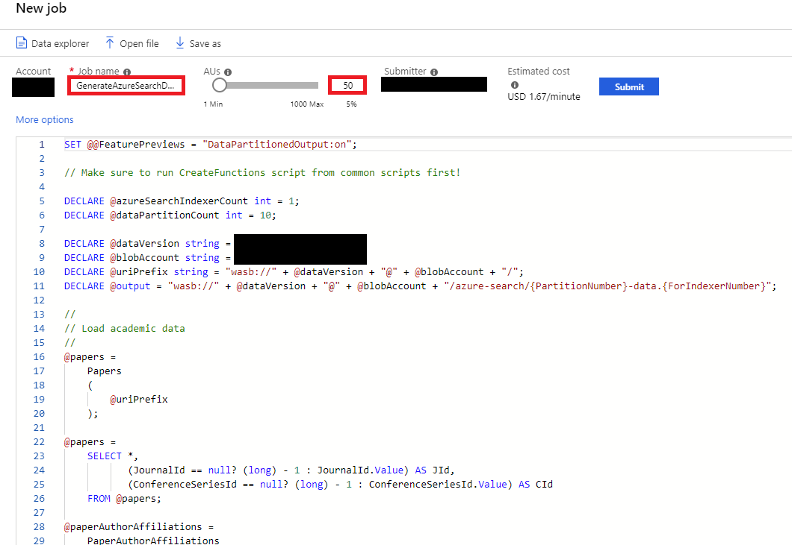
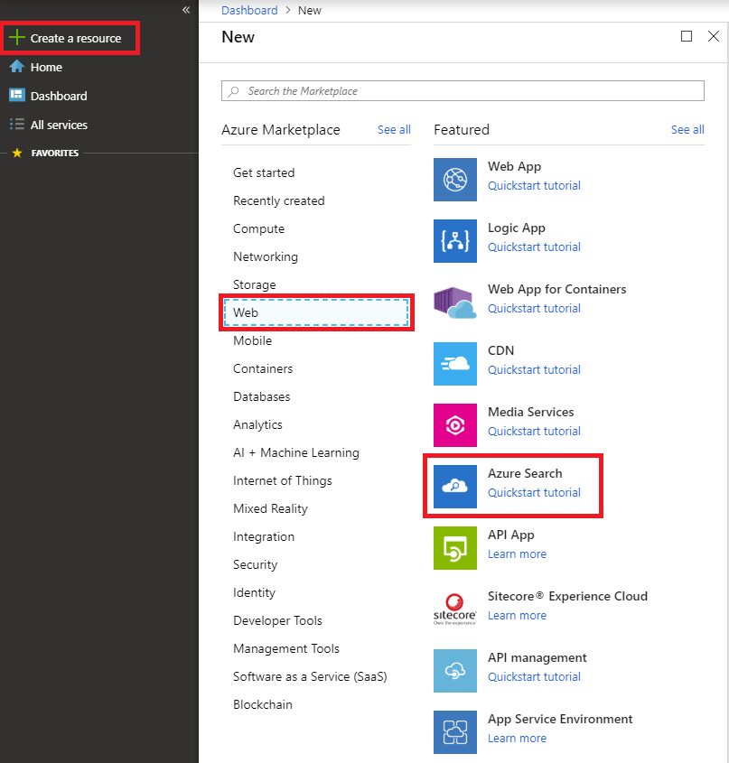
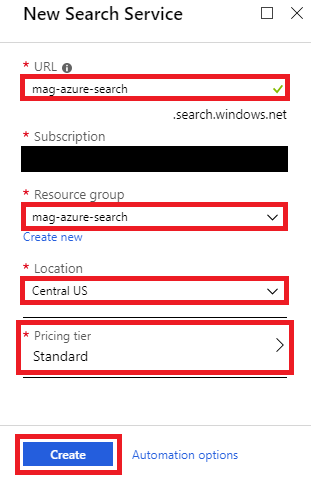
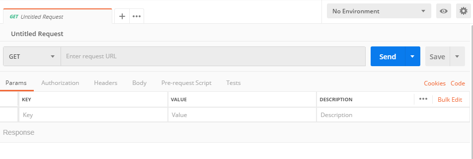
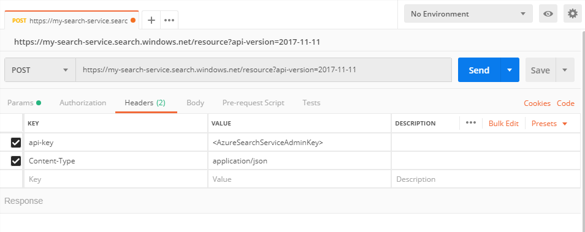
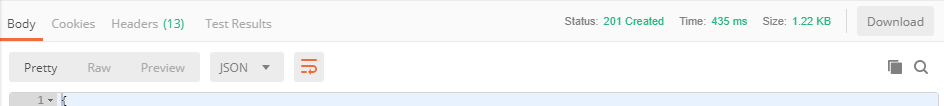
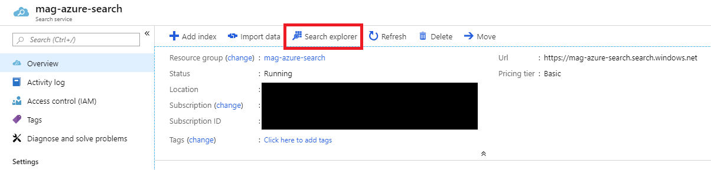

# Tutorial: Set up academic reference parsing with Azure Search

This tutorial provides step-by-step instructions for setting up an Azure Search service that enables full-text search of all paper entities in the Microsoft Academic Graph, and is optimized for queries using academic reference (citation) strings.

After completing this tutorial, you should be able to:

* Transform academic entities into text documents suitable for full-text indexing
* Create an Azure Search service
* Create Azure Search service data sources, indexers and indexes using the REST API
* Perform full-text searches using the Azure Search "search explorer" tool
* Perform full-text searches using the Azure Search REST API

> [!WARNING]
> This is an **advanced** tutorial that creates an Azure Search service that indexes **all of the papers in the Microsoft Academic Graph**.
>
> Because of the large scope of the data in the Microsoft Academic Graph, the Azure Search service requires a significant amount of time and resources to both setup and keep online.
>
> Please take the time to familiarize yourself with the costs associated with Azure Search in the [capacity planning](https://docs.microsoft.com/azure/search/search-sku-tier) documentation.

## Prerequisites

Complete these tasks before beginning this tutorial:

* [Set up provisioning of Microsoft Academic Graph to an Azure blob storage account](get-started-setup-provisioning.md)
* [Set up an Azure Data Lake Analytics for Microsoft Academic Graph](get-started-setup-azure-data-lake-analytics.md)
* [Install Postman desktop app](https://www.getpostman.com/)

## Gather the information that you need

   Before you begin, you should have these items of information:

   :heavy_check_mark:  The name of your Azure Storage (AS) account containing MAG dataset from [Get Microsoft Academic Graph on Azure storage](get-started-setup-provisioning.md#note-azure-storage-account-name).

   :heavy_check_mark:  The name of your Azure Data Lake Analytics (ADLA) service from [Set up Azure Data Lake Analytics](get-started-setup-azure-data-lake-analytics.md#create-azure-data-lake-analytics-account).

   :heavy_check_mark:  The name of your Azure Data Lake Storage (ADLS) from [Set up Azure Data Lake Analytics](get-started-setup-azure-data-lake-analytics.md#create-azure-data-lake-analytics-account).

   :heavy_check_mark:  The name of the container in your Azure Storage (AS) account containing MAG dataset.

   :heavy_check_mark:  The path to a MAG dataset in the container.

   :heavy_check_mark:  The connection string of your Azure Storage account containing the MAG data set. It should look similar to ```DefaultEndpointsProtocol=https;AccountName=<AzureStorageAccountName>;AccountKey=<AzureStorageAccountKey>;EndpointSuffix=core.windows.net```

## Define functions to extract MAG data

[!INCLUDE [define-mag-function](../includes/define-mag-function.md)]

## Generate text documents for academic papers

In this section, you submit an ADLA job to generate text files containing academic data that will be used to create an Azure Search service.

1. In the [Azure portal](https://portal.azure.com), go to the Azure Data Lake Analytics (ADLA) service that you created, and select **Overview** > **New Job**.

   

1. Copy and paste the following code block in the script window.

    ```U-SQL
    // Enables OUTPUT statements to generate dynamic files using column values
    SET @@FeaturePreviews = "DataPartitionedOutput:on";
    
    // The Azure blob storage account name that contains the Microsoft Academic Graph data to be used by this script
    DECLARE @inputBlobAccount string = "<MagAzureStorageAccount>";
    
    // The Azure blob storage container name that contains the Microsoft Academic Graph data to be used by this script
    DECLARE @inputBlobContainer string = "<MagContainer>";
    
    // The path to a MAG dataset in the container
    DECLARE @magVersion string = "<MagVersion>";
    
    // The Windows Azure Blob Storage (WASB) URI of the Microsoft Academic Graph data to be used by this script
    IF @magVersion == "" THEN
      DECLARE @inputUri string = "wasb://" + @inputBlobContainer + "@" + @inputBlobAccount + "/";
    ELSE
      DECLARE @inputUri string = "wasb://" + @inputBlobContainer + "@" + @inputBlobAccount + "/" + @magVersion + "/";
    END;
    
    // The Azure blob storage account name that output files will be generated in
    DECLARE @outputBlobAccount string = "<OutputAzureStorageAccount>";
    
    // The Azure blob storage container name that output files will be generated in
    // ***IMPORTANT: This container must exist before running this script otherwise the script will fail
    DECLARE @outputBlobContainer string = "<OutputContainer>";
    
    // The Windows Azure Blob Storage (WASB) URI  that output files will be generated in
    DECLARE @outputUri = "wasb://" + @outputBlobContainer + "@" + @outputBlobAccount + "/azure-search-data/{FileNumber}-data.{IndexerNumber}";
    
    // The number of Azure Search indexers that will be used when indexing the documents generated by this script
    DECLARE @maximumIndexerCount int = 6;
    
    // The the number of files to generate for each indexer
    DECLARE @maximumFileCountPerIndexer int = 500;
    
    //
    // Load academic data
    //
    @papers = Papers(@inputUri);
    
    @paperAuthorAffiliations = PaperAuthorAffiliations(@inputUri);
    
    @authors = Authors(@inputUri);
    
    @journals = Journals(@inputUri);
    
    @conferenceSeries = ConferenceSeries(@inputUri);
    
    //
    // Generate non-null values for optional fields to ensure we can properly join
    //
    @papers =
        SELECT *,
               (JournalId == null? (long) - 1 : JournalId.Value) AS JId,
               (ConferenceSeriesId == null? (long) - 1 : ConferenceSeriesId.Value) AS CId
        FROM @papers;
    
    @paperAuthorAffiliations =
        SELECT *,
               (AffiliationId == null? (long) - 1 : AffiliationId.Value) AS AfId
        FROM @paperAuthorAffiliations;
    
    //
    // Filter and flatten paper author data into a single attribute for each paper
    //
    @paperAuthorsDistinct =
        SELECT DISTINCT A.PaperId,
                        A.AuthorId,

                        // NOTE: Casting AuthorSequenceNumber to nullable as MAP_AGG requires it
                        ((uint?)A.AuthorSequenceNumber) AS AuthorSequenceNumber
        FROM @paperAuthorAffiliations AS A
        INNER JOIN @papers AS P
            ON A.PaperId == P.PaperId
        OPTION(ROWCOUNT=500000000);
    
    @paperAuthors =
        SELECT P.PaperId,
               A.NormalizedName AS AuthorName,
               P.AuthorSequenceNumber
        FROM @paperAuthorsDistinct AS P
             INNER JOIN
                 @authors AS A
             ON P.AuthorId == A.AuthorId
        OPTION(ROWCOUNT=500000000);
    
    @paperAuthorsAggregated =
        SELECT PaperId,
               "[" + string.Join(",", MAP_AGG("\"" + AuthorName + "\"", AuthorSequenceNumber).OrderBy(a => a.Value).Select(a => a.Key)) + "]" AS Authors
        FROM @paperAuthors
        GROUP BY PaperId
        OPTION(ROWCOUNT=200000000);
    
    //
    // Generate tab delimited files containing the partitioned academic data we filtered/flattened above
    //
    @paperDocumentFields =
        SELECT P.PaperId,
               P.Rank,
               P.Year,
               (P.JournalId == null?null : J.NormalizedName) AS Journal,
               (P.ConferenceSeriesId == null?null : C.NormalizedName) AS Conference,
               A.Authors,
               P.Volume,
               P.Issue,
               P.FirstPage,
               P.LastPage,
               P.PaperTitle,
               P.Doi,
               (int) (P.PaperId % @maximumIndexerCount) AS IndexerNumber,
               (int) ((P.PaperId / @maximumIndexerCount) % @maximumFileCountPerIndexer) AS FileNumber
        FROM @papers AS P
             LEFT OUTER JOIN
                 @journals AS J
             ON P.JId == J.JournalId
             LEFT OUTER JOIN
                 @conferenceSeries AS C
             ON P.CId == C.ConferenceSeriesId
             LEFT OUTER JOIN
                 @paperAuthorsAggregated AS A
             ON P.PaperId == A.PaperId
        OPTION(ROWCOUNT=200000000);
    
    //
    // Generates partitioned files based on the values in the ForIndexerNumber and PartitionNumber columns
    //
    OUTPUT @paperDocumentFields
    TO @outputUri
    USING Outputters.Tsv(quoting : false);
    
    ```

1. Replace placeholder values in the script using the table below

   |Value  |Description  |
   |---------|---------|
   |**`<MagAzureStorageAccount>`** | The name of your Azure Storage account containing the Microsoft Academic Graph data set. |
   |**`<MagContainer>`** | The container name in your Azure Storage account containing the Microsoft Academic graph data set, usually in the form of **mag-yyyy-mm-dd**. |
   |**`<OutputAzureStorageAccount>`** | The name of your Azure Storage account where you'd like the text documents to go. |
   |**`<OutputContainer>`** | The container name in your Azure Storage account where you'd like the text documents to go. |

1. Provide a **Job name**, change **AUs** to 50, and select **Submit**

   

1. The job should finish successfully in about 20 minutes

   

## Create Azure Search service

> [!WARNING]
> Because of the large scope of the data in the Microsoft Academic Graph, the Azure Search service requires a significant amount of time and resources to both setup and keep online.
>
> Please take the time to familiarize yourself with the costs associated with Azure Search in the [capacity planning](https://docs.microsoft.com/azure/search/search-sku-tier) documentation.

1. Go to the Azure Management Portal and create a new Azure Search service

   

1. Enter information for a new service then click the create button

    

    1. Enter a unique name for the service
    1. Create a new resource group for the service with the same name as the service
    1. To ensure the best performance, use the same location as the Azure storage account containing the Microsoft Academic Graph data
    1. Use the "standard" price tier

1. Once the new service has been created, navigate to the overview section of the service and get the URL
1. Navigate to the keys section of the service and get the primary admin key

## Configure initial Postman request

For each step in the sections below we will be re-using the same Postman request, which means we only need to configure the URL endpoint, api-version, api-key, and content-type once.

The full URL should look similar to the following example, only yours should have a valid replacement for the ```my-search-service``` placeholder name: ```https://my-search-service.search.windows.net/resource?api-version=2017-11-11```

Service URL composition includes the following components

* HTTPS prefix
* Service URL, obtained from the overview section of your service on the portal
* Resource, an operation that creates an object on your service
* api-version, a required lowercase string specified as "?api-version=2017-11-11" for the current version

Postman should populate a default "get" request when initially opened, similar to the following:



Change the action verb from GET to POST, the request URL to the service URL detailed above and add the following two header key/value pairs

* ```api-key: <AzureSearchServiceAdminKey>```
* ```Content-Type: application/json```

This should result in a Postman request similar to the following:



## Create data source

* Keep the request headers and action verb as-is
* Change the resource to ```/datasources```. The full URL should look like
```https://my-search-service.search.windows.net/datasources?api-version=2017-11-11```
* Click the "Body" tab in the request and copy/paste the JSON below, changing ```<AzureStorageAccountConnectionString>``` and ```<MagContainer>``` to the values for your Azure Storage Account and MAG containers, respectively

    ```JSON
    {
        "name" : "azure-search-data",
        "type" : "azureblob",
        "credentials" : { "connectionString" : "<AzureStorageAccountConnectionString>" },
        "container" : { "name" : "<MagContainer>", "query" : "azure-search-data" }
    }
    ```

* Click the "Send" button

You should receive a "201 created" response similar to the following:



## Create index

* Keep the request headers and action verb as-is
* Change the resource to ```/indexes```. The full URL should look like
```https://my-search-service.search.windows.net/indexes?api-version=2017-11-11```
* Change request body to the following JSON

    ```JSON
    {
        "name": "mag-index",  
        "fields": [
            {"name": "id", "type": "Edm.String", "key": true, "filterable": false, "searchable": false, "sortable": false, "facetable": false},
            {"name": "rank", "type": "Edm.Int32", "filterable": true, "searchable": false, "facetable": false, "sortable": true},
            {"name": "year", "type": "Edm.String", "filterable": true, "searchable": true, "facetable": false, "sortable": false},
            {"name": "journal", "type": "Edm.String", "filterable": true, "searchable": true, "facetable": false, "sortable": false},
            {"name": "conference", "type": "Edm.String", "filterable": true, "searchable": true, "facetable": false, "sortable": false},
            {"name": "authors", "type": "Collection(Edm.String)", "filterable": true, "searchable": true, "facetable": false, "sortable": false},
            {"name": "volume", "type": "Edm.String", "filterable": false, "searchable": true, "facetable": false, "sortable": false},
            {"name": "issue", "type": "Edm.String", "filterable": false, "searchable": true, "facetable": false, "sortable": false},
            {"name": "first_page", "type": "Edm.String", "filterable": false, "searchable": true, "facetable": false, "sortable": false},
            {"name": "last_page", "type": "Edm.String", "filterable": false, "searchable": true, "facetable": false, "sortable": false},
            {"name": "title", "type": "Edm.String", "filterable": false, "searchable": true, "facetable": false, "sortable": false},
            {"name": "doi", "type": "Edm.String", "filterable": false, "searchable": true, "facetable": false, "sortable": false}
        ]
    }
    ```

* Click the "Send" button

## Create indexers

The Microsoft Academic Graph has well over 200 million papers, which can take a considerable amount of time to index. To help reduce the amount of time taken to index the papers we create **six indexers** each targeting a specific subset of the text documents generated earlier.

* Keep the request headers and action verb as-is
* Change the resource to ```/indexers```. The full URL should look like
```https://my-search-service.search.windows.net/indexers?api-version=2017-11-11```
* Change the request body to the following JSON and click the "send" button

    ```JSON
    {
        "name" : "mag-indexer-1",
        "dataSourceName" : "azure-search-data",
        "targetIndexName" : "mag-index",
        "schedule" : {
            "interval" : "PT5M"
        },
        "parameters" : {
            "configuration" : {
                "parsingMode" : "delimitedText",
                "delimitedTextHeaders" : "id,rank,year,journal,conference,authors,volume,issue,first_page,last_page,title,doi",
                "delimitedTextDelimiter": "	",
                "firstLineContainsHeaders": false,
                "indexedFileNameExtensions": ".0"
            }
        }
    }
    ```

* Change the request body to the following JSON and click the "send" button

    ```JSON
    {
        "name" : "mag-indexer-2",
        "dataSourceName" : "azure-search-data",
        "targetIndexName" : "mag-index",
        "schedule" : {
            "interval" : "PT5M"
        },
        "parameters" : {
            "configuration" : {
                "parsingMode" : "delimitedText",
                "delimitedTextHeaders" : "id,rank,year,journal,conference,authors,volume,issue,first_page,last_page,title,doi",
                "delimitedTextDelimiter": "	",
                "firstLineContainsHeaders": false,
                "indexedFileNameExtensions": ".1"
            }
        }
    }
    ```

* Change the request body to the following JSON and click the "send" button

    ```JSON
    {
        "name" : "mag-indexer-3",
        "dataSourceName" : "azure-search-data",
        "targetIndexName" : "mag-index",
        "schedule" : {
            "interval" : "PT5M"
        },
        "parameters" : {
            "configuration" : {
                "parsingMode" : "delimitedText",
                "delimitedTextHeaders" : "id,rank,year,journal,conference,authors,volume,issue,first_page,last_page,title,doi",
                "delimitedTextDelimiter": "	",
                "firstLineContainsHeaders": false,
                "indexedFileNameExtensions": ".2"
            }
        }
    }
    ```

* Change the request body to the following JSON and click the "send" button

    ```JSON
    {
        "name" : "mag-indexer-4",
        "dataSourceName" : "azure-search-data",
        "targetIndexName" : "mag-index",
        "schedule" : {
            "interval" : "PT5M"
        },
        "parameters" : {
            "configuration" : {
                "parsingMode" : "delimitedText",
                "delimitedTextHeaders" : "id,rank,year,journal,conference,authors,volume,issue,first_page,last_page,title,doi",
                "delimitedTextDelimiter": "	",
                "firstLineContainsHeaders": false,
                "indexedFileNameExtensions": ".3"
            }
        }
    }
    ```

* Change the request body to the following JSON and click the "send" button

    ```JSON
    {
        "name" : "mag-indexer-5",
        "dataSourceName" : "azure-search-data",
        "targetIndexName" : "mag-index",
        "schedule" : {
            "interval" : "PT5M"
        },
        "parameters" : {
            "configuration" : {
                "parsingMode" : "delimitedText",
                "delimitedTextHeaders" : "id,rank,year,journal,conference,authors,volume,issue,first_page,last_page,title,doi",
                "delimitedTextDelimiter": "	",
                "firstLineContainsHeaders": false,
                "indexedFileNameExtensions": ".4"
            }
        }
    }
    ```

* Change the request body to the following JSON and click the "send" button

    ```JSON
    {
        "name" : "mag-indexer-6",
        "dataSourceName" : "azure-search-data",
        "targetIndexName" : "mag-index",
        "schedule" : {
            "interval" : "PT5M"
        },
        "parameters" : {
            "configuration" : {
                "parsingMode" : "delimitedText",
                "delimitedTextHeaders" : "id,rank,year,journal,conference,authors,volume,issue,first_page,last_page,title,doi",
                "delimitedTextDelimiter": "	",
                "firstLineContainsHeaders": false,
                "indexedFileNameExtensions": ".5"
            }
        }
    }
    ```

## Scale up the service

In addition to creating multiple indexers, we also need to scale up the services search units (SU) so ensure that each indexer can be run concurrently and that there is sufficient space to store the index.

For a Standard S1 search service where partitions are limited to 25GB of data, you will need at least 6 partitions to store 150GB. Navigate to the scale section of the service and change the number of partitions to 6 and number of replicas to 1, then click the "save" button.

Note that if the dataset grows larger than 150GB (MAG is constantly growing), consider either creating more partitions or choosing a higher service tier (S2).

> [!IMPORTANT]
> The scale operation may take **an hour or more to complete** and the service may be unavailable while the operation is completing.

## Waiting for indexers to complete

The indexing operation can take a long time to complete, likely between 24-48 hours.

The indexers will each show a "success" status once they have completed indexing their respective sections, and the index should show a document count roughly equal to the total number of papers in the graph (you can see the most current count by visiting [Microsoft Academic](https://academic.microsoft.com/)).

## Scale down the service

Once the indexers have completed, you can optionally scale the service back down by reducing the number of replicas and partitions.

> [!WARNING]
> It's important to note that you should not reduce the number of partitions below the number required to hold the indexed data. Doing so would result in documents being removed from the index, which would in turn reduce the accuracy of search operations.

> [!TIP]
> The performance of individual search queries can be improved by increasing the number of partitions, and likewise the number of concurrent search requests (throughput) can be improved by increasing the number of replicas. For more details about Azure Search performance, please see [Scale partitions and replicas for query and indexing workloads](https://docs.microsoft.com/azure/search/search-capacity-planning)

## Reference parsing with search explorer

Once the indexer has completed, you can immediately begin querying the service by clicking the "Search explorer" button from the overview section:



The fields included in this index make it optimal for finding papers that match citation strings.

> [!IMPORTANT]
> The search explorer tool does not URL-escape queries, so URI-sensitive characters (i.e. &, ?, etc.) can cause it to return invalid results.
>
> The citations below have had such characters removed, however if you are copy/pasting your own references be warned that you need to account for removing the special characters, or alternatively use the API (see below section)

Try some of the following (sourced from the "cite" feature on [Microsoft Academic](https://academic.microsoft.com/)):

* Lloyd, K., Wright, S., Suchet-Pearson, S., Burarrwanga, L., Hodge, P. (2012). Weaving lives together: collaborative fieldwork in North East Arnhem Land, Australia. Annales de Géographie, 121(5), 513–524.
* Brodsky, F. M., Chen, C.-Y., Knuehl, C., Towler, M. C., Wakeham, D. E. (2001). Biological Basket Weaving: Formation and Function of Clathrin-Coated Vesicles. Annual Review of Cell and Developmental Biology, 17(1), 517–568.
* Winkel, B., et al. “Efficient Least-Squares Basket-Weaving.” Astronomy and Astrophysics, vol. 547, 2012.
* Partan, Jim, Jim Kurose, and Brian Neil Levine. 2006. “A Survey of Practical Issues in Underwater Networks.” In Proceedings of the 1st ACM International Workshop on Underwater Networks, 17–24.
* Mabuchi, Kazumi, et al. Dust Collection Basket for Floating Substance and Dust Collection System Using It. 2008.
* Toft, Peter Andreas. “Moravian and Inuit Encounters: Transculturation of Landscapes and Material Culture in West Greenland.” Arctic, vol. 69, no. 5, 2017, pp. 1–13.
* Williams, Eduardo. 2014. “Aquatic Environments in Mesoamerica: Pre-Hispanic Subsistence Activities.”
* Hill, Lisa. 2001. “The Hidden Theology of Adam Smith.” European Journal of The History of Economic Thought 8 (1): 1–29.
* Dammers, C. R., McCauley, R. N. (2006). Basket Weaving: The Euromarket Experience with Basket Currency Bonds. BIS Quarterly Review.

For example, searching "Williams, Eduardo. 2014. “Aquatic Environments in Mesoamerica: Pre-Hispanic Subsistence Activities.”" should result in JSON similar to the following:

```JSON
{
    "@odata.context": "https://my-search-service.search.windows.net/indexes('mag-index')/$metadata#docs(*)",
    "value": [
        {
            "@search.score": 1.7316712,
            "id": "165267322",
            "rank": 24764,
            "year": "2014",
            "journal": null,
            "conference": null,
            "authors": [
                "eduardo williams"
            ],
            "volume": null,
            "issue": null,
            "first_page": null,
            "last_page": null,
            "title": "aquatic environments in mesoamerica pre hispanic subsistence activities",
            "doi": null
        },
        ...
    ]
}
```

The search explorer response only provides basic details about each matching paper:

* Document score based on the search query (the higher this value the better)
* All of the retrievable index fields in each matching result

> [!TIP]
> To better understand how Azure Search service (and full text search in general) handles scoring, check out the [full text search scoring](https://docs.microsoft.com/azure/search/search-lucene-query-architecture#stage-4-scoring) documentation.

To better leverage everything Azure Search service provides check out the next section, which directly queries the index using the REST API.

## Reference parsing with Azure Search REST API

Once the indexer has completed, you can immediately begin querying it using the Azure Search REST API.

To get started, load Postman and create a new request with the following details:

* Configure the basic request following the [configure initial Postman request](#configure-initial-postman-request) earlier in the tutorial
* Set the action verb to POST
* Change the resource to ```/indexes/mag-index/docs/search```. The full URL should look like
```https://my-search-service.search.windows.net/indexes/mag-index/docs/search?api-version=2017-11-11```
* Change request body to the following JSON and click the "send" button

```JSON
{  
     "highlight": "year,journal,conference,authors,volume,issue,first_page,last_page,title,doi",  
     "highlightPreTag": "<q>",  
     "highlightPostTag": "</q>",  
     "search": "Lloyd, K., Wright, S., Suchet-Pearson, S., Burarrwanga, L., Hodge, & P. (2012). Weaving lives together: collaborative fieldwork in North East Arnhem Land, Australia. Annales de Géographie, 121(5), 513–524.",  
     "searchFields": "year,journal,conference,authors,volume,issue,first_page,last_page,title,doi",  
     "select": "id,rank,year,title",
     "top": 2
}
```

The response should look similar to the following:

```JSON
{
    "@odata.context": "https://my-search-service.search.windows.net/indexes('mag-index')/$metadata#docs(*)",
    "value": [
        {
            "@search.score": 1.4480418,
            "@search.highlights": {
                "last_page": [
                    "<q>524</q>"
                ],
                "authors": [
                    "kate <q>lloyd</q>",
                    "sarah <q>wright</q>",
                    "laklak <q>burarrwanga</q>",
                    "paul <q>hodge</q>"
                ],
                "year": [
                    "<q>2012</q>"
                ],
                "volume": [
                    "<q>121</q>"
                ],
                "title": [
                    "<q>weaving</q> <q>lives</q> <q>together</q> <q>collaborative</q> <q>fieldwork</q> <q>in</q> <q>north</q> <q>east</q> <q>arnhem</q> <q>land</q> <q>australia</q>"
                ],
                "issue": [
                    "<q>5</q>"
                ],
                "first_page": [
                    "<q>513</q>"
                ]
            },
            "id": "2048732395",
            "rank": 22068,
            "year": "2012",
            "title": "weaving lives together collaborative fieldwork in north east arnhem land australia"
        },
        {
            "@search.score": 0.38991615,
            "@search.highlights": {
                "authors": [
                    "lak lak <q>burarrwanga</q>",
                    "sarah <q>wright</q>",
                    "kate <q>lloyd</q>"
                ],
                "title": [
                    "<q>weaving</q> <q>lives</q> <q>together</q> at bawaka <q>north</q> <q>east</q> <q>arnhem</q> <q>land</q>"
                ]
            },
            "id": "2461544671",
            "rank": 21674,
            "year": "2008",
            "title": "weaving lives together at bawaka north east arnhem land"
        }
    ]
}
```

This response includes a lot of useful details about why a document was matched, including the individual fields that were matched including the specific lexical terms (denoted by the ```<q>``` tags).

> [!TIP]
> To learn more about searching documents with the Azure Search REST API, see the [Search Documents (Azure Search Service REST API)](https://docs.microsoft.com/rest/api/searchservice/search-documents) documentation.

## Resources

* [Get started with Azure Data Lake Analytics using Azure portal](https://docs.microsoft.com/azure/data-lake-analytics/data-lake-analytics-get-started-portal)
* [Data Lake Analytics](https://azure.microsoft.com/services/data-lake-analytics/)
* [U-SQL Language Reference](https://docs.microsoft.com/u-sql/)
* [Azure Search](https://docs.microsoft.com/azure/search/)
