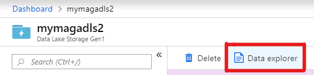

# Tutorial: Compute author h-index using Azure Data Lake Analytics (U-SQL)

In this tutorial, you will compute h-index for all authors in Microsoft Academic Graph (MAG) using Azure Data Lake Analytics (U-SQL). You will extract data from Azure Storage, compute h-index, and save the result in Azure Data Lake Storage.

## Prerequisites

Complete these tasks before beginning this tutorial:

* [Set up provisioning of Microsoft Academic Graph to an Azure blob storage account](get-started-setup-provisioning.md)
* [Set up an Azure Data Lake Analytics for Microsoft Academic Graph](get-started-setup-azure-data-lake-analytics.md)

## Gather the information that you need

   Before you begin, you should have these items of information:

   :heavy_check_mark:  The name of your Azure Storage (AS) account containing MAG dataset from [Get Microsoft Academic Graph on Azure storage](get-started-setup-provisioning.md#note-azure-storage-account-name).

   :heavy_check_mark:  The name of your Azure Data Lake Analytics (ADLA) service from [Set up Azure Data Lake Analytics](get-started-setup-azure-data-lake-analytics.md#create-azure-data-lake-analytics-account).

   :heavy_check_mark:  The name of your Azure Data Lake Storage (ADLS) from [Set up Azure Data Lake Analytics](get-started-setup-azure-data-lake-analytics.md#create-azure-data-lake-analytics-account).

   :heavy_check_mark:  The name of the container in your Azure Storage (AS) account containing MAG dataset.

   :heavy_check_mark:  The path to a MAG dataset in the container.

## Define functions to extract MAG data

[!INCLUDE [define-mag-function](../includes/define-mag-function.md)]

## Compute author h-index

In this section, you submit an ADLA job to compute author h-index and save output to Azure Data Lake Storage (ADLS).

1. In the [Azure portal](https://portal.azure.com), go to the Azure Data Lake Analytics (ADLA) service that you created, and select **Overview** > **New Job**.

   

1. Copy and paste the following code block in the script window.
   
    ```U-SQL
    DECLARE @blobAccount string = "<AzureStorageAccount>";
    DECLARE @blobContainer string = "<MagContainer>";
    DECLARE @magVersion string = "<MagVersion>";
    DECLARE @outAuthorHIndex string = "/output/AuthorHIndex.tsv";

    // The Windows Azure Blob Storage (WASB) URI of the Microsoft Academic Graph data to be used by this script
    IF @magVersion == "" THEN
    DECLARE @uriPrefix string = "wasb://" + @blobContainer + "@" + @blobAccount + "/";
    ELSE 
    DECLARE @uriPrefix string = "wasb://" + @blobContainer + "@" + @blobAccount + "/" + @magVersion + "/";
    END;

    //
    // Load Academic Graph data
    //
    @authors = Authors(@uriPrefix);
    @affiliations = Affiliations(@uriPrefix);
    @papers = Papers(@uriPrefix);
    @paperAuthorAffiliations = PaperAuthorAffiliations(@uriPrefix);

    //
    // Get Affiliations
    //
    @affiliations =
        SELECT
            (long?)AffiliationId AS AffiliationId, // Change datatype join with PaperAuthorAffiliations later
            DisplayName
        FROM @affiliations;

    //
    // Get Authors
    //
    @authors =
        SELECT
            AuthorId,
            DisplayName,
            LastKnownAffiliationId,
            PaperCount
        FROM @authors;

    //
    // Get (author, paper) pairs
    //
    @authorPaper =
        SELECT DISTINCT
            AuthorId,
            PaperId
        FROM @paperAuthorAffiliations;

    //
    // Get EstimatedCitation from Papers table
    // Treat papers with same FamilyId as a single paper and sum the EstimatedCitation
    //
    @paperCitation =
        SELECT
            (long)(FamilyId == null ? PaperId : FamilyId) AS PaperId,
            EstimatedCitation
        FROM @papers
        WHERE EstimatedCitation > 0;

    @paperCitation =
        SELECT
            PaperId,
            SUM(EstimatedCitation) AS EstimatedCitation
        FROM @paperCitation
        GROUP BY PaperId;

    //
    // Generate author, paper, citation view
    //
    @authorPaperCitation =
        SELECT
            @authorPaper.AuthorId,
            @authorPaper.PaperId,
            @paperCitation.EstimatedCitation
        FROM @authorPaper
        INNER JOIN @paperCitation
            ON @authorPaper.PaperId == @paperCitation.PaperId;

    //
    // Compute Paper Rank using EstimatedCitation
    //
    @authorPaperRankByCitation =
        SELECT
            AuthorId,
            PaperId,
            EstimatedCitation,
            ROW_NUMBER() OVER(PARTITION BY AuthorId ORDER BY EstimatedCitation DESC) AS PaperRank
        FROM @authorPaperCitation;

    //
    // Compute HIndex and total citation count
    //
    @authorHIndex =
        SELECT
            AuthorId,
            SUM(EstimatedCitation) AS CitationCount,
            MAX((EstimatedCitation >= PaperRank) ? PaperRank : 0) AS HIndex
        FROM @authorPaperRankByCitation 
        GROUP BY AuthorId;

    // Get author detail information
    @authorHIndex =
        SELECT
            @authors.AuthorId,
            @authors.DisplayName AS AuthorName,
            @affiliations.DisplayName AS AffiliationDisplayName,
            @authors.PaperCount,
            @authorHIndex.CitationCount,
            @authorHIndex.HIndex
        FROM @authorHIndex
        INNER JOIN @authors
            ON @authorHIndex.AuthorId == @authors.AuthorId
        LEFT OUTER JOIN @affiliations
            ON @authors.LastKnownAffiliationId == @affiliations.AffiliationId;

    OUTPUT @authorHIndex
    TO @outAuthorHIndex
    ORDER BY HIndex DESC, AuthorName ASC
    FETCH 100 ROWS
    USING Outputters.Tsv(quoting : false);
    ```

1. In this code block, replace `<AzureStorageAccount>`, `<MagContainer>`, and `<MagVersion>` placeholder values with the values that you collected while completing the prerequisites of this sample.

   |Value  |Description  |
   |---------|---------|
   |**`<AzureStorageAccount>`** | The name of your Azure Storage (AS) account containing MAG dataset. |
   | **`<MagContainer>`** | This is the container name in Azure Storage account containing MAG dataset. See below. |
   | **`<MagVersion>`** | This is the path to a MAG dataset in MagContainer.  See below. |

   <br>

   - If the MAG dataset is from Azure Data Share, set **MagContainer** to the container mapped when accepting Data Share invitation, and **MagVersion** to `'mag/yyyy-mm-dd'`.
   - Otherwise, set **MagContainer** to `'mag-yyyy-mm-dd'`, and **MagVersion** to `''`.

1. Provide a **Job name**, change **AUs** to 5, and select **Submit**.

   

1. The job should finish successfully in about 10 minutes.

   

## View output data

The output of the ADLA job in previous section goes to "/Output/AuthorHIndex.tsv" in the Azure Data Lake Storage (ADLS). In this section, you use [Azure portal](https://portal.azure.com/) to view output content.

1. In the [Azure portal](https://portal.azure.com), go to the Azure Data Lake Storage (ADLS) service that you created, and select **Data Explorer**.

   

1. Select **Output** > **AuthorHIndex.tsv**.

   

1. You see an output similar to the following snippet:

   

## Next steps

If you're interested in Academic analytics and visualization, we have created U-SQL samples that use some of the same functions referenced in this tutorial.

> [!div class="nextstepaction"]
>[Analytics and visualization samples](samples-usql-analytics.md)

## Resources

* [Get started with Azure Data Lake Analytics using Azure portal](https://docs.microsoft.com/azure/data-lake-analytics/data-lake-analytics-get-started-portal)
* [Data Lake Analytics](https://azure.microsoft.com/services/data-lake-analytics/)
* [U-SQL Language Reference](https://docs.microsoft.com/u-sql/)
* [H-index](https://en.wikipedia.org/wiki/H-index)
