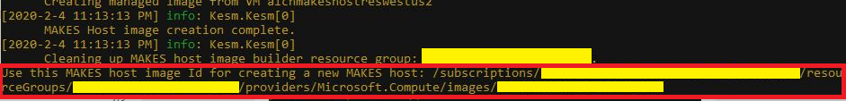

# Deploying a basic MAKES instance to Azure from your Subscription

 Step-by-step guide for deploying a Microsoft Academic Knowledge Exploration Service (MAKES) instance from a MAKES release. For more information on obtaining a MAKES release, visit [Sign up for MAKES](get-started-setup-provisioning.md)

## Prerequisites

- [Microsoft Academic Knowledge Exploration Service (MAKES) subscription](get-started-setup-provisioning.md)

## Verify the current release

When new versions of MAKES are released, a new folder will be created in the "makes" blob container of your Azure Storage Account.  This folder contains all the elements required to self-host an instance of MAKES.  To get started, let's verify that MAKES has been published to your subscription successfully.

1. Open the [Azure Management Portal](https://portal.azure.com) and navigate to **Storage Accounts**.

1. Find the Storage Account that you set up to receive your MAKES subscription.

1. Open the Storage Account in **Storage Explorer**.  This might require you to download and install the tool if you have not installed it already.

     

    Once Storage Explorer has opened, verify that there is a blob container called **makes**.

    

1. Open the **makes** blob container; verify there is at least one folder in that container.  This folder should be named by the date of the MAKES release.  Ex: 2020-01-30

1. Open the 'dated' folder.

## Verify the folders and content

There should be four (4) folders and a licence:

- **grammar** - This folder holds the grammar files.

- **index** - This folder holds the index files.

- **tools** - This folder holds the scripts required to customize MAKES and deploy MAKES to Azure.

- **webhost** - This folder holds the files required to create the VM instance of MAKES.

- **License.docx** - Microsoft Word file with the license to use this data and software.


## Download the deployment command from your Azure Storage Account

Each MAKES deployment includes the scripts required to provision an instance of MAKES in Azure.  Open the **tools** folder.  To download the scripts, select the **kesm.zip** file and select **Download** from the top ribbon:


Save this file to a local folder.

## Unzip the kesm.zip package

Once the file has been downloaded you will need to extract the contents.  Right click on the **kesm.zip** file.  If you are using the Windows operating system select **Extract All** from the context menu.  If you are using a Mac, double-click the zip file and it will decompress into the same folder. You will now see two folders, one for each environment we support.  Select **win-x86** if you are using a Windows machine or **osx-x64** if you will be running the command on a Mac and open the folder.  In this folder there is another folder, **Kesm**.  Open this folder. In this folder there are two files: **kesm.exe** and **kesm.pdb**.  The **kesm.exe** file is the executable that we will be running to deploy MAKES.

## Run the command

>![IMPORTANT]
>This command will run under your Azure credentials, have your Azure login credentials ready.

At this point to are ready to deploy an instance of MAKES to your Azure account.  The first step creates an Azure Host VM Image.  This image can be reused to generate more instances of MAKES if you would like more than a single instance in your VM Scale Set.  Open a command prompt (Windows) or terminal window (Mac) and navigate to the folder that you extracted the **kesm.exe** file to.

1. Execute the following command to create your hosting resources:

    ```cmd
    kesm.exe CreateHostResources --HostResourceName <makes_host_resource_group_name> --MakesPackage "https://<makes_storage_account_name>.blob.core.windows.net/makes/<makes_release_version>/"
    ```

    Example: **kesm.exe CreateHostResources --HostResourceName "contosorgmakesone" --MakesPackage "https://makesascontoso.blob.core.windows.net/makes/2020-01-30/"**

    Replace the following tokens in the command above with the appropriate value:

    | Token to relpace | Value |
    | --------| ----- |
    | <makes_host_resource_group_name> | The name of the Resource Group that will be created for this deployment. |
    | <makes_storage_account_name> | The name of the storage account you downloaded the scripts from above. |
    | <makes_release_version> | The MAKES release you would like to deploy. |

    The command will then prompt you to go to a secure website to authenticate.

1. Open a new browser window and copy the URL from the command.  Ex: **https://microsoft.com/devicelogin**

1. Enter the authentication code given to you from the command.

1. Use your id or email address to sign into your azure account.

    Once you have authenticated, you may close your browser window and the command will continue to run.  This command will take 20-30 mins to complete.

  >![NOTE]
  >This command will take around 20-30 minutes to complete.  Once this command has been run, you can reuse the Host Image Id to deploy more instances of MAKES.

1. Copy the **Host Image Id** from the last line of output from the command, you will use it in the next command.  Ex:  **/subscriptions/<your_subscription_id>/resourceGroups/<makes_host_rource_group_name>/profiders/Microsoft.Compute/Images/<makes_host_rource_group_name>** 

    

1. Execute the following command to deploy your hosting resources:

    ```cmd
    kesm.exe DeployHost --HostName "<makes_instance_host_name>" --MakesPackage "https://<makes_storage_account_name>.blob.core.windows.net/makes/<makes_release_version>/"  --MakesHostImageId "<id_from_previous_command_output>"
    ```

    Example: **kesm.exe DeployHost --HostName contosomakes --MakesPackage "https://makesascontoso.blob.core.windows.net/makes/2020-01-30/" --MakesHostImageId "/subscriptions/00000000-0000-0000-0000-000000000000/resourceGroups/contosorgmakesone/profiders/Microsoft.Compute/Images/contosoImageName"**

    Replace the following tokens in the command above with the appropriate value:

    | Token to relpace | Value |
    | --------| ----- |
    | <makes_instance_host_name> | The host name for your service.  The hostname will be the host name of the server where your MAKES deployment will be hosted.  Ex: If you used 'contosomakes', your MAKES API will be hosted at http://contosomakes.westus.cloudapp.azure.net. |
    | <makes_storage_account_name> | The name of the storage account you downloaded the scripts from above. |
    | <makes_release_version> | The MAKES release you would like to deploy. |
    | <id_from_previous_command_output> | The id you copied from the output of the previous command. |

If necessary, authenticate the command in the same way as you did above for the first command.

>![IMPORTANT]
>While this script is running, the admin name and password will be shown on the screen for the VM being created.  Make note of this for logging into the VM at a later time for any reason or if logging the output of this command, be sure to remove this information.

>![NOTE]
>This command will take approximately 45 mins to complete if the VM image created by the first command is co-located (in the same Azure region) as your Azure storage account and you are using the standard ds14_v2 VM (this is the default).

At this point the tool will take care of creating all of the required resources and deploying MAKES.  As stated above, you can re-use the MAKES hosting image created from the CreateHostResources command for subsequent deployments to reduce the start-up time.  See the [Command line Reference](reference-makes-command-line-tool.md) for more details.  

> [!NOTE]
> To achieve the fastest instance start times, ensure that all resources (storage account, virtual machine scale set, etc.) are located in the same region. The "--Region" parameter controls which region new resources are created in. Visit the [Command line Reference](reference-makes-command-line-tool.md) section for full details on this and other parameters.

Depending on the region your storage account is in and the region you are deploying to, deployment may take longer as the default indexes are quite large and need to be copied.  By default, the tool deploys to the WestUS region of Azure.  For a reference of all the available parameters type:

```cmd
kesm.exe --help

// For command specific help; type the command, appending '--help'

kesm.exe DeployHost --help
```

Or, you can visit the [Command Line Tool(kesm.exe) Reference](reference-makes-command-line-tool.md).

## Verify your new instance of MAKES

1. Open a browser and go to the status URL for your new MAKES instance.  Ex: **http://<your_makes_public_IP_DNS>.<azure_region>.cloudapp.azure.com/status**. The "readyToServeRequest" property should be true.

1. Go to the details URL for your new MAKES instance and verify the version of the API. Ex: **http://<your_makes_public_IP_DNS>.<azure_region>.cloudapp.azure.com/details**.  In the description the created time should match the date of your release.

1. Go to the base URL for your new MAKES instance and verify the API's are working as expected.  Ex: **http://<your_makes_public_IP_DNS>.<azure_region>.cloudapp.azure.com**


## Next steps

Check out the sample projects that leverage the MAKES API.
