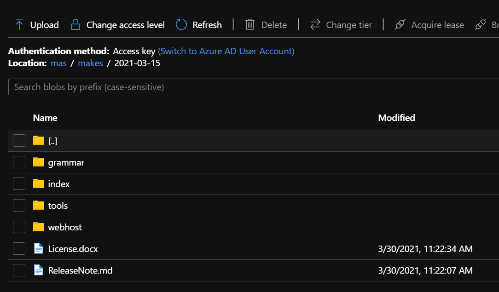

# Receive MAKES releases using Azure Data Share

[!INCLUDE [ma-subscription-receive-data](../includes/ma-subscription-receive-data.md)]

## Verify MAKES releases

MAKES release are deployed approximately every two weeks to the Azure storage account that were used to signed up for the distribution preview. When new versions of MAKES are released, a new folder will be created under the "makes" dataset with the release version being the folder name.  This folder contains all the elements required to self-host an instance of MAKES. Let's verify that MAKES has been published to your subscription successfully.

1. Open the [Azure Management Portal](https://portal.azure.com) and navigate to **Storage Accounts**.

1. Find the Storage Account that you set up to receive your MAKES subscription.

1. Select "Containers" and find the container that you mapped to receive your MAKES subscription.

1. Open the latest MAKES release folder; This folder should be named by the date of the MAKES release.  Ex: 2021-03-15

1. Open the 'dated' folder.
    
    There should be four (4) folders and a licence:
    - **grammar** - This folder holds the grammar files.
    - **index** - This folder holds the index files.
    - **tools** - This folder holds the command line tool and worker packages required to customize MAKES and deploy MAKES to Azure.
    - **webhost** - This folder holds the files required to create the VM instance of MAKES.
    - **License.docx** - Microsoft Word file with the license to use this data and software.

## Next steps

Deploy your first MAKES instance 
> [!div class="nextstepaction"]
>[Deploy a MAKES instance to Azure](get-started-create-api-instances.md)

## Resources

* [Azure Data Share](https://azure.microsoft.com/services/data-share/)

* [Tutorial: Accept and receive data using Azure Data Share](https://docs.microsoft.com/azure/data-share/subscribe-to-data-share)
