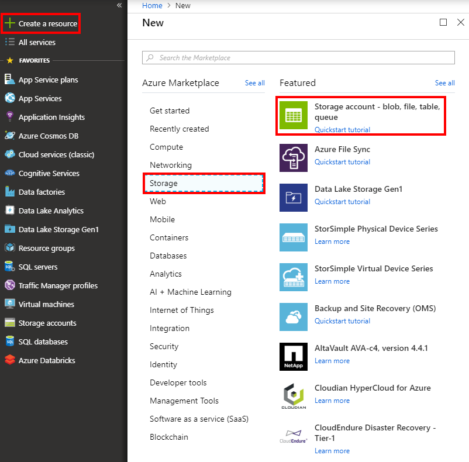
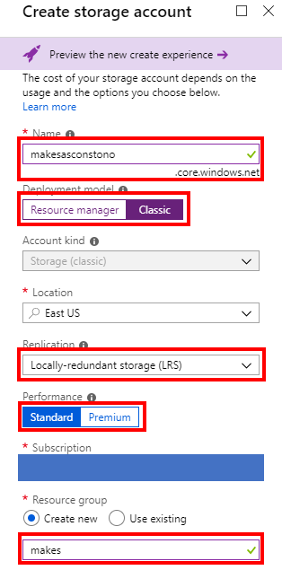
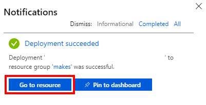
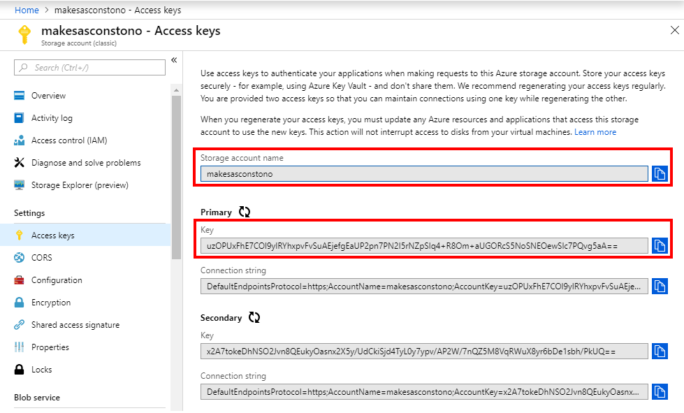
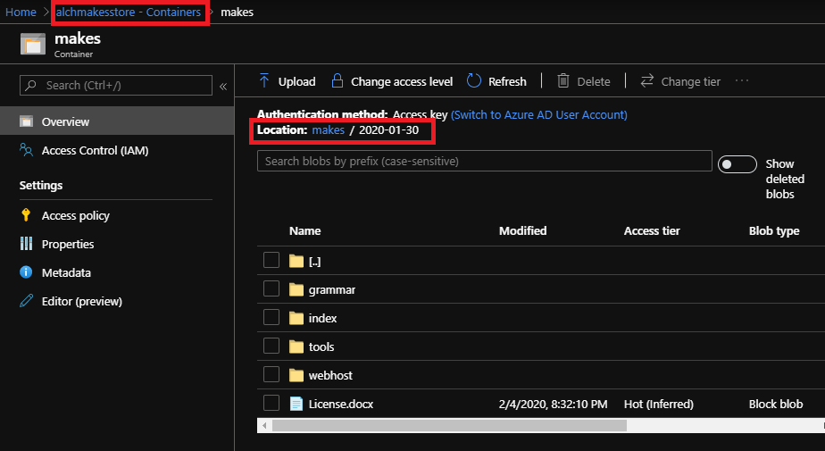

# Get started with Microsoft Academic Knowledge Exploration Service

Details step-by-step instructions for setting up one-time or automatic provisioning of Microsoft Academic Knowledge Exploration Service APIs to an Azure blob storage account.

## Open Data License: [ODC-BY](https://opendatacommons.org/licenses/by/1.0/)

When using Microsoft Academic data (MAG, MAKES, etc.) in a product or service, or including data in a redistribution, please acknowledge Microsoft Academic using the URI https://aka.ms/msracad. For publications and reports, please cite the following article:

> [!NOTE]
> Arnab Sinha, Zhihong Shen, Yang Song, Hao Ma, Darrin Eide, Bo-June (Paul) Hsu, and Kuansan Wang. 2015. An Overview of Microsoft Academic Service (MA) and Applications. In Proceedings of the 24th International Conference on World Wide Web (WWW '15 Companion). ACM, New York, NY, USA, 243-246. DOI=http://dx.doi.org/10.1145/2740908.2742839

## Create an Azure subscription and storage account to receive MAKES API builds

### [Create an Azure Subscription](https://azure.microsoft.com/get-started)

Please create a new Azure subscription for the distribution previews. If your organization already has an Azure account, this can be a separate subscription under the same tenant id. If you start from scratch, for example “create Azure free account”, the subscription will be created under a new tenant id.

### [Create an Azure Storage Account](https://docs.microsoft.com/azure/storage/common/storage-quickstart-create-account?tabs=portal)

1. Home > Create a resource > Storage > Storage account

    

2. Specify the following settings:

    | Setting | Value |
    | --------| ----- |
    | Account Name | makesas<org_name> |
    | Account kind | Select "StorageV2" |
    | Replication | Select "LRS" |
    | Performance | Select "Standard" |
    | Resource Group | Enter "makes" without quotes |

    

    > [!IMPORTANT]
    > You don’t need to use your organization name after the “makesas”, however the account name must be unique among all Azure Storage Accounts

    > [!NOTE]
    > Select whatever region is most appropriate for your existing Azure resources

3. Once notified that the storage account has been created, click “go to resource”

    

4. Go to “access keys” and take note of the “storage account name” and the “primary key”

    

5. To sign up for the MAKES API distribution preview, send the following details to <a href="mailto:academicapi@microsoft.com?subject=Access request to Microsoft Academic Knowledge Exploration Service (MAKES) distribution preview">academicapi@microsoft.com</a> with the subject "Access request to Microsoft Academic Knowledge Exploration Service (MAKES) distribution preview":

    - Are you affiliated with a company or university?
        - If company, please provide the company’s name, your department/group and your role
        - If university, please provide the university’s name, department, group/advisor, and your role (undergraduate student, grad student, professor, etc.)
    - Brief description of the project you will be using MAKES for
    - Name of your Microsoft sales representative, if you have one
    - Azure storage account name
    - Azure storage account primary access key
    - Which MAKES APIs you want to receive (semantic interpretation API, entity API, or both)

    > [!NOTE]
    > MAKES is currently in a free preview period, so there are no charges associated with the provisioning or use of data/service itself. However Azure requires you to cover all costs associated with standard resource creation, usage, etc. For cost estimates associated with MAKES please see the [Pricing](resources-pricing.md) page.   Most research institutions have an "Enterprise Account" with Microsoft including Azure subscription. The pricing for Enterprise Accounts differ from the individual account shown in Azure's price calculator.   If you have an Enterprise Account, please check with your individual institution's Information Technology/Computer Center resource on the process of setting up Azure to get MAKES. You might need to obtain a "Master Agreement #" and involve MLSP (Microsoft Licensed Solution Provider) for help.

## API release process

MAKES API builds are deployed approximately once a week to the Azure storage account that were used to signed up for the distribution preview.

Each API build has a unique name reflecting the date it was created, and is placed in the following location inside the storage account:

makes(storage account container)
  - YYYY-MM-DD (release date)
    - indexes
      - makes-YYYY-MM-DD-prod-index#.kes
    - grammar
      - makes-default-grammar.kesg
    - tools
      - makes.zip
      - indexer.zip
      - preprocessor.zip
      - jobManager.zip
      - generateMakesEntitiesFromMag.usql
    - webhost
      - makes-service-host.zip

Example:

