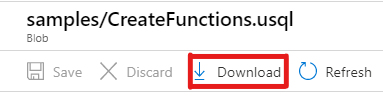
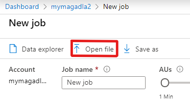
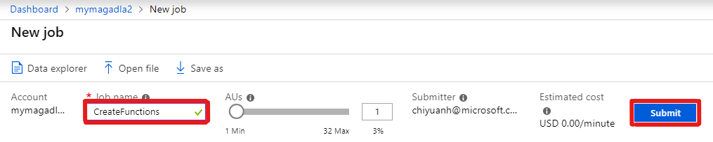
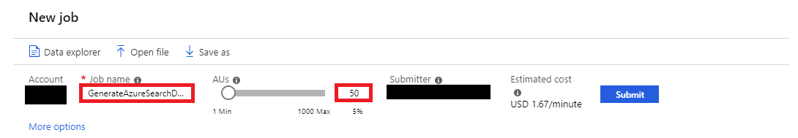
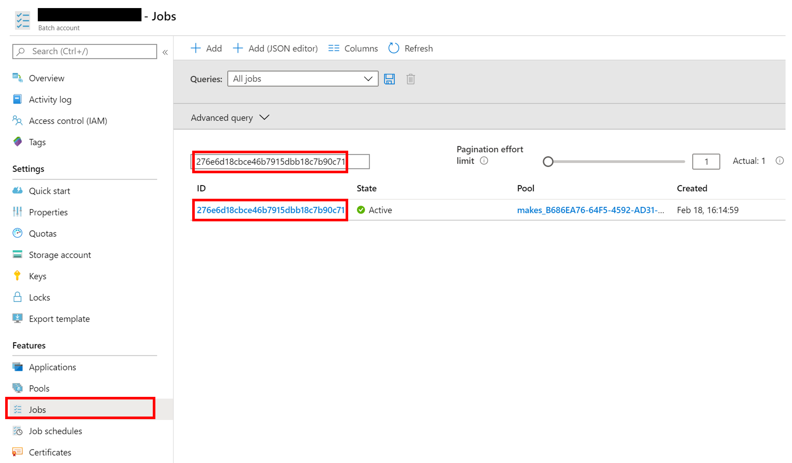
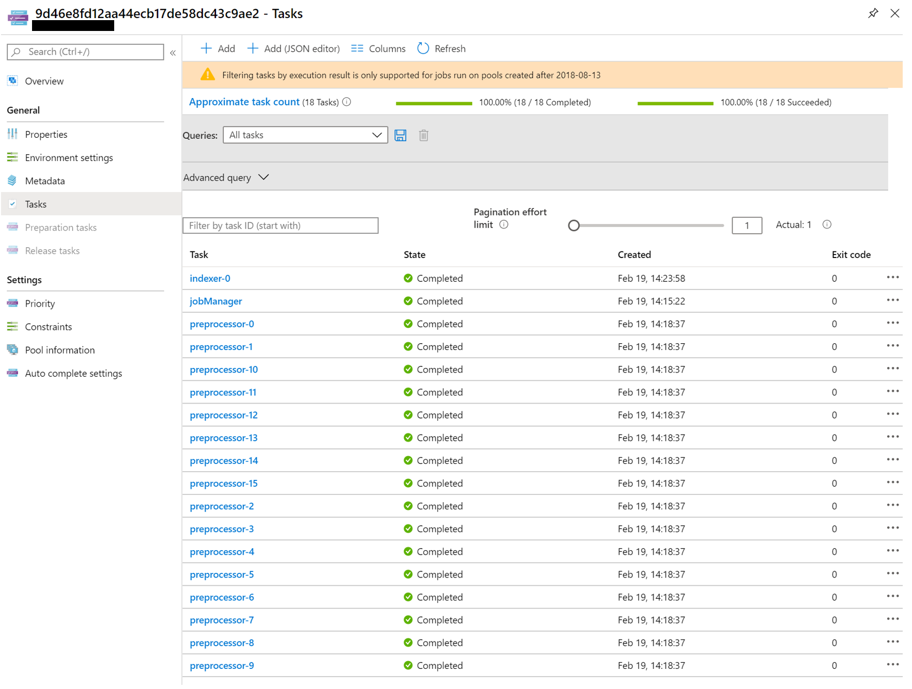

# Generating MAKES indexes from a MAG release

 Step-by-step guide for generating MAKES indexes from a Microsoft Academic Graph (MAG) release. For more information on obtaining a MAG release, visit [Get Microsoft Academic Graph on Azure storage](../graph/get-started-setup-provisioning.md).  In this example we will be building a custom index of all Microsoft publications and associated entities.

## Prerequisites

- Microsoft Academic Graph (MAG) subscription. See [Get Microsoft Academic Graph on an Azure Storage](../graph/get-started-setup-provisioning.md) to obtain one.
- [Set up Azure Data Lake Analytics for MAG](../graph/get-started-setup-azure-data-lake-analytics.md)
- Microsoft Academic Knowledge Exploration Service (MAKES) subscription. See [Get started with Microsoft Academic Knowledge Exploration Service](get-started-setup-provisioning.md) to obtain one.

## Transform MAG data to MAKES json entities

MAKES requires data it indexes to be placed in a single JSON file, with each line representing an individual entity. For this example, we will use a U-SQL script to filter and transform MAG data into JSON data which will then be used to create a custom index. To do this, you will need to go to your Azure Data Lake Analytics (ADLA) service instance and submit a new ALDA job to generate the text files containing academic data.

### Define functions to extract MAG data

1. Download `samples/CreateFunctions.usql` from your MAG release to your local drive. <br> From [Azure portal](https://portal.azure.com), go to your MAG Azure Storage account > **Containers > [mag-yyyy-mm-dd] > samples > CreateFunctions.usql > Download**.

   

1. In the [Azure Management Portal](https://portal.azure.com), go to the Azure Data Lake Analytics (ADLA) service that you created, and select **Overview > New job > Open file**. Select `CreateFunctions.usql` in your local drive.
   

   

1. Select **Submit**.

   

1. The job should finish successfully.

   

### Run MAG to MAKES transformation U-SQL script

1. Download the U-SQL script [MagDataToMakesJson.usql](./MagDataToMakesJson.usql) to your local drive.

1. In the [Azure Management Portal](https://portal.azure.com), go to the Azure Data Lake Analytics (ADLA) service that you created, and select **Overview > New Job > Open file**. Select `MagDataToMakesJson.usql` from your local drive.

   
   

1. Replace placeholder values in the script using the table below

   |Value  |Description  | Example |
   |---------|---------|------|
   |**`@In_MagBlobAccount`** | The name of your Azure Storage account containing the Microsoft Academic Graph data set. | **mymagstore**
   |**`@In_MagBlobContainer`** | The container name in your Azure Storage account containing the Microsoft Academic graph data set, usually in the form of **mag-YYYY-MM-DD**. | **mag-2020-02-07**
   |**`@Out_OutputPath string`** | The entity output storage path to where you'd like the formatted entities documents to go. The container for the azure output storage location must exist before running the script.| **wasb://makessubgraph@mymakesstore/2020-02-07/microsoft/entities**  |
   |**`@Param_UseSubgraphForInstitution`** | Generates a subgraph containing data related to the specified institution. | **microsoft**|

    > [!IMPORTANT]
    > If you use the example output path. Make sure to create the **makessubgraph** container before running this script. Follow [Create a container](https://docs.microsoft.com/azure/storage/blobs/storage-quickstart-blobs-portal#create-a-container) guide for how to do this.
    >

    > [!TIP]
    > This tutorial uses Microsoft as an organization by default. You can target any organization by finding its NormalizedName in the Microsoft Academic Graph and then changing the value of the affiliationNormalizedNameFilter variable to said name.
    >
    > You can also modify the script to create different subgraphs. See script comments in the Subgraph Creation section.
    >
    > Please note that doing this may impact time estimates for script execution and index generation later on in this tutorial.

1. Provide a **Job name**, change **AUs** to 20, and select **Submit**

   

The job should take approximately 50 minutes to run and cost $4. This estimation assumes the Azure Data Lake Analytics, MAG storage, and MAKES storage accounts are in the same region.

## Create indexing resources in Azure

We will now use Kesm.exe to create the necessary resources in Azure that will be used for generating MAKES indexes. Kesm.exe will create and configure a Azure Batch account for spinning up workers (virtual machines) to process MAKES json entities and build MAKES indexes. Once the indexing resources are created, a configuration file will be written to you local machine. We'll be using this configuration file with Kesm.exe to build indexes in the next step.

If you have not done so already, download the Kesm.exe tool from your MAKES subscription. See the [Create an API Instance](get-started-create-api-instances.md) for instructions on downloading the tool.

1. Open a command prompt or terminal window and navigate to the folder where you have extracted the Kesm.exe tool.

1. Copy the following command to your command / terminal window:

    ```cmd
    kesm CreateIndexResources --IndexResourceName "<IndexResourceName>" --MakesPackage "<MakesPackageLocation>" --MakesIndexResourceConfigFilePath "<MakesIndexResourceConfigFilePath>"
    ```

1. Replace the command parameters with the values from the table below:

    | Values | Description | Example |
    |---------|---------|------|
    |**`<IndexResourceName>`** | The name of the indexing resources. This step will create a Resource Group, Azure Batch account, and an Azure Storage Account using this name. | **makesindexres** |
    |**`<MakesPackageLocation>`** | The base URL to a MAKES release. The indexer, preprocessor, and jobManager package inside the release will be used to set up the Azure Batch account|  **https://mymakesstore.blob.core.windows.net/makes/2020-02-07/** |
    |**`<MakesIndexResourceConfigFilePath>`** | The local output file for saving the indexing resource configuration information to build your index. | **makesIndexResConfig.json** |

1. Run the command

## Submit a build index job to the indexing resources created

The final step to generate your index is to submit a build index job to Azure Batch account via the kesm tool. The Azure Batch account will spin up workers(virtual machines) to process MAKES json entities and build the index. The build index job will handled by three types of workers: jobManager, preprocessor, and indexer. The jobManager will take a build index job and create preprocessor and indexers tasks and monitor preprocessor(s) and indexer(s) till they finish their tasks. Preprocessor will validate, partition, and format the MAKES json entities. Indexer will then build indexes using the preprocessed entities.

1. Copy the following command to your command /terminal window:

    ```cmd
    kesm BuildIndex --EntitiesUrlPrefix "<InputEntitiesUrl>" --OutputUrlPrefix "<OutputIndexUrl>" --MakesIndexBuildResourceConfigFilePath "<MakesIndexResourceConfigFilePath>"
    ```

1. Replace the command parameters with the values from the table below:

    | Values | Description | Example |
    |---------|---------|-------|
    |**`<InputEntitiesUrl>`** | The input URL to the MAKES entities generated from running the U-SQL script above. | **https://mymakesstore.blob.core.windows.net/makessubgraph/2020-02-07/microsoft/entities/** |
    |**`<OutputUrlPrefix>`** | The output base URL for writing the built MAKES index.| **https://mymakesstore.blob.core.windows.net/makessubgraph/2020-02-07/microsoft/index/**
    |**`<MakesIndexResourceConfigFilePath>`** | The configuration file generated from running CreateIndexResources above. | **makesIndexResConfig.json** |

1. Run the command

1. The command should return a build index job ID for you monitor the job progress

  > [!IMPORTANT]
  > Generating indexes can cost money.
  >
  > Time to create an index can be up to 3 hours.

## Monitor the build index job progress

You can check the build index job progress using Azure Management Portal. Each job should start with running a jobManager task, then preprocessor tasks, and finally indexer tasks. The number of preprocessor tasks should match the number of input entities file. The number of indexer tasks should match the **--IndexPartitionCount** parameter used for the BuildIndex command.

1. In [Azure Management Portal](https://portal.azure.com), find the Azure Batch Account associated with the indexing resources created above. The batch account name should be the same as the **--IndexResourceName** parameter used for CreateIndexResources command above.

1. In Azure Batch Account detail page, select **Jobs** and find the build index job using the build index job ID from executing BuildIndex command above.
    

1. Get the build index job progress by selecting **Refresh**.
    

>[!NOTE]
> Preprocessor and indexer tasks are created in batches to avoid overwhelming the virtual machine workers. See jobManager task's output for more details.

## Next steps

Now that the JSON data has been generated to build the custom index, we use the kesm tool to execute the build. You will follow the same procedures as deploying an index from your MAKES subscription, but replacing the **--MakesIndex** parameter with the path to the output of this example.

```cmd
Kesm.exe DeployHost --HostName "<makes_instance_host_name>" --MakesPackage "https://<makes_storage_account_name>.blob.core.windows.net/makes/<makes_release_version>/"  --MakesHostImageId "<id_from_create_host_resources_command>"
--MakesIndex "https://yourstorageaccount.blob.core.windows.net/makes/2020-02-07/subgraph/microsoft/index"

````

See [Create an API instance](get-started-create-api-instances.md) for more information.
