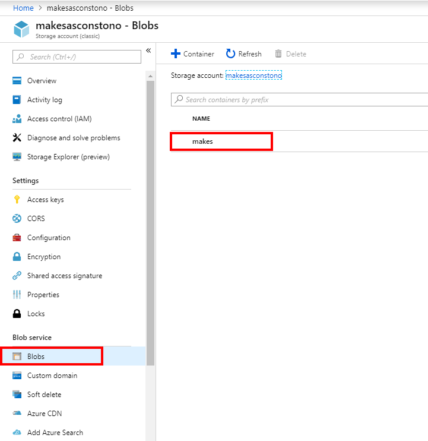
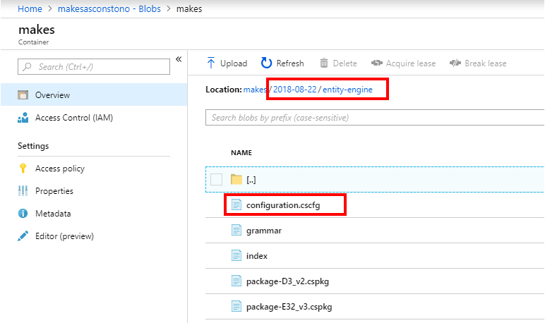
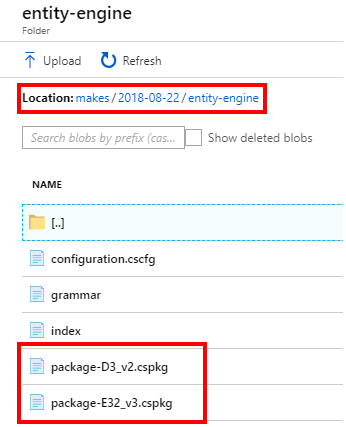
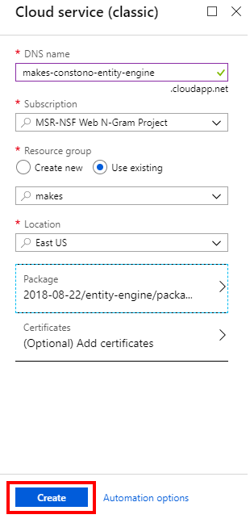

# Deploy Microsoft Academic Knowledge Exploration Service engine using Azure Management Portal

Details step-by-step guide for deploying Microsoft Academic Knowledge Exploration Service engines using the Azure Management Portal.

## Configure engine build

Before deploying a new MAKES engine build it must first be configured to use the Azure storage account created to contain the builds.

### Load configuration file of MAKES engine you want to deploy

1. Navigate to the Azure storage account

    

1. Navigate to the "makes" container in the "blobs" service tab

    

1. Navigate to the MAKES engine directory of the MAKES version you want to deploy and click the "configuration.cscfg" blob

    

### Edit the "configuration.cscfg" blob

1. From the configuration.cscfg blob screen click the "edit blob" tab

    

1. Change “_STORAGE_ACCOUNT_NAME_” to the Azure storage account name and “_STORAGE_ACCOUNT_ACCESS_KEY” to the Azure storage account primary key, then click “save”

    
    

    > [!IMPORTANT]
    > Make sure to do this for **each MAKES engine you want to deploy**, i.e. if you want to deploy both the semantic-interpretation-engine and the entity-engine you will need to modify each engines configuration file separately

    > [!IMPORTANT]
    > This only needs to be done **ONCE** for each new MAKES engine build version

## Deploy MAKES engine to new cloud service

1. Click the search box, type “cloud services” and click the “Cloud services (classic)” option

    

2. Add a new cloud service with a unique DNS name, using the same resource group that the Azure storage account is in, then click the “select a package” option

    

3. Enter a descriptive deployment label for the cloud service, check “deploy even if one or more roles contain a single instance”, and click “from blob” for package/configuration location

    

4. Select MAKES engine package

    Click "Package (.cspkg, .zip)"

    

    Enter the name of the Azure storage account you’re using for MAKES engine builds, click the result and then click the “makes” container

    

    Navigate to the MAKES engine build you want to deploy and click the package file (.cspkg) that corresponds to the type of cloud service type you want to host the engine on, then click “select”

    

    > [!IMPORTANT]
    > The name part after “package-“ corresponds to different types of pre-configured cloud service instances [detailed here](https://azure.microsoft.com/en-us/pricing/details/cloud-services/). **PLEASE NOTE THAT COSTS ASSOCIATED WITH DIFFERENT INSTANCE TYPES CAN VARY DRAMATICALLY.** See the “cloud service deployment options” section in the appendix for cost/benefit details of the different pre-configured cloud instance types.

5. Select the MAKES engine configuration

    Click “Configuration (.cscfg)”

    

    Enter the name of the Azure storage account you’re using for MAKES engine builds, click the result and then click the “makes” container

    

    Navigate to the MAKES engine build you want to deploy, click the configuration file (.cscfg) and then click “select”

    

6. Click "OK"

    

7. Click "Create"

    

8. Wait for deployment to complete and MAKES engine to fully come online

    Click the “go to resource” button once the cloud service deployment completes

    

    Verify that cloud service instance status is “starting”

    

    Wait for cloud service instance status to show “running”

    

9. Verify that the new MA-KES engine instance is working

    To verify the entity engine is working, navigate to https://your-entity-engine-cloud-service.cloudapp.net/evaluate?expr=And(Composite(AA.AuN=='darrin%20eide'),Ti=='an%20overview%20of%20microsoft%20academic%20service%20mas%20and%20applications')&attributes=Id,Ti&count=1 and verify “an overview of microsoft academic service mas and applications” is returned

    

    To verify the semantic interpretation engine is working, navigate to https://your-semantic-interpretation-engine-cloud-service.cloudapp.net/interpret?query=darrin%20eide%20an%20overview%20of&complete=1&count=1 and verify that the top interpretation contains the expression “And(Composite(AA.AuN=='darrin eide'),Ti=='an overview of microsoft academic service mas and applications')”

    

## Update existing MA-KES engine deployment with new build

1. Click the “update” button on the “overview” section of the cloud service to be updated

    

2. Enter a descriptive deployment label for the deployment, check “deploy even if one or more roles contain a single instance”, check “allow the update if role sizes change…” and click “from blob” for package/configuration location

    

3. Select MA-KES engine package

    Click “Package (.cspkg, .zip)”

    

    Enter the name of the Azure storage account you’re using for MAKES engine builds, click the result and then click the “makes” container

    

    Navigate to the MAKES engine build you want to deploy and click the package file (.cspkg) that corresponds to the type of cloud service type you want to host the engine on, then click “select”

    

    > [!IMPORTANT]
    > The name part after “package-“ corresponds to different types of pre-configured cloud service instances [detailed here](https://azure.microsoft.com/en-us/pricing/details/cloud-services/). **PLEASE NOTE THAT COSTS ASSOCIATED WITH DIFFERENT INSTANCE TYPES CAN VARY DRAMATICALLY.** See the “cloud service deployment options” section in the appendix for cost/benefit details of the different pre-configured cloud instance types.

4. Select the MAKES engine configuration

    Click “Configuration (.cscfg)”

    

    Enter the name of the Azure storage account you’re using for MAKES engine builds, click the result and then click the “makes” container

    

    Navigate to the MAKES engine build you want to deploy, click the configuration file (.cscfg) and then click “select”

    

5. Click "OK"

    

6. Click "Create"

    

7. Wait for deployment to complete and MAKES engine to fully come online

    Click the “go to resource” button once the cloud service deployment completes

    

    Verify that cloud service instance status is “starting”

    

    Wait for cloud service instance status to show “running”

    

8. Verify that the new MA-KES engine instance is working

    To verify the entity engine is working, navigate to https://your-entity-engine-cloud-service.cloudapp.net/evaluate?expr=And(Composite(AA.AuN=='darrin%20eide'),Ti=='an%20overview%20of%20microsoft%20academic%20service%20mas%20and%20applications')&attributes=Id,Ti&count=1 and verify “an overview of microsoft academic service mas and applications” is returned

    

    To verify the semantic interpretation engine is working, navigate to https://your-semantic-interpretation-engine-cloud-service.cloudapp.net/interpret?query=darrin%20eide%20an%20overview%20of&complete=1&count=1 and verify that the top interpretation contains the expression “And(Composite(AA.AuN=='darrin eide'),Ti=='an overview of microsoft academic service mas and applications')”

    