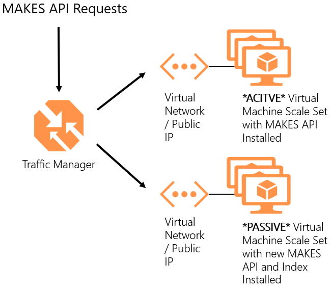
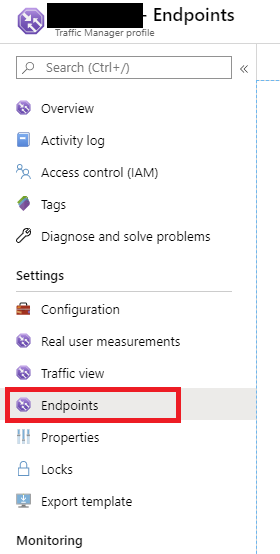
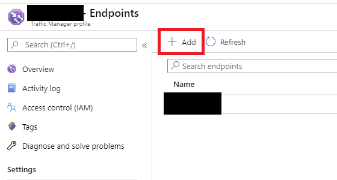
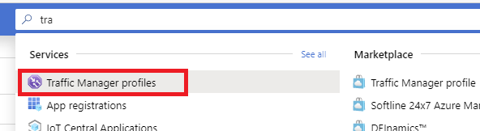

# Deploying a MAKES release for uninterrupted service

Step-by-step guide for deploying a new Microsoft Academic Knowledge Explorarion Service (MAKES) release to an existing MAKES deployment.  For more information about deploying an instance of MAKES from your subscription, visit [Create an API Instance](get-started-create-api-instances.md).

## Prerequisites

- [Microsoft Academic Knowledge Service (MAKES) subscription](get-started-setup-provisioning.md)

- [An existing deployment of the Microsoft Academic Knowledge Service (MAKES)](get-started-create-api-instances.md)

## Goals / Assumptions

In this example we will walk you through the steps to deploy new MAKES releases to a live service.  This example has the following goals and assumptions:

- You would like to create a live MAKES service that can be updated with no downtime (production environment).

- You would like to easily update the MAKES service when new releases are published to your account.

- You have existing MAKES instances in one or many Azure Regions.

> [!NOTE]
> This is a basic example setting up an active / passive topology for deploying your MAKES solution.  Your needs may dictate a different solution.  Consult the Azure documentation for addition infomation about Traffic Manager, Azure DNS, Azure Front Door and other offerings to create a solution that works for you.

## Architecture overview

Given the design and nature of MAKES, "hot-swapping" resources on the MAKES instances is not a viable option for always-on solutions.  The indexes that power MAKES are large and need to be mounted when the service is started.  This would require downtime if you were to only have a single instance of MAKES in production.  To support the goals above, you will need to establish a single entry point for your MAKES service and swap active instances when you deploy.  Azure provides a few ways to accomplish this, below are two of the Azure products that we use on our team:

| Azure Service | Benefits |
|_________|_________|
|[Azure Traffic Manager](https://azure.microsoft.com/services/traffic-manager/) |Operates at the DNS level to direct incoming traffic in the method you choose (closest instance, most performant instance). |
|[Azure Front Door](https://azure.microsoft.com/services/frontdoor/) |Similar to traffic manager, this option directs incoming traffic in the method you choose to the appropriate instances.  Azure Front Door aslo includes WAF protection, caching and other features not included with Azure Traffic Manager. |

In this example, we will be using the Azure Traffic Manager product as a traffic cop for our production MAKES instance(s).  We have chosen this solution as it is inexpensive and easy to manage for most scenarios.  The Microsoft Academic team uses both Azure Traffic Manager and Azure Front Door in our MAKES API and Website deployments.  The services you choose depend on the requirements of your system.  Below is an architecture diagram of the solution provided in this example.

## Create a Traffic Manager profile

Create a Traffic Manager profile that directs user traffic based on endpoint priority.  Open your browser and navigate to the [Azure portal](https://portal.azure.com).

1. On the upper-left side of the screen, select **Create a resource** > **Networking** > **Traffic Manager profile**.
2. In the **Create Traffic Manager profile**, enter, or select these settings:

    | Setting | Value |
    | --------| ----- |
    | Name | Enter a unique name for your Traffic Manager profile.|
    | Routing method | Select **Priority**.|
    | Subscription | Select the subscription you want the traffic manager profile applied to. |
    | Resource group | Select the resource group associated with your MAKES subscription.|
    | Location |This setting refers to the location of the resource group. It has no effect on the Traffic Manager profile that will be deployed globally.|

3. Select **Create**.

4. Go to the configuration section and change the following settings:

    | Setting | Value |
    | --------| ----- |
    | Protocol | HTTP |
    | Port | 80 |
    | Path | /alive |

## Add your current MAKES deployment as an endpoint

1. In your Traffic manager profile, select **Endpoints**:

2. Click **Add** at the top of the screen to add a new endpoint:

3. Apply the following settings:

    | Setting | Value |
    | --------| ----- |
    | Type | Select **Azure endpoint** |
    | Name | *Add a descriptive name of your choosing here* |
    | Target resource type | Select **Public IP Address** |
    | Target resource | Select the name of the public IP address that was created for you MAKES deployment |
    | Custom Header settings | **Leave Blank**  |
    | Add as disabled | **un-checked**  |

4. Select **Ok** to create your new endpoint.

Repeat the above steps for each MAKES deployment you currently have in your production environment.

## Verify your service is working as expected

In the list of endpoints, watch the **Monitor Status** of the new endpoint you created.  In the beginning it will say **Checking Endpoint**.  Select the **Refresh** button at the top of the section every 30 secs or so until the status changes to **Online**; this could take a few minutes.

Once the new endpoint monitor is in the **Online** status, verify the API is up and running.  In the **Overview** section of your Traffic Manager Profile, there will be a URL next to the **DNS Name** property.  Copy this value and paste it into a browser of your choice and append **/details** to the end of the url.  Ex: **http://<your_traffic_manager_profile_name>.trafficmanager.net/details**.  The response that comes back will have the date the index was built in the description field.  This date should match the date of the folder in your MAKES subscription that you created this instance from.  

Now go to your base URL.  Ex: **http://<your_traffic_manager_profile_name>.trafficmanager.net**.  Verify the instance is working by running some queries one this page or use your favorite tool to execute queries against the API endpoints and verify the responses and response codes..

> [!NOTE]
> Traffic Manager by default uses http, not https

## Deploy the new version of MAKES

Follow the deployment instructions on this site for deploying the new version of a MAKES release, see [Create in API instance](get-started-create-api-instances.md).

## Verify your new instance of MAKES

1. Open a browser and go to the status URL for your new MAKES instance.  Ex: **http://<your_makes_public_IP_DNS>.<azure_region>.cloudapp.azure.com/status**. The "readyToServeRequest" property should be true.

2. Go to the **details** URL for your new MAKES instance and verify the version of the API. Ex: **http://<your_makes_public_IP_DNS>.<azure_region>.cloudapp.azure.com/details**. The response that comes back will have the date the index was built in the description field.

3. Go to the **base** URL for your new MAKES instance and verify the API's are working as expected.  Ex: **http://<your_makes_public_IP_DNS>.<azure_region>.cloudapp.azure.com**

## Add the new instance of MAKES to your Traffic Manager Profile

1. Open the Azure Portal and search for **Azure Traffic Manager Profiles**.

2. Select the **Traffic Manager Profiles** suggestion from the list.  When the page opens, select the profile that you have previously created.

3. Select **Endpoints** on the left hand side of the page to open the list of endpoints for this traffic manager profile.

4. Select **Add** at the top of the screen to add a new endpoint.

3. Apply the following settings:

    | Setting | Value |
    | --------| ----- |
    | Type | Azure endpoint |
    | Name | *Add a descriptive name of your choosing here* |
    | Target resource type | Public IP Address |
    | Target resource | Select the name of the public IP address that was created for you MAKES deployment |
    | Custom Header settings | **Leave Blank**  |
    | Add as disabled | **checked** |

9. Select **Ok** to create your new endpoint.

It will take Azure a moment to create your new endpoint, but once completed it will be added to the list of endpoints available in your Traffic Manager Profile.

## Swap MAKES instances in Traffic Manager

When you are ready to bring new traffic to your new MAKES instance you must enable the new instance and disable the old.

1. From the endpoints section of your Traffic Manager Profile, select the endpoint that you just created above.

2. Move the status toggle from **Disabled** to **Enabled** by clicking on it.

3. Select **Save** at the top to save your changes.

4. Select on the old endpoint that was serving production traffic.

5. Move the status toggle from **Enabled** to **Disabled** by clicking on it.

6. Select **Save** at the top to save your changes.

## Verify your service is working as expected

In the list of enpoints, watch the **Monitor Status** of the new endpoint you created.  In the beginning it will say **Checking Endpoint**.  Click the Refresh button on the top every 30 secs or so until the status changes to **Online**; this could take a few minutes.

Once the new endpoint monitor is in the **Online** status, verify the API is up and running.  In the **Overview** section of your Traffic Manager Profile, there will be a URL next to the **DNS Name** property.  Copy this value and paste it into a browser of your choice.  Ex: **http://<your_traffic_manager_profile_name>.trafficmanager.net**.  Verify the instance is working by running some queries one this page or use your favorite tool to execute queries against the API endpoints and verify the responses and response codes.  If anything is not working as expected, reverse the steps above to enable the old version of the API.

> [!NOTE]
> Traffic Manager by default uses http, not https

## Clean up resources 

Once you have verified that your new MAKES instance is performing as expected, you can safely delete the resources from your previous MAKES deployment.  For more information on how to delete a MAKES deployment, see [Delete a MAKES deployment](how-to-delete-api-instances.md)