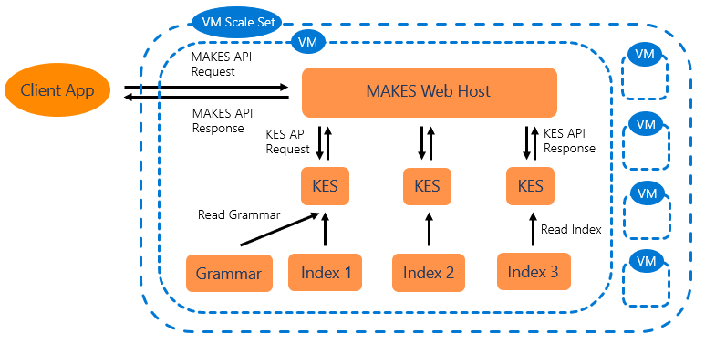
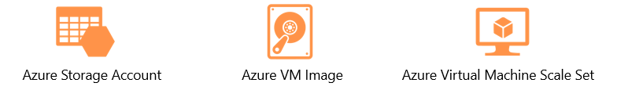
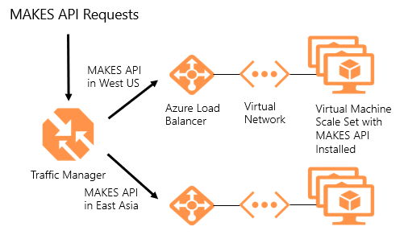
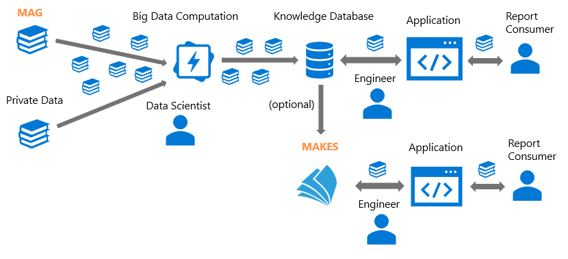

# About Microsoft Academic Knowledge Exploration Service

Microsoft Academic Knowledge Exploration Service (MAKES) was created to unlock the power of the [Microsoft Academic Graph (MAG)](../graph/index.yml) for realtime applications.  It enables users to build interactive solutions for knowledge based applications that can scale and deliver high quality results.  MAKES is a turn-key solution; running a single script will provision in Azure private instances of an interactive academic search API, powered by [Knowledge Exploration Service (KES)](#knowledge-exploration-service) APIs.  For an example of what can be built using MAKES, see the [Microsoft Academic Website](https://academic.microsoft.com/).

Once signed up for MAKES, new versions of the service and indexes will be delivered to you every 1-2 weeks.  Users have the option of using the default index supplied by the service, which includes all the entities and meta data included in MAG.

## Why use MAKES?

::: moniker range="makes-1.0"

because it's the first try..

::: moniker-end

::: moniker range="makes-3.0"

because it's more secure

::: moniker-end

Some more shared content here...

Here are some key features of the Microsoft Academic Knowledge Exploration Service (MAKES):

- **Self-hosting Project Academic Knowledge** - Many organizations have found great value in our [Project Academic Knowledge API](https://www.microsoft.com/research/project/academic-knowledge/) (formerly known as the Cognitive Service Academic Knowledge API), but have been limited by the throughput allowed.  MAKES is a turn-key solution to self-host this set of APIs without limits.

- **Create knowledge applications** - MAKES enables users to build dynamic knowledge applications that can analyze the state of research in particular areas, compare individuals and institutions and find objective connections between entities.  Check out our tutorials and samples for useful examples!

- **Add a large corpus of academic entities to an existing search solution** - Integrating MAKES can help enhance existing search solutions by giving users access to a large corpus of academic knowledge.

- **Coming soon - Customize using the Knowledge Exploration Service Management tool** -In some cases you may not need all of the data in MAG, or you would like combine your own private data with MAG. With the Knowledge Exploration Service Management tool(kesm.exe) you can easily create custom indexes and hosting options, using subsets or super-sets of the Microsoft Academic Graph. As an example, you could build an index specific to certain Journals or Institutions while including publications from your own organization.

## What is MAKES?

The Microsoft Academic knowledge Exploration Service (MAKES) in its' basic form is a self hosted [REST API](reference-makes-api.md) leveraging an index of all the entities in the Microsoft Academic Graph (MAG).  By subscribing to MAKES, the required components are delivered to your Azure subscription when new versions of MAG are created; typically once every 1 to 2 weeks.  A provided tool can then be run and MAKES instances are automatically provisioned to your Azure account.

The components shipped to a MAKES subscription include:

- **Web Host Application** - This is the REST API web application that interacts with the MAKES index and grammar.  See the [MAKES API](reference-makes-api.md) documentation to see what endpoints are available.

- **Indexes** - Binary index files built from MAG that support the [Knowledge Exploration Service (KES)](#knowledge-exploration-service).

- **Language model** - A grammar file built to support academic related queries. See the [natural language queries](concepts-queries.md) concepts page for more information.

- **Management tools** - Includes tools that help users customize MAKES and deploy instances to Azure. See the [Command Line Tool documentation](reference-makes-command-line-tool.md) for more details.

## MAKES Architecture

The MAKES API is designed to be hosted in an Azure Virtual Machine Scale Set to provide extensibility, scalability, and reliability.  [Azure Virtual Machine Scale Sets](https://docs.microsoft.com/azure/virtual-machine-scale-sets/overview) allow users to easily configure:

- Auto scaling (not set up by default)

- Load balancing

- Virtual network for additional security

Below is a diagram describing the internal MAKES architecture and how it interacts with requests:

## Minimum resource requirements

The most basic form of MAKES uses the following Azure resources:

- **Azure Storage account** - You will need to provision and specify a storage account when subscribing to MAKES.  Each release of MAKES will push all the required components to this storage account.  MAKES deployments require ~650GB of space.

- **Azure VM Image** - An Azure VM image will be provisioned by MAKES when deployed.

- **Azure Virtual Machine Scale Set** - A scale set is provisioned by MAKES when deployed.  The scale set includes an Azure virtual network and security group, an Azure load balancer, a static public IP address and a premium SSD.

## Scaling MAKES

MAKES is designed to scale to our users' requirements.  If more throughput is required, users are able to deploy additional virtual machines using the Azure Virtual Machine Scale Set.  By default, a load balancer is placed in front of a VM Scale set to distribute the load.

Additionally, if your application needs to be scaled globally, you may deploy MAKES to different regions.  Using Azure Traffic Manager or Azure Front Door, traffic will be directed to the closest instance to ensure optimal performance.

Below is an example of a geo-scalable architecture for MAKES:

## Using MAG and MAKES to generate a custom solution

>[!NOTE]
>This functionality is coming soon.

Some customers may have requirements that go beyond hosting the supplied index.  Specific customizations of the MAKES indexes are supported and give the user a great deal of flexibility.  Below is a diagram showing the end to end process users would follow when combining MAG and MAKES subscriptions to create custom solutions with private data and specific entities from MAG:

This scenario can be taken further as well.  Users are able to modify the grammar and schema of MAKES to support additional languages and data attributes.  These advanced topics are covered in the "how to" section.

## Knowledge Exploration Service

Knowledge Exploration Service (KES) offers a fast and effective way to add interactive search and refinement to applications. With KES, you can build a compressed index from structured data, author a grammar that interprets natural language queries, and provide interactive query formulation with auto-completion suggestions.

KES is available as a completely stand-alone project. For details and documentation please see [this website](https://docs.microsoft.com/azure/cognitive-services/KES/overview).