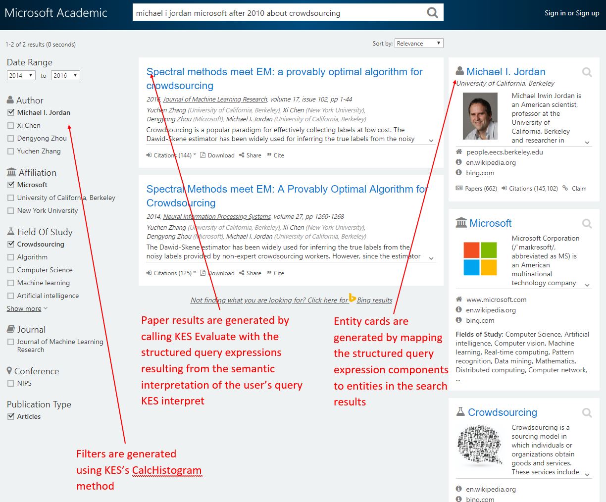

# Microsoft Academic Knowledge Exploration Service entity engine

The Microsoft Academic Knowledge Exploration Service entity engine enables query evaluation (evaluate) and histogram calculation (calchistogram) for academic entities in the Microsoft Academic Graph.

## Open Data License: [ODC-BY](https://opendatacommons.org/licenses/by/1.0/)

When using Microsoft Academic data (MAG, MAKES, etc.) in a product or service, or including data in a redistribution, please acknowledge Microsoft Academic using the URI https://aka.ms/msracad. For publications and reports, please cite the following article:

> Arnab Sinha, Zhihong Shen, Yang Song, Hao Ma, Darrin Eide, Bo-June (Paul) Hsu, and Kuansan Wang. 2015. An Overview of Microsoft Academic Service (MA) and Applications. In Proceedings of the 24th International Conference on World Wide Web (WWW '15 Companion). ACM, New York, NY, USA, 243-246. DOI=http://dx.doi.org/10.1145/2740908.2742839

## Overview

This engine is optimized for the lookup and retrieval of all types of academic entities using a wide range of their available attributes.

Search results, filters and entity cards on [Microsoft Academic](https://academic.microsoft.com/) are partially generated with this engine using a combination of evaluate and histogram methods and semantic interpretations from the [Semantic Interpretation engine](semantic-interpretation-engine.md):

   

## Affiliation entity schema

Attribute | Description | Type | Operations
--- | --- | --- | ---
Id | Entity ID | Int64 | Equals
Ty | Entity type | Enum | Equals
CC | Citation count | Int32 | None
ECC | Estimated citation count | Int32 | None
AfN | Normalized affiliation (institution) name | String | Equals
DAfN | Affiliation (institution) display name | Blob | N/A

## Author entity schema

Attribute | Description | Type | Operations
--- | --- | --- | ---
Id | Entity ID | Int64 | Equals
Ty | Entity type | Enum | Equals
CC | Citation count | Int32 | None
ECC | Estimated citation count | Int32 | None
AuN | Normalized author name | String | Equals
DAuN | Author display name | Blob | N/A
LKA | Last known author affiliation | Composite | N/A
LKA.AfId | Last known author affiliation ID | Int64 | Equals
LKA.AfN | Last known normalized author affiliation name | String | Equals

## Conference entity schema

Attribute | Description | Type | Operations
--- | --- | --- | ---
Id | Entity ID | Int64 | Equals
Ty | Entity type | Enum | Equals
CC | Citation count | Int32 | None
ECC | Estimated citation count | Int32 | None
CN | Normalized conference series name | String | Equals
DCN | Conference series display name | Blob | None 
F | Field of study composite collection | Composite[] | N/A
F.FId | Field of study ID | Int64 | Equals
F.FN | Normalized field of study name | String | Equals

## Conference instance entity schema

Attribute | Description | Type | Operations
--- | --- | --- | ---
Id | Entity ID | Int64 | Equals
Ty | Entity type | Enum | Equals
CC | Citation count | Int32 | None
ECC | Estimated citation count | Int32 | None
CIN | Normalized conference instance name | String | Equals
DCIN | Conference instance display name | Blob | None
CIL | Conference instance location | String | Equals
CISD | Conference instance start date | Date | Equals, IsBetween
CIED | Conference instance end date | Date | Equals, IsBetween
CIARD | Conference instance abstract registration date | Date | Equals, IsBetween
CISDD | Conference instance submission due date | Date | Equals, IsBetween
CINDD | Conference instance notification due date | Date | Equals, IsBetween
CIFVD | Conference instance final version date | Date | Equals, IsBetween
PCS | Conference instance parent conference series composite | Composite | N/A
PCS.CId | Conference instance parent conference series ID | Int64 | Equals
PCS.CN | Conference instance normalized parent conference series name | String | Equals
CD | Collection of conference instance date composite | Composite[] | N/A
CD.D | Conference instance  date  | Date | Equals, IsBetween
CD.T | Conference instance date type | String | Equals

## Field of study entity schema

Attribute | Description | Type | Operations
--- | --- | --- | ---
Id | Entity ID | Int64 | Equals
Ty | Entity type | Enum | Equals
CC | Citation count | Int32 | None
ECC | Estimated citation count | Int32 | None
FN | Normalized field of study name | String | Equals
DFN | Field of study display name | Blob | None
FL | Field of study hierarchy level | Int32 | Equals, IsBetween
FC | Collection of field of study children  | Composite[] | N/A
FC.FId | Field of study child field of study ID | Int64 | Equals
FC.FN | Field of study normalized child field of study name | String | Equals
FP | Collection of field of study parents | Composite[] | N/A
FP.FId | Field of study parent field of study ID | Int64 | Equals
FP.FN | Field of study normalized parent field of study name | String | Equals

## Journal entity schema

Attribute | Description | Type | Operations
--- | --- | --- | ---
Id | Entity ID | Int64 | Equals
Ty | Entity type | Enum | Equals
CC | Citation count | Int32 | None
ECC | Estimated citation count | Int32 | None
JN | Normalized journal name | String | Equals
DJN | Journal display name | Blob | None

## Paper entity schema

> Note that each engine (semantic interpretation, entity) indexes a different set of attributes for paper entities

Attribute | Description | Type | Operations
--- | --- | --- | ---
Id | Entity ID | Int64 | Equals
Ty | Entity type | Enum | Equals
CC | Citation count | Int32 | None
ECC | Estimated citation count | Int32 | None
D | Publication date | Date | Equals, IsBetween
L | Paper language(s) | String | Equals
Pt | Publication type | String | Equals
RId | Collection of paper IDs that reference this entity | Int64[] | Equals
Ti | Normalized paper title | String | Equals
W | Collection of words found in normalized paper title | String[] | Equals
Y | Publication year | Int32 | Equals, IsBetween
AA | Author affiliation composite collection | Composite[] | N/A
AA.AfId | Author affiliation ID | Int64 | Equals
AA.AfN | Normalized author affiliation name | String | Equals
AA.DAfN | Author affiliation display name | Blob | None
AA.AuId | Author ID | Int64 | Equals
AA.AuN | Normalized author name | String | Equals
AA.DAuN | Author display name | Blob | None
AA.S | Sequence number of author in publication (1-based) | Int32 | Equals
C | Conference series composite | Composite | N/A
C.CId | Conference series ID | Int64 | Equals
C.CN | Normalized conference series name | String | Equals
CI | Conference instance composite | Composite | N/A
CI.CIId | Conference instance ID | Int64 | Equals
CI.CIN | Normalized conference instance name | String | Equals
F | Field of study composite collection | Composite[] | N/A
F.FId | Field of study ID | Int64 | Equals
F.FN | Normalized field of study name | String | Equals
J | Journal composite | Composite | N/A
J.JId | Journal ID | Int64 | Equals
J.JN | Normalized journal name | String | Equals

## SRGS grammar

Speech Recognition Grammar Specification (SRGS) is a [W3C recommended standard](https://www.w3.org/TR/speech-grammar/) for defining the syntax for grammar representation.

> Because the entity engine is not designed for interpreting natural language academic queries, its grammar is essentially a placeholder that only enables simple entity lookup by ID. To interpret natural language academic queries, please use the [semantic interpretation engine](semantic-interpretation-engine.md).

``` XML
<?xml version="1.0" encoding="utf-8"?>
<grammar root="GetEntities">
  <import schema="schema.json" name="entity"/>
  <rule id="GetEntities">
    <tag>query = All();</tag>
    <attrref uri="entity#Id" name="q"/>
    <tag>out = Resolve(q);</tag>
  </rule>
</grammar>
```