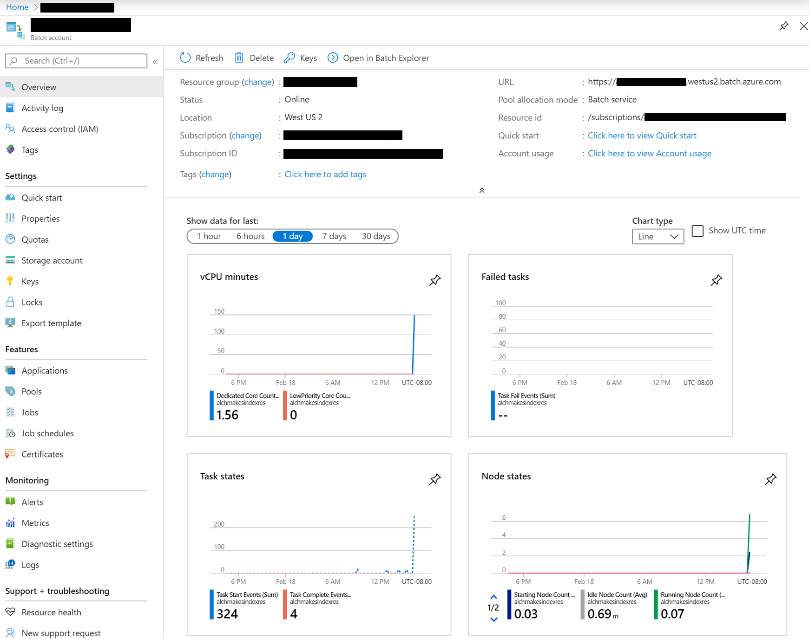
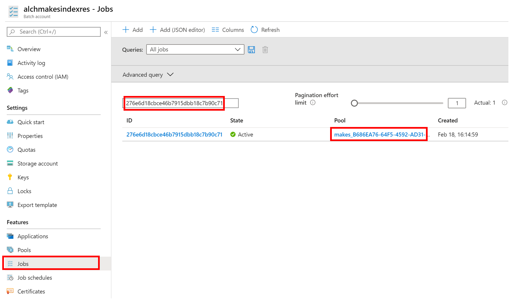
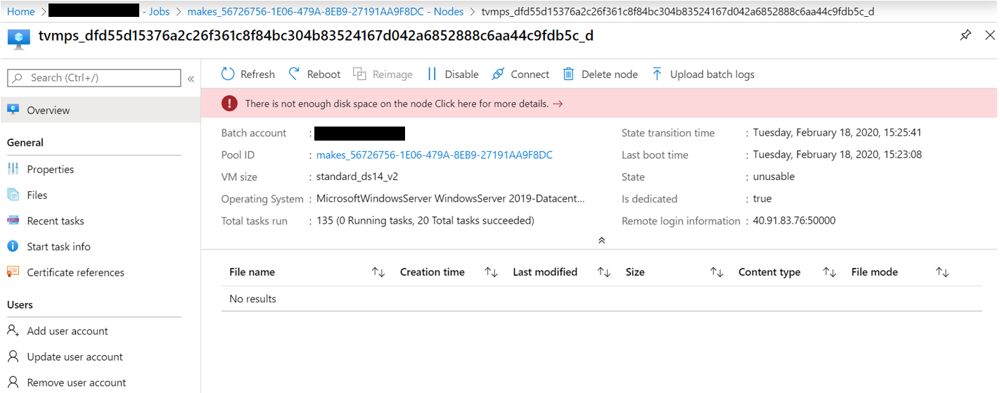

# Troubleshoot Common MAKES command line tool issues

## Azure login failure due to multiple subscriptions being tied to a single Azure account

If you have multiple azure subscriptions associated with a single azure account, you'll need to specify the azure active directory domain name associated with the azure subscription that you would like to use to execute the command. (e.g. "--AzureActiveDirectoryDomainName constco.onmicrosoft.com").  

You can find this information by logging into azure portal, searching for "Azure Active Directory" and viewing resource detail page.  The domain name to use will be in the "Overview" section at the top left.

## Azure subscription limit

If you encounter errors such as "operation could not be completed as it results in exceeding approved XXXXXX quota", you'll either need to contact azure support to increase your account quota or change the MAKES host machine settings.  

## Incomplete MAKES release transfer

A release may not be completed when you see a new folder in your storage account. Please allow 1 day after new release folder creation for all the necessary files to be transferred.

## MAKES hosting resource/deployment region mismatch

MAKES can only be deployed to the same region as the MAKES hosting image. If you see an error message containing "...The Image '/subscriptions/XXXXXXX-XXXX-XXX-XXXX-XXXXXXX/resourceGroups/xxxxmakeshostres/providers/Microsoft.Compute/images/xxxxmakeshostres' cannot be found in 'xxxx' region..." Make sure to create MAKES deployments and hosting images in the same region.

## Wrong MAKES path parameters

Special characters in parameters need to be escaped. You can also escape the whole parameter string by using quotes. E.g. --MakesPackage "https://consto.blob.core.windows.net/makes/2020-01-23/"

*Quotation charactors need to be straight. Ex: "ParamValue". Using any other qutotation charactor is will result in an error.  Ex: “ParamValue”

## Command line tool(kesm.exe) version mismatch

Use the command line tool that is contained in each release to customize and deploy MAKES. Previous versions of the kesm.exe tool are unsupported for new releases.  

## MAKES deployment failure due to bad MAKES hosting image  

MAKES hosting image creation may fail due to Azure outages or failures. If you cannot reach your MAKES status endpoint (http://<deploymentName>.<deploymentRegion>.cloudapp.azure.net/status), please try creating the MAKES hosting image again using the command line tool(kesm.exe).

## MAKES BuildIndex job hangs with no task failures

The underlying worker node for a BuildIndex job may have gone into an error state. Check the node status using the following steps:  

1. Find the batch resource associated with the BuildIndex job
    1. Open [Azure Management Portal](https://portal.azure.com)
    1. Search for the batch resource associated with the BuildIndex job by typing in the **IndexResourceName** used for the CreateIndexResources command
    1. Open the batch account resource that matches the **IndexResourceName**.
        
1. Open up BuildIndex job's pool detail
    1. Select **Jobs**
    1. Find the BuildIndex job by the job ID
    1. Select the job pool
        
1. Open error nodes detail page to inspect the  failure
    1. Select **Nodes**
    1. Select the node that's in an unhealthy state to view the error
        

If the error shows "There is not enough disk space on the node..." re-submit the job with a higher worker count and partition count by using the --WorkerCount and --IndexPartitionCount command. Otherwise, select **reboot** to restart the failed node.  

## MAKES BuildIndex job hangs with task failures due to data transfer

If your have large input entities data, BuildIndex job may encounter data transfer failure due to latency or throttling by Azure. To prevent failures due to data transfer, co-locate the input/output data storage account in the same region as the index build resources.
