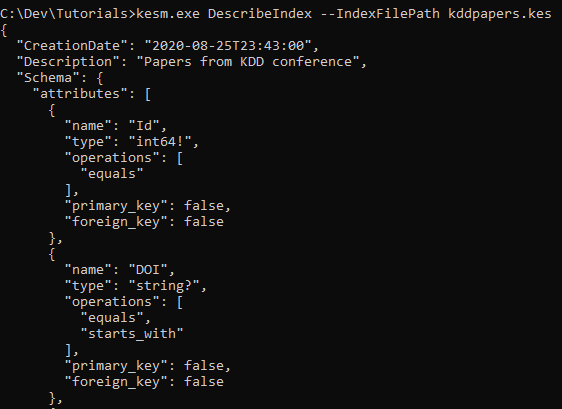

# Introduction 

This is the first part of building an knowledge application for KDD conference. 

The application will have all the knowledge of papers published in **Interationial Conference on Knowlege Discovery and Data Mining**. It will help users find KDD papers and Oral presentations through Natural Language Processing and smart fitlers. 

In this tutorial, we'll focus on designing the approrpiate KES schema such that KDD papers can be retriable and filterabl. We will start by designing a KES schema for the conference papers, build/host the index, and leverage MAKES REST API (Evaluate and Histogram) to create the Filterable Paper List UI.


## Get started 

1. Download and unzip tutorial resources from [here](https://makesstore.blob.core.windows.net/makes-tutorial-resource/latest.zip).

1. Download and unzip MAKES managment tool (kesm.exe) from your latest MAKES release. **https://<makes_storage_account>.blob.core.windows.net/makes/<makes_release>/tools/kesm.zip**

## Design a KES schema

We start by determining what attributes do we want to include in the index, what are appropriate types to store them, and what operations should they support. The conference paper entity data **kddData.json** can be found at in the tutorial resource folder. The data is dervieved from MAG. 

Here's an example entity from **kddData.json**
```JSON
{
    "logprob": -21.407,
    "Id": 20513064,
    "Title": "proceedings of the 4th multiclust workshop on multiple clusterings multi view data and multi source knowledge driven clustering",
    "TitleWords": [
        "proceedings",
        "of",
        "the",
        "4th",
        "multiclust",
        "workshop",
        "on",
        "multiple",
        "clusterings",
        "multi",
        "view",
        "data",
        "and",
        "source",
        "knowledge",
        "driven",
        "clustering"
    ],
    "OriginalTitle": "Proceedings of the 4th MultiClust Workshop on Multiple Clusterings, Multi-view Data, and Multi-source Knowledge-driven Clustering",
    "Abstract": "Cluster detection is a very traditional data analysis task with several decades of research. However, it also includes a large variety of different subtopics investigated by different communities such as data mining, machine learning, statistics, and database systems. \"Multiple Clusterings, Multi-view Data, and Multi-source Knowledge-driven Clustering\" names several challenges around clustering: making sense or even making use of many, possibly redundant clustering results, of different representations and properties of data, of different sources of knowledge. Approaches such as ensemble clustering, semi-supervised clustering, subspace clustering meet around these problems. Yet they tackle these problems with different backgrounds, focus on different details, and include ideas from different research communities. This diversity is a major potential for this emerging field and should be highlighted by this workshop. A core motivation for this workshop series is our believe that these approaches are not just tackling different parts of the problem but that they should benefit from each other and, ultimately, combine the different perspectives and techniques to tackle the clustering problem more effectively. In paper presentations and discussions, we therefore would like to encourage the workshop participants to look at their own research problems from multiple perspectives.",
    "Year": 2013,
    "Date": "2013-08-11",
    "CitationCount": 1,
    "EstimatedCitationCount": 1,
    "FieldsOfStudy": [
        {
            "Name": "subspace clustering",
            "OriginalName": "Subspace clustering"
        },
        {
            "Name": "multi source",
            "OriginalName": "Multi-source"
        },
        {
            "Name": "data science",
            "OriginalName": "Data science"
        },
        {
            "Name": "conceptual clustering",
            "OriginalName": "Conceptual clustering"
        },
        {
            "Name": "computer science",
            "OriginalName": "Computer science"
        },
        {
            "Name": "cluster analysis",
            "OriginalName": "Cluster analysis"
        }
    ],
    "AbstractWords": [
        "cluster",
        "detection",
        "is",
        "a",
        "very",
        "traditional",
        "data",
        "analysis",
        "task",
        "with",
        "several",
        "decades",
        "of",
        "research",
        "however",
        "it",
        "also",
        "includes",
        "large",
        "variety",
        "different",
        "subtopics",
        "investigated",
        "by",
        "communities",
        "such",
        "as",
        "mining",
        "machine",
        "learning",
        "statistics",
        "and",
        "database",
        "systems",
        "38",
        "39",
        "40",
        "41",
        "43",
        "44",
        "names",
        "challenges",
        "around",
        "clustering",
        "making",
        "sense",
        "or",
        "even",
        "use",
        "many",
        "possibly",
        "redundant",
        "results",
        "representations",
        "properties",
        "sources",
        "knowledge",
        "approaches",
        "ensemble",
        "semi",
        "supervised",
        "subspace",
        "meet",
        "these",
        "problems",
        "yet",
        "they",
        "tackle",
        "backgrounds",
        "focus",
        "on",
        "details",
        "include",
        "ideas",
        "from",
        "this",
        "diversity",
        "major",
        "potential",
        "for",
        "emerging",
        "field",
        "should",
        "be",
        "highlighted",
        "workshop",
        "core",
        "motivation",
        "series",
        "our",
        "believe",
        "that",
        "are",
        "not",
        "just",
        "tackling",
        "parts",
        "the",
        "problem",
        "but",
        "benefit",
        "each",
        "other",
        "ultimately",
        "combine",
        "perspectives",
        "techniques",
        "to",
        "more",
        "effectively",
        "in",
        "paper",
        "presentations",
        "discussions",
        "we",
        "therefore",
        "would",
        "like",
        "encourage",
        "participants",
        "look",
        "at",
        "their",
        "own",
        "multiple",
        ""
    ],
    "Conference": {
        "Name": "kdd"
    },
    "VenueFullName": "Knowledge Discovery and Data Mining",
    "VenueShortName": "KDD",
    "AuthorAffiliations": [
        {
            "AuthorName": "ira assent",
            "OriginalAuthorName": "Ira Assent",
            "Sequence": 1,
            "AffiliationName": "aarhus university",
            "OriginalAffiliationName": "aarhus university, denmark"
        },
        {
            "AuthorName": "carlotta domeniconi",
            "OriginalAuthorName": "Carlotta Domeniconi",
            "Sequence": 2,
            "AffiliationName": "george mason university",
            "OriginalAffiliationName": "George Mason University"
        },
        {
            "AuthorName": "francesco gullo",
            "OriginalAuthorName": "Francesco Gullo",
            "Sequence": 3,
            "AffiliationName": "yahoo",
            "OriginalAffiliationName": "Yahoo! Res., Spain"
        },
        {
            "AuthorName": "andrea tagarelli",
            "OriginalAuthorName": "Andrea Tagarelli",
            "Sequence": 4,
            "AffiliationName": "university of calabria",
            "OriginalAffiliationName": "[University of Calabria, Italy]"
        },
        {
            "AuthorName": "arthur zimek",
            "OriginalAuthorName": "Arthur Zimek",
            "Sequence": 5,
            "AffiliationName": "ludwig maximilian university of munich",
            "OriginalAffiliationName": "Ludwig Maximilians Universität München Germany"
        }
    ]
}
```
After inspecting the data, we can now create the schema for it. 

### Display only attributes

The display attrbitues are attributes that are needed for display only, such as **OriginalTitle**, **OriginalAuthorName** In this case, we can define them as **Blob** type such that KES won't create any index for them.

The following schema elements reflects the display attributes:

```json
{
  "attributes": [
    {"name": "OriginalTitle","type": "blob?"},
    {"name": "Abstract","type": "blob?"},
    
    {"name": "AuthorAffiliations","type": "Composite*"},
    {"name": "AuthorAffiliations.OriginalAuthorName","type": "blob?"},
    {"name": "AuthorAffiliations.OriginalAffiliationName","type": "blob?"},

    {"name": "FieldsOfStudy","type": "Composite*"},
    {"name": "FieldsOfStudy.OriginalName","type": "blob?"},
    
    {"name": "VenueFullName","type": "blob?"},
    {"name": "VenueShortName","type": "blob?"}
  ]
}
```

### Filter attributes

Filter attributes are attributes that can be used to filter entity data.

The numeric attributes that we want to filter by would be the conference paper's **Year, CitationCount, EstimatedCitationCount**. Depending on the filter UX we want to provide, we can add **equals** and/or **is_between** operations to the filterable numeric attributes. 

>
>[!NOTE] 
>Try adding **is_between** to numeric filter attributes and extend the sample code to enables publication year range filter.

The following schema elements reflects the filterable numeric attributes:

```json
{
  "attributes": [
    {"name": "Id","type": "int64!","operations": [ "equals" ]},
    {"name": "Year","type": "int32?","operations": [ "equals", "is_between" ]},
    {"name": "CitationCount","type": "int32?","operations": [ "equals", "is_between" ]},
    {"name": "EstimatedCitationCount","type": "int32?","operations": [ "equals", "is_between" ]},
    {"name": "AuthorAffiliations.Sequence","type": "int32?","operations": [ "equals" ]}
  ]
}
 
For string attributes, we want to select attributes that common values such as journal name, conference name. For attribute values that may be too noisy, you may opt for the normalized version such as using **AuthorName** instead of **OriginalAuthorName**. we should add **equals** operation to these attributes.


The following schema elements reflects the filterable string attributes:

```json
{
  "attributes": [
    {"name": "DOI","type": "string?","operations": [ "equals", "starts_with" ]},
    {"name": "Title","type": "string?","operations": [ "equals", "starts_with" ]},
    {"name": "TitleWords","type": "string*","operations": [ "equals" ]},
    {"name": "AbstractWords","type": "string*", "operations": [ "equals" ]},
  
    {"name": "AuthorAffiliations","type": "Composite*"},
    {"name": "AuthorAffiliations.AuthorName","type": "string?","operations": [ "equals", "starts_with" ]},
    {"name": "AuthorAffiliations.AffiliationName","type": "string?","operations": [ "equals", "starts_with" ]},
    
    {"name": "FieldsOfStudy","type": "Composite*"},
    {"name": "FieldsOfStudy.Name","type": "string?","operations": [ "equals", "starts_with" ]},

    {"name": "Conference","type": "Composite?"},
    {"name": "Conference.Name","type": "string?","operations": [ "equals", "starts_with" ]},
  ]
}

We've include a complete schema for you to compare against. See **<tutorial_resource_root>/kddSchema.josn**

## Build a custom paper index 

Once you're ready with your schema. We can start building the index. Since the index we're building is relatively small, we can build this locally on a windows machine. If the index you're building is large, you can use cloud index build to leverage high performing machines in Azure.  Nevertheless, we should use local index build with test data to validate the schema correctness during development.

### Validate schema using local index build

Open up a commandline console, change directory to the root of the conference tutorial resource folder, and build the index with the following command:

```cmd
kesm.exe BuildIndexLocal --SchemaFilePath <tutorial_resource_root>/kddSchema.json --EntitiesFilePath kddData.json --OutputIndexFilePath <tutorial_resource_root>/kddpapers.kes --IndexDescription "Papers from KDD conference"
```

>![NOTE]
> BuildIndexLocal command is only avaliable on win-x64 version of kesm
>

Validate the index is built correctly by inspecting the index meta data by using the following command:

```cmd
kesm.exe DescribeIndex --IndexFilePath <tutorial_resource_root>/kddpapers.kes
```



### Submit a index job for production workflow

The index we're creating for this tutorial is relatively small and can be built locally. For larger size index (containing more than 1M entities), we can use cloud builds to leverage high performing machines in Azure to build. To learn more, follow [How to create index from MAG](how-to-create-index-from-mag.md)

## Deploy MAKES API Host with custom index

We are now ready to set up a MAKES API instance with custom index.

Upload built custom index to your MAKES storage account. You can do so by using following [Blob Upload from Azure Portal](https://docs.microsoft.com/en-us/azure/storage/blobs/storage-quickstart-blobs-portal). If you use cloud index build, you may skip this step. 

Run CreateHostResources to create MAKES hosting virtual machine image.

```cmd
kesm.exe CreateHostResources --MakesPackage https://<makes_storage_account_name>.blob.core.windows.net/makes/<makes_release_version> --HostResourceName <makes_host_resource_name>
```

Run DeployHost command and use the "--MakesIndex" parameter to load the custom KDD paper index we've built.

```cmd
 kesm.exe DeployHost --HostName "<makes_host_instance_name>" --MakesPackage "https://<makes_storage_account_name>.blob.core.windows.net/makes/<makes_release_version>/"  --MakesHostImageId "<id_from_previous_command_output>" --MakesIndex "<custom_index_url>"
```

>
> ![NOTE]
> You can reduce Azure consumption for this tutorial by using the "--HostMachineSku" parameter and set the SKU to "Standard_D2_V2".
> For more detailed deployment instruction, see (Create API Instances)[get-started-create-api-instances.md#create-makes-hosting-resources]

## Create Filterable Paper List UX using Evaluate and Histogram API

We now have a backend API to server our conference paper data. We can now create the client application to showcase the filterable paper list. 

### Paper list KES Query Expression

We start with crafting a KES query expression that will represent the paper list shown on the UI. Since the inital list of papers we want to see is "all papers", the corresponding KES query expression would be "All()". For more information on KES Query Expressions, see [Structured query expressions](concepts-query-expressions.md)

This corresponds to the following code in **<tutorial_resource_root>/ConferenceWebsite/index.js**

```javascript
/* 
 * Client app entry point/ main.
 */
var app = new FilterablePaperList();
app.setOriginalPaperListExpression("All()");
mount(document.body, app);
```

### Retrieve top papers 

We can then call Evaluate API with the paper list expression "All()" to retrieve all the paper entities. After retrieiving the paper entities from Evaluate API, all is left is to translate the entity data to UI elements.

To get papers using Evaluate API, see **async GetPapers(paperExpression)** method in **<tutorial_resource_root>/ConferenceWebsite/makesInteractor.js**:

```javascript
/*
    * Gets a list of papers using a KES expression
    */ 
async GetPapers(paperExpression)
{
    let requestBody = {
            expr: paperExpression,
            attributes: this.paperListItemAttributes,
            count: this.paperListItemCount
        }

    let response = await Promise.resolve($.post(this.GetEvaluateApiEndpoint(), requestBody));      
    return response?.entities;
}
```

For more information on Evaluate API, see [Evaluate REST API](reference-post-evaluate.md)

The corresponding data transformation logic for paper UI elements can be found in 
    1. **<tutorial_resource_root>/ConferenceWebsite/paperListItem.js**
    1. **<tutorial_resource_root>/ConferenceWebsite/paperFieldsOfStudyListItem.js**

### Generate filters  

We can also call Histogram API with the paper list expression "All()" to get filter attribute histograms and transform them into filters. 

Histogram returns the most probalistic attribute values for each attributes. We can use these values for each filter attribute as suggested filter values.

To generate filters using Histogram API, see **async GetFilters(paperExpression)** method in **<tutorial_resource_root>/ConferenceWebsite/makesInteractor.js**:

```javascript
    /*
     * Gets a list of filters/filter sections using a KES expression
     */
    async GetFilters(paperExpression)
    {
        let requestBody = {
            expr: paperExpression,
            attributes: this.paperFilterAttributes,
            count: this.paperFilterCount
        }
        let response = await Promise.resolve($.post(this.GetHistogramApiEndpoint(), requestBody));
        return response?.histograms;
    }
```

For more information on Histogram API, see [Histogram REST API](reference-post-histogram.md)

The corresponding data transformation logic for filter UI elements can be found in 
    1. **<tutorial_resource_root>/ConferenceWebsite/filterSectionListItem.js**
    1. **<tutorial_resource_root>/ConferenceWebsite/filterAttributeListItem.js**


### Handle filter event

We can apply filter by modifying the paper list expression. To apply a filter, we combine the current paper expression and the target filter expression with a "And" operator. 

For example, to apply a filter to constraint the paper publication year to 2013, the filter expression will be **Y=2019**, and the paper list expession will be **And(All(),Y=2019)**.

To handle filter event, see **async appendFilter(attributeName, attributeValue)** and **async updatePaperList()** method in **<tutorial_resource_root>/ConferenceWebsite/filterablePaperList.js** for more details.

```javascript
    /*
     * appends a filter and refreshes the paper list.
     */
    async appendFilter(attributeName, attributeValue)
    {
        if (!attributeName)
        {
            console.log("appendFilter: attributeName cannot be null");
            return;
        }
        if (!attributeValue)
        {
            console.log("appendFilter: attributeValue cannot be null");
            return;
        }

        this.pageData.appliedFilterListData.push(new Filter(attributeName, attributeValue));
        await this.updatePaperList();
    }
    

    /*
     * refreshes the paper list.
     * updates the paper list expression by combing the original paper list expression and applied filters expressions
     */
    async updatePaperList()
    {
        let filterExpressions = this.pageData.appliedFilterListData.map( paperFilter => paperFilter.getKesExpression())
        filterExpressions.push(this.pageData.originalExpression);
        let paperExpression = this.makesInteractor.CreateAndExpression(filterExpressions);
        await this.updatePaperListExpression(paperExpression);
    }
```

### Use sample UI code to see them in action

We've create a sample client app written in javascript. You should be able to see the conference website with filterable paper list by wiring up the MAKES host URL to your deployed MAKES instance. For more to run the client app information, see **<tutorial_resource_root>/ConferenceWebsite/README.md**