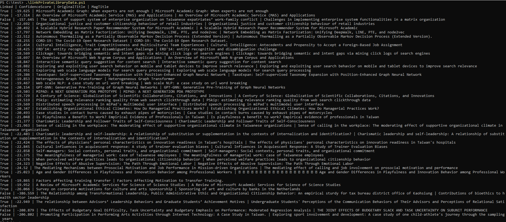

# Entity Linking

This tutorial illustrates how to link private paper data with MAKES paper entities. In this tutorial, we will show you how to link our sample library papers with MAKES paper entities using MAKES Interpret API.

## Prerequisites

- [Microsoft Academic Knowledge Service (MAKES) subscription](get-started-setup-provisioning.md)
- [Powershell 7](https://docs.microsoft.com/powershell/scripting/install/installing-powershell-core-on-windows?view=powershell-7)

## Select entity attributes to enrich our data

We start by determining which MAKES entity type do we want to link our data against and what attributes can help enrich our private data. See [MAKES Entity Schema](reference-makes-api-entity-schema.md) to explore the different types and entities and attributes available in MAKES' default index.

In this tutorial, the [sample library data](samplePrivateLibraryData.json) is bare bones and only contains paper title and on-prem full text link. We want to add more paper information and enable semantic/keyword search by linking against MAKES' paper entity.

In the [sample entity linking script](linkPrivateLibraryData.ps1), we will be leverage paper entity's DOI, citation count, abstract, fields of study, authors, affiliation, and venue to enrich our data and support semantic/keyword search. For detailed list of attributes, see how **interpretRequestBody** is constructed in the [sample entity linking script](linkPrivateLibraryData.ps1).

## Determine linking strategy

Once we know what entity we want to link our data against, we can determine what's the appropriate linking strategy. In abstract, we'll leverage MAKES's [natural language processing](concepts-queries.md) capability via Interpret API to link entities.

MAKES' default grammar supports vairous type of paper search queries such as author, affiliation, fields of study, etc. You can leverage the Interpret test page to explore what types of query makes the most sense for your senario. In this tutorial, our sample library data includes a title so we can leverage MAKES' paper title search capability to link our data. We achieve this by sending Interpret requests to a MAKES instance with the query being the library paper title. For detailed list of attribute see how **interpretRequestBody** is constructed in the [sample entity linking script](linkPrivateLibraryData.ps1).

You can also link different types of entities together with the default grammar. For example, you can link author data with MAKES papers by sending Interpret requests with queries being "**[author name] [affiliation name]"**.

You can also build a custom grammar to better fit your linking scenario.

## Set appropriate confidence score for linking

Lastly, we'd have to determine an acceptable confidence score to link entities. Interpret API returns a log probability associated with each interpretation. This log probability can be seen as "confidence score" for the given interpretation. The sample entity linking script uses **-100** as the cut off confidence score for linking data.

Depending on your linking strategy, you may have to set a different score. You may also want to design a custom grammar to have better scoring system for your scenario.

## Run sample solution to see entity linking in action

1. Deploy a MAKES instance by following [Create API Instance](get-started-create-api-instances.md) guid
1. Download [Sample Library Data](samplePrivateLibraryData.json)
1. Download [Sample Entity Linking Script](linkPrivateLibraryData.ps1)
1. Modify the entity linking script and set **makesEndpoint** variable to your deployed MAKES instance url
1. Open up a powershell7 console and run the sample entity linking script. Make sure the sample library data and linking script are under the same directory.

The sample entity linking script output should look like the following:

## Next steps

Advance to the next section to learn how to design a MAKES schema to enable filter and search for the library data.