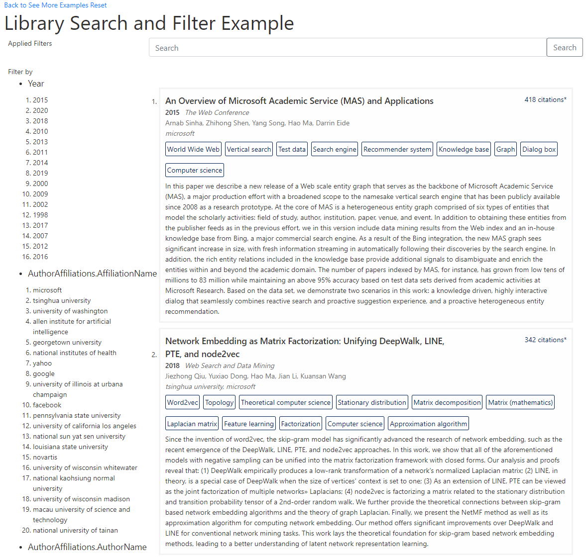

# Build a library search

This tutorial illustrates how to build a library search using the linked publication records from [link private publication records with MAKES entities](tutorial-entity-linking.md) tutorial and concepts from [library browser with contextual filters](tutorial-entity-linking.md) tutorial. You will learn how to:

- Design a MAKES schema tailored for publication search
- Design a MAKES grammar to process search queries
- Build, compile, and deploy a MAKES instance with custom index and grammar
- Create a frontend client for publication search using MAKES APIs.



## Prerequisites

- [Microsoft Academic Knowledge Exploration Service (MAKES) subscription](get-started-setup-provisioning.md) (release version after 2020-11-23)
- Completion of [link private publication records with MAKES entities tutorial](tutorial-entity-linking.md)
- Completion of [build a library browser with contextual filters tutorial](tutorial-schema-design.md)
- Read through the [define index schema how-to guide](how-to-index-schema.md)
- Read through the [define grammar how-to guide](how-to-grammar.md)
- Download the [sample search schema for linked private library publications](samplePrivateLibraryData.linked.search.schema.json)
- Download the [sample search grammar for linked private library publications](samplePrivateLibraryData.linked.search.grammar.xml)

## Design a schema for search

When designing a new schema for search, it's important to evaluate the following:

- What entity attributes can appear in search queries?
- How will the entity attributes appear in search queries?

### Publication search schema design goal

To determine what attributes that need to be indexed, we need to drill into the types of search queries we will process. We can map out what search queries need to be by supported by going through the search scenarios. For this tutorial, we want to enable users to

- Search by categorical attributes, such as fields of study, author and affiliation.
- Search by keywords extracted from abstact and title
- Search by identifiable attributes, such as the publication's title, DOI, and the full text url from the original records.

### Modify library browser schema to support search

The design goal above guides us to create the [sample search schema for linked private library publications](samplePrivateLibraryData.linked.search.schema.json) by modifying the schema from ["Build a library browser with contextual filters"](tutorial-entity-linking.md) tutorial. The following attributes and index operations were added:

| Attribute Name | Description| Index Data Type | Index Operations |
| ---- | ---- | ---- | ---- |
| `Abstract.Words` | A words array containing all distinct words from the publication's abstract. Used for supporting abstract keywords search. | `string*` | `["equals"]` |
| `DOI.Text` | Used for providing attribute match in DOI search. | `string?` | `["equals"]` |
| `Title.Text` | Used for providing attribute match in title search. | `blob?` | - |
| `Title.Words` | A words array containing all distinct words from the publication's title. Used for supporting title keywords search. | `string*` | `["equals"]` |
| `FullTextUrl.Text` | Used for providing attribute match in FullTextUrl search| `string?` | `["equals"]` |

#### Search attributes

Attributes that we plan to use for processing search queries need to be indexed, similar to filter attributes in the ["Build a library browser with contextual filters"](tutorial-schema-design.md) tutorial. For example, to enable our application to process search queries like "papers from microsoft about machine learning" we need to enable the `equals` index operation on the `FieldsOfStudy.Text` and `AuthorAffiliations.AffiliationName` attributes.

Before indexing the attributes, we also want to normalize the attributes to improve search results. For example, we can improve publication title search accuracy by normalizing both the publication titles and the search queries to lowercase characters only. This ensures that publication title queries that have case mismatches will still yield search results. For more normalization details, see `MakesInteractor.NormalizeStr(queryStr)` in `makesInteractor.js`.

To enable fuzzy search or keywords search, we may also transform the attributes before indexing the them. For example, we enable abstract keywords search by transforming the attribute `Abstract.Text` into `Abstract.Words` such that unique words from abstracts can be indexed.

## Design a search grammar

Now that we have the appropriate data fields in our index, we will design a grammar tailored to process natural language search queries. In this tutorial, we will use the [sample grammar](samplePrivateLibraryData.linked.search.grammar.xml) to illustrate how to support [single attribute queries](#support-single-attribute-queries), [multiple attribute queries](#support-multiple-attribute-queries), [keyword based queries](#support-keyword-based-queries), [composite entity attribute queries](#support-composite-entity-attribute-queries), and [dropping query terms when they can't be matched](#support-dropping-query-terms-when-they-can't-be-matched)

### Support single attribute queries

Single attribute queries are queries that only contain a single publication attribute. For example, a user may want to look up a publication by its title, doi, or full text url. These are basically lookup queries using attributes that can be identifiers of the entities themselves. To craft a grammar for single attribute queries, we can use the `<attrref>` element:

:::code language="xml" source="samplePrivateLibraryData.linked.search.grammar.xml" id="snippet_direct_attribute_search":::

This allows us to process queries such as "paper titled An Overview of Microsoft Academic Service (MAS) and Applications" or "paper with doi 10.1145/2740908.2742839"

We also need to return the corresponding KES query expression once the attribute is matched. The `<attrref uri="libraryPapers#Title.Text" name="q"/>` element will store the matched paper title in a variable called "q". We can then craft our return query by using the following:

:::code language="xml" source="samplePrivateLibraryData.linked.search.grammar.xml" id="snippet_create_return_query":::

### Support multiple attribute queries

Multiple attribute queries are queries that contain multiple attribute terms. For example, a user may want to search for publications given a few fields of study and affiliations.

We use the repeat item `<item repeat="1-INF" repeat-logprob="-1">` element to process queries that contains multiple attributes by continously matching remaining query terms using different search grammars.

:::code language="xml" source="samplePrivateLibraryData.linked.search.grammar.xml" id="snippet_multiple_attribute_search_loop":::

This allows us to process queries such as "papers from microsoft about machine learning"

### Support keyword based queries

Keyword based queries are queries that contain keywords from entities. For example, a user may search for a paper using terms from the paper's title or abstract.

We use a `<item repeat="1-INF">` element to process keyword based queries using abstract and title words.

:::code language="xml" source="samplePrivateLibraryData.linked.search.grammar.xml" id="snippet_partial_attribute_search":::

Notice that we have heavier penalties (-3 and -4) associated with title and abstract word search compared to other grammar rules in the sample grammar. (i.e. author and affiliation searches have a penalty of -2). This is designed to demote title/abstract keyword searches if more specific attribute searches yield results.

In addition to heavier penalties, we also set a minimum word match count requirement for title and abstract words search. Title and abstract words may cover lots of common terms that can be matched against terms in a query. We introduce this requirement to create a higher quality bar for title and abstract words search results. The following code ensures that the title and abstract words search is only valid if there are 3 or more words in the query that can be matched against the title/abstract words.

:::code language="xml" source="samplePrivateLibraryData.linked.search.grammar.xml" id="snippet_partial_attribute_search_constraints":::

### Support dropping query terms when they can't be matched

We can make attribute matching less strict by allowing query terms to be dropped/ignored. For example, a user may want to search for the publication "A Review of Microsoft Academic Services for Science of Science Studies" by using the parts of the title the user recalls and enters the query "Microsoft Academic Services". Allowing query terms to be ignored enables this type of query to be matched via keyword attributes.

:::code language="xml" source="samplePrivateLibraryData.linked.search.grammar.xml" id="snippet_allow_drop_terms_in_quries":::

We enable drop terms by using `<regex pattern='\b\w+' name="garbage" />` element to match against any words. We also pick a high penalty `<item logprob="-25">` to discourage query terms being dropped.

We also want to ensure that the grammar cannot drop all terms in a query. To achieve this, we use a variable `hasSearchResult` to represent that at least one type of search was used to process the query and not all terms are being treated as drop/garbage terms.

:::code language="xml" source="samplePrivateLibraryData.linked.search.grammar.xml" id="snippet_drop_term_constraints":::

### Support composite entity attribute queries

We can improve search accuracy by creating a grammar that consider search intents. A search query containing an author name and an affiliation name may have multiple intents. An intent can be "search for papers based on an author and an institution that the author has collaborated with", or "search for papers based on an author who is affiliated with an institution", etc. In the sample grammar, we create a special rule to recognize the intent, "search for papers based on an author who is affiliated with an institution". This enables the grammar to recognize the intent for queries like "papers by iheng chen while at national sun yat sen university" and return results with more accuracy.

The search grammar below handles the natural language search query format for extracting the intent.

:::code language="xml" source="samplePrivateLibraryData.linked.search.grammar.xml" id="snippet_composite_entity_attribute_search":::

Ensure the query returned from the search grammar yields results by calling the `Resolve` semantic function and validate the result by calling `HasResult` and `AssertRequals` semantic function.

:::code language="xml" source="samplePrivateLibraryData.linked.search.grammar.xml" id="snippet_ensure_query_has_results":::

## How to build index, compile grammar, test, and deploy MAKES API

We are now ready to set up a MAKES API instance by building a searchable index, compiling a search grammar, and deploying them.

### How to build a custom index

1. Copy the win-x64 version of kesm.exe to your working directory or include it in your command line PATH variable.

1. Open up a commandline console, change your current directory to your working directory, and build the index with the following command:

    ```cmd
    kesm BuildIndexLocal --SchemaFilePath samplePrivateLibraryData.linked.search.schema.json --EntitiesFilePath samplePrivateLibraryData.linked.json --OutputIndexFilePath samplePrivateLibraryData.linked.search.kes --IndexDescription "Searchable Linked Private Library Publications"
    ```

    > [!IMPORTANT]
    > The `BuildIndexLocal` command is only available on win-x64 version of kesm. If you are using other platforms you will need to execute a cloud build.

### How to test a custom index

1. Run Evaluate command to verify the stored entity attributes are correct:

    ```cmd
    kesm Evaluate --IndexFilePaths samplePrivateLibraryData.linked.search.kes --KesQueryExpression="All()" --Count 1 --Attributes *
    ```

    The output should mirror the following JSON:

    ```json
    {
    "expr": "All()",
    "entities": [
      {
        "logprob": -17.514,
        "prob": 2.4760901E-08,
        "EstimatedCitationCount": "393",
        "VenueFullName": "The Web Conference",
        "Year": 2015,
        "Abstract": {
          "OriginalText": "In this paper we describe a new release of a Web scale entity graph that serves as the backbone of Microsoft Academic Service (MAS), a major production effort with a broadened scope to the namesake vertical search engine that has been publicly available since 2008 as a research prototype. At the core of MAS is a heterogeneous entity graph comprised of six types of entities that model the scholarly activities: field of study, author, institution, paper, venue, and event. In addition to obtaining these entities from the publisher feeds as in the previous effort, we in this version include data mining results from the Web index and an in-house knowledge base from Bing, a major commercial search engine. As a result of the Bing integration, the new MAS graph sees significant increase in size, with fresh information streaming in automatically following their discoveries by the search engine. In addition, the rich entity relations included in the knowledge base provide additional signals to disambiguate and enrich the entities within and beyond the academic domain. The number of papers indexed by MAS, for instance, has grown from low tens of millions to 83 million while maintaining an above 95% accuracy based on test data sets derived from academic activities at Microsoft Research. Based on the data set, we demonstrate two scenarios in this work: a knowledge driven, highly interactive dialog that seamlessly combines reactive search and proactive suggestion experience, and a proactive heterogeneous entity recommendation.",
          "Words": ["in","this","paper","we","describe","a","new","release","of","web","scale","entity","graph","that","serves","as","the","backbone","microsoft","academic","service","mas","major","production","effort","with","broadened","scope","to","namesake","vertical","search","engine","has","been","publicly","available","since","2008","research","prototype","at","core","is","heterogeneous","comprised","six","types","entities","model","scholarly","activities","field","study","author","institution","venue","and","event","addition","obtaining","these","from","publisher","feeds","previous","version","include","data","mining","results","index","an","house","knowledge","base","bing","commercial","result","integration","sees","significant","increase","size","fresh","information","streaming","automatically","following","their","discoveries","by","rich","relations","included","provide","additional","signals","disambiguate","enrich","within","beyond","domain","number","papers","indexed","for","instance","grown","low","tens","millions","83","million","while","maintaining","above","95","accuracy","based","on","test","sets","derived","set","demonstrate","two","scenarios","work","driven","highly","interactive","dialog","seamlessly","combines","reactive","proactive","suggestion","experience","recommendation"]
        },
        "DOI": {
          "OriginalText": "10.1145/2740908.2742839",
          "Text": "10 1145 2740908 2742839"
        },
        "FullTextUrl": {
          "OriginalText": "http://localhost/example-full-text-link-2",
          "Text": "http localhost example full text link 2"
        },
        "Title": {
          "OriginalText": "An Overview of Microsoft Academic Service (MAS) and Applications",
          "Text": "an overview of microsoft academic service mas and applications",
          "Words": ["an","overview","of","microsoft","academic","service","mas","and","applications"]
        },
        "AuthorAffiliations": [
          {
            "AffiliationName": "microsoft",
            "AuthorName": "arnab sinha",
            "OriginalAuthorName": "Arnab Sinha",
            "Sequence": "1"
          },
          {
            "AffiliationName": "microsoft",
            "AuthorName": "zhihong shen",
            "OriginalAuthorName": "Zhihong Shen",
            "Sequence": "2"
          },
          ...
        ],
        "FieldsOfStudy": [
          {
            "OriginalText": "World Wide Web",
            "Text": "world wide web"
          },
          {
            "OriginalText": "Vertical search",
            "Text": "vertical search"
          },
          ...
        ]
      }
    ],
    "timed_out": false
    }
    ```

1. Run Evaluate command using the built index to verify index operations are working as expected:

    ```cmd
    kesm Evaluate --IndexFilePaths samplePrivateLibraryData.linked.search.kes --KesQueryExpression="Year=2020" --Attributes "Year"
    ```

    The output should be

    ```cmd
    {
      "expr": "Year=2020",
      "entities": [
        {
          "logprob": -18.255,
          "prob": 1.18019626E-08,
          "Year": 2020
        },
        {
          "logprob": -19.386,
          "prob": 3.8086159E-09,
          "Year": 2020
        },
        {
          "logprob": -19.625,
          "prob": 2.9989608E-09,
          "Year": 2020
        },
        {
          "logprob": -19.853,
          "prob": 2.3875455E-09,
          "Year": 2020
        },
        {
          "logprob": -20.154,
          "prob": 1.7669693E-09,
          "Year": 2020
        }
      ],
      "timed_out": false
    }
    ```

As discussed in ["Build a library browser with contextual filters"](tutorial-schema-design.md) tutorial, we use a local build for this tutorial because the amount of data to be indexed is very small. For larger and more complex indexes, cloud build must be used. One advantage of cloud builds is that they can leverage high performance virtual machines in Azure that can dramatically improve build performance. To learn more, follow [How to create index from MAG](how-to-create-index-from-mag.md)

### How to compile a custom grammar

1. Copy the win-x64 version of kesm.exe to your working directory or include it in your command line PATH variable.

1. Open up a commandline console, change your current directory to your working directory, and compile the grammar with the following command:

    ```cmd
    kesm CompileGrammarLocal --GrammarDefinitionFilePath samplePrivateLibraryData.linked.search.grammar.xml --OutputCompiledGrammarFilePath samplePrivateLibraryData.linked.search.grammar.kesg
    ```

    > [!IMPORTANT]
    > The `CompileGrammarLocal` command is only available on win-x64 version of kesm.

### How to test a custom grammar

Open up a commandline console, change your current directory to your working directory, and test the grammar with a multiple attribute search test query ("microsoft machine learning") using the following command:

```cmd
kesm Interpret --IndexFilePaths samplePrivateLibraryData.linked.search.kes --GrammarFilePath samplePrivateLibraryData.linked.search.grammar.kesg --Query "microsoft machine learning" --NormalizeQuery false --AllowCompletion false
```

you should see the following response:

```json
{
"query": "papers from microsoft about machine learning",
"interpretations": [
  {
    "logprob": -20.529,
    "parse": "<rule name=\"#SearchPapers\">papers from <attr name=\"libraryPapers#AuthorAffiliations.AffiliationName\">microsoft</attr> about <attr name=\"libraryPapers#FieldsOfStudy.Text\">machine learning</attr><end/></rule>",
    "rules": [
      {
        "name": "#SearchPapers",
        "output": {
          "type": "query",
          "value": "And(Composite(AuthorAffiliations.AffiliationName='microsoft'),Composite(FieldsOfStudy.Text='machine learning'))",
          "entities": []
        }
      }
    ]
  },
  {
    "logprob": -71.529,
    "parse": "<rule name=\"#SearchPapers\">papers<rule name=\"#DroppedWord\"> from</rule><rule name=\"#DroppedWord\"> microsoft</rule> about <attr name=\"libraryPapers#FieldsOfStudy.Text\">machine learning</attr><end/></rule>",
    "rules": [
      {
        "name": "#SearchPapers",
        "output": {
          "type": "query",
          "value": "Composite(FieldsOfStudy.Text='machine learning')",
          "entities": []
        }
      },
      {
        "name": "#DroppedWord",
        "output": {
          "type": "string",
          "value": "microsoft"
        }
      },
      {
        "name": "#DroppedWord",
        "output": {
          "type": "string",
          "value": "from"
        }
      }
    ]
  },
  ...
  }
],
"timed_out_count": 0,
"timed_out": false
}
```

The top interpretation's parse shows that the query was interpreted using the **multiple attribute search** grammar path as we designed. The remaining interpretations represent the drop term grammar that attemps to drop terms from the query but don't yield highier interpretation logprobs.

The top interpretation's `logprob` is the sum of the accumulative grammar weights (grammar path log probability) and the top entity's log probability.

Below is a table of example test queries to validate the search grammar we designed.

| Search Scenario | Test Query | Expected Top Interpretation Grammar Parse
|---|---|---|
| attribute search | `paper titled an overview of microsoft academic service mas and applications` | `<rule name=\"#SearchPapers\">paper titled <attr name=\"libraryPapers#Title.Text\">an overview of microsoft academic service mas and applications</attr><end/></rule>`
| composite attribute search | `papers by iheng chen while at national sun yat sen university` | `<rule name="#SearchPapers">papers by <attr name="libraryPapers#AuthorAffiliations.AuthorName">iheng chen</attr> while at <attr name="libraryPapers#AuthorAffiliations.AffiliationName">national sun yat sen university</attr><end/></rule>` |
| multiple composite attribute search |`papers from national sun yat sen university and from national kaohsiung normal university` | `<rule name="#SearchPapers">papers from <attr name="libraryPapers#AuthorAffiliations.AffiliationName">national sun yat sen university</attr><rule name="#DroppedWord"> and</rule> from <attr name="libraryPapers#AuthorAffiliations.AffiliationName">national kaohsiung normal university</attr><end/></rule>` |
| multiple attribute search | `papers from microsoft about machine learning` | `<rule name=\"#SearchPapers\">papers from <attr name=\"libraryPapers#AuthorAffiliations.AffiliationName\">microsoft</attr> about <attr name=\"libraryPapers#FieldsOfStudy.Text\">machine learning</attr><end/></rule>` |
| multiple attribute search without scope terms |  `microsoft machine learning` | `<rule name="#SearchPapers"><attr name="libraryPapers#AuthorAffiliations.AffiliationName">microsoft</attr><attr name="libraryPapers#FieldsOfStudy.Text">machine learning</attr><end/></rule>` |
| partial attribute search | `microsoft academic applications` | `<rule name=\"#SearchPapers\"><attr name=\"libraryPapers#Title.Words\">microsoft</attr> <attr name=\"libraryPapers#Title.Words\">academic</attr> <attr name=\"libraryPapers#Title.Words\">applications</attr><end/></rule>` |
| partial attribute search + drop terms | `microsoft garbageterm garbageterm academic garbageterm applications`| `<rule name=\"#SearchPapers\"><attr name=\"libraryPapers#Title.Words\">microsoft</attr><rule name=\"#DroppedWord\"> garbageterm</rule><rule name=\"#DroppedWord\"> garbageterm</rule> <attr name=\"libraryPapers#Title.Words\">academic</attr><rule name=\"#DroppedWord\"> garbageterm</rule> <attr name=\"libraryPapers#Title.Words\">applications</attr><end/></rule>` |
| multiple attribute search + drop terms | `microsoft garbageterm machine learning garbageterm`| `<rule name=\"#SearchPapers\"><attr name=\"libraryPapers#AuthorAffiliations.AffiliationName\">microsoft</attr><rule name=\"#DroppedWord\"> garbageterm</rule> <attr name=\"libraryPapers#FieldsOfStudy.Text\">machine learning</attr> garbageterm<end/></rule>` |

## Create a client application that uses the MAKES API instance

Now that we have deployed a MAKES API instance that uses the custom index and grammar, the last step is to create a frontend client that gives users the ability to browse, search, and filter library publications. In the remaining sections of the tutorial, we will be using the sample UI code to illustrate how to retrieve data and generate filters via MAKES Evaluate and Histogram APIs.

### Explore the library browser application sample

The code for the library browser application sample is part of the standard MAKES deployment. After the MAKES API instance with the custom index build has been fully deployed, you can use the library browser application by visiting the following URL:

`<Makes_Instance_Url>/examples/privateLibraryExample/index.html`

The remainder of this tutorial details how the library browser application uses the MAKES API to accomplish publication browsing, searching, and filtering. To follow along, download the library browser application source files from your MAKES API instance using the following URLs:

- `<Makes_Instance_Url>/examples/privateLibraryExample/index.html`
- `<Makes_Instance_Url>/examples/privateLibraryExample/appliedFilterListItem.js`
- `<Makes_Instance_Url>/examples/privateLibraryExample/dynamicRankedPublicationEntities.js`
- `<Makes_Instance_Url>/examples/privateLibraryExample/filter.js`
- `<Makes_Instance_Url>/examples/privateLibraryExample/filterAttributeListItem.js`
- `<Makes_Instance_Url>/examples/privateLibraryExample/filterSectionListItem.js`
- `<Makes_Instance_Url>/examples/privateLibraryExample/index.js`
- `<Makes_Instance_Url>/examples/privateLibraryExample/makesInteractor.js`
- `<Makes_Instance_Url>/examples/privateLibraryExample/parsedSearchQueryInterpretationListItem.js`
- `<Makes_Instance_Url>/examples/privateLibraryExample/privateLibraryExample.js`
- `<Makes_Instance_Url>/examples/privateLibraryExample/publicationEntities.js`
- `<Makes_Instance_Url>/examples/privateLibraryExample/publicationFieldsOfStudyListItem.js`
- `<Makes_Instance_Url>/examples/privateLibraryExample/publicationListItem.js`
- `<Makes_Instance_Url>/examples/privateLibraryExample/searchBox.js`
- `<Makes_Instance_Url>/examples/privateLibraryExample/searchResult.js`
- `<Makes_Instance_Url>/examples/privateLibraryExample/searchResults.js`
- `<Makes_Instance_Url>/examples/privateLibraryExample/privateLibraryExample.css`

Once downloaded, modify the `hostUrl` variable in `makesInteractor.js` and point it to your MAKES instance with the custom index you have built from this tutorial. You can then run the application in your browser by opening the `index.html` file (you can just drag and drop the file into a new browser window).

### Search via Interpret API

We process search queries by calling the Interpret API. MAKES process the query and returns top interpretations along with KES query expressions to retrieve the entities from Evaluate API. For more details, see `async SearchPublications(query)` in `makesInteractor.js`.

We can control the depth of the search by changing the `searchInterpretationsCount` class variable in `MakesInteractor`. Increasing the amount of interpretations we get back from Interpret API means increasing the depth of search.

### Retrieve publications and applying dynamic rank

Similar to how we leverage a KES query expression to retrieve top publications from ["Build a library browser with contextual filters"](tutorial-schema-design.md) tutorial, we will retrieve top publication entities by calling Evaluate API.

Instead of calling Evaluate API once, we call Evaluate API for each interpretation and merge sort the publications by dynamic rank. We calculate the dynamic rank for a entity by extracting the grammar path log probability as the dynamic rank from the interpretation. To learn more, see `MakesInteractor.GetPublicationsByDynamicRank(searchResults)` in `makesInteractor.js` for more details.
