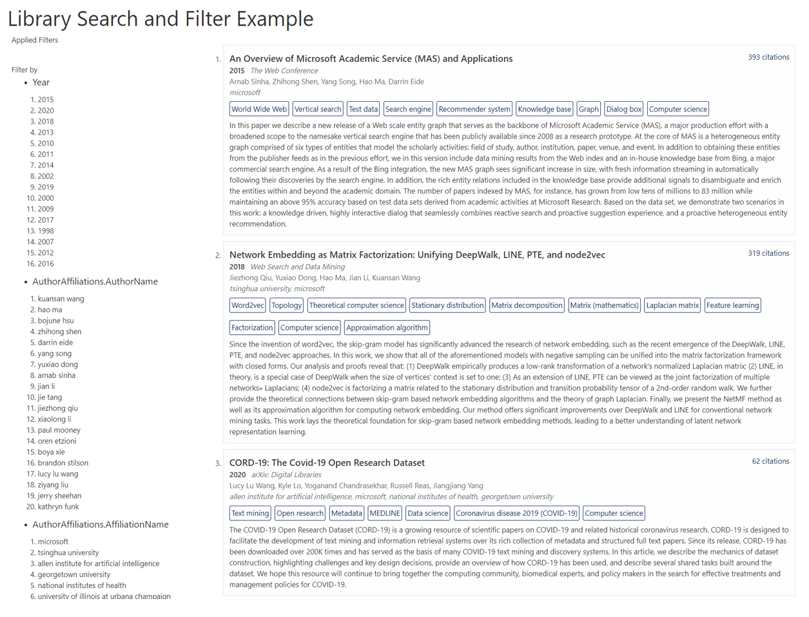
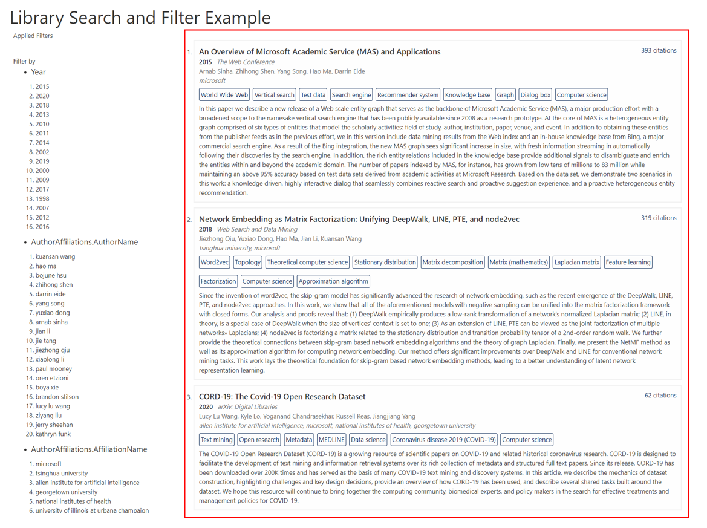
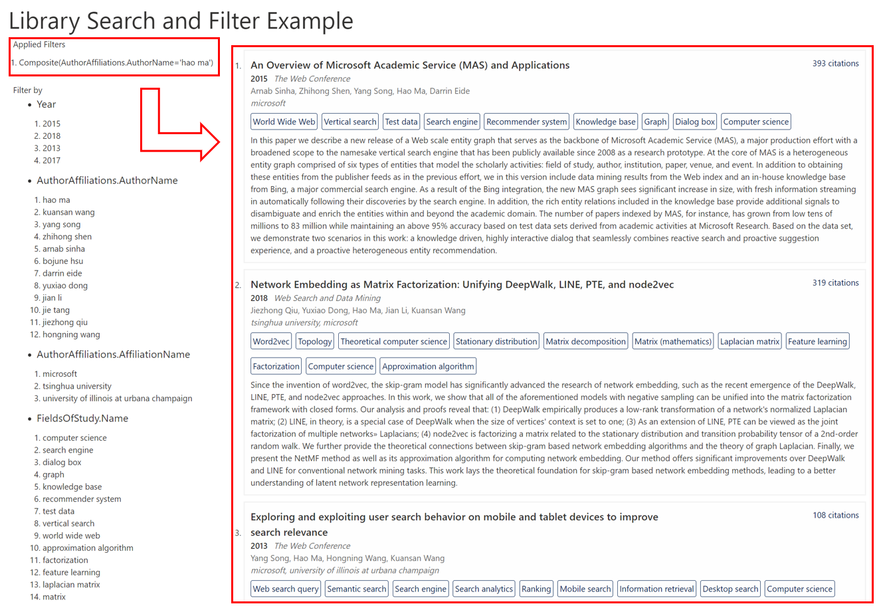
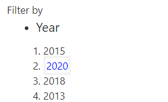
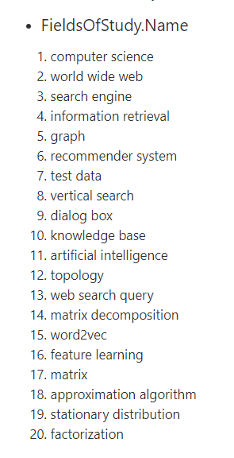

---
title: Build a library browser with contextual filters
description: Step by step tutorial to design MAKES schema for custom data
ms.topic: tutorial
ms.date: 12/09/2020
---

# Build a library browser with contextual filters

This tutorial illustrates how to build a library browser application, using the publication records from [link private publication records with MAKES entities tutorial](tutorial-entity-linking.md). You will learn how to:

- Design a MAKES schema tailored for serving publication entities using contextual filters.
- Build and deploy a MAKES instance with custom index.
- Create a frontend client for navigating publication entities with contextual filters using MAKES APIs.



## Prerequisites

- [Microsoft Academic Knowledge Exploration Service (MAKES) subscription](get-started-setup-provisioning.md) (release version of at least 2020-11-23)
- Completion of [link private publication records with MAKES entities tutorial](tutorial-entity-linking.md)
- Read through the [define index schema how-to guide](how-to-index-schema.md)
- Download the [sample schema for linked private library publications](samplePrivateLibraryData.linked.schema.json)

## Design a schema for linked private library publications

When designing a new MAKES schema, it's important to evaluate the following:

- What entity attributes do we want to include?
- What are the appropriate data types for each entity attribute?
- How should each attribute be indexed?

### Evaluating input data

Using the entities generated from the [link private publication records with MAKES entities tutorial](tutorial-entity-linking.md), we want to evaluate each different entity attribute to see if it's applicable for the library browser application we're building. You should have a file named **samplePrivateLibraryData.linked.json** in your working directory from completing the previous tutorial, which should contain entities like the following:

```json
{
  "logprob": -19.55,
  "EstimatedCitationCount": "19",
  "VenueFullName": "Quantitative Science Studies",
  "Year": 2020,
  "Abstract": "An ongoing project explores the extent to which artificial intelligence (AI), specifically in the areas of natural language processing and semantic reasoning, can be exploited to facilitate the stu...",
  "NormalizedAbstractWords": ["an","ongoing","project","explores","the","extent","to","which","artificial","intelligence","ai","specifically","in","areas","of","natural","language","processing","and","semantic","reasoning","can","be","exploited","facilitate","stu"],
  "DOI": "10.1162/QSS_A_00021",
  "NormalizedDOI": "10 1162 qss_a_00021",
  "FullTextUrl": "http://localhost/example-full-text-link-1",
  "NormalizedFullTextUrl": "http localhost example full text link 1",
  "Title": "Microsoft Academic Graph: When experts are not enough",
  "NormalizedTitle": "microsoft academic graph when experts are not enough",
  "NormalizedTitleWords": ["microsoft","academic","graph","when","experts","are","not","enough"],
  "AuthorAffiliations": [
    {
      "NormalizedAffiliationName": "microsoft",
      "NormalizedAuthorName": "kuansan wang",
      "AuthorName": "Kuansan Wang",
      "Sequence": "1"
    },
    {
      "NormalizedAffiliationName": "microsoft",
      "NormalizedAuthorName": "zhihong shen",
      "AuthorName": "Zhihong Shen",
      "Sequence": "2"
    },
    ...
  ],
  "FieldsOfStudy": [
    {
      "Name": "World Wide Web",
      "NormalizedName": "world wide web"
    },
    {
      "Name": "Knowledge graph",
      "NormalizedName": "knowledge graph"
    },
    ...
  ]
}
```

For more information on the MAKES entity data file format, see [Entity data files](how-to-index-data.md).

### Library browser application design goals

To determine what entity attributes should be included in the index we'll use for the library browser application, and how they should be indexed, we should first analyze our desired design goals:

1. Show publication list
    

2. Show filter suggestions
    

3. Enable filters to be applied to publication list
    

### Define entity attributes, type, and index operations

The design goals above guide us to define a [schema for the linked sample library publications](samplePrivateLibraryData.linked.schema.json), which uses a subset of the entity attributes generated from the previous tutorials output:

| Attribute Name | Description| Index Data Type | Index Operations |
| ---- | ---- | ---- | ---- |
| `EstimatedCitationCount` | Used for displaying citation count in publication cards. | `blob?` | - |
| `VenueFullName` | Used for displaying published venue in publication cards. | `blob?` | - |
| `Year` | Used for filtering publication cards by publishing year. Also used for displaying the year of publication in publication cards. | `int?` | `["equals"]` |
| `Abstract` | Used for displaying abtract in publication cards.  | `blob?` | - |
| `DOI` | Used for displaying DOI in publication cards. | `blob?` | - |
| `Title` | Used for displaying title in publication cards. | `blob?` | - |
| `FullTextUrl` | Used for displaying the full text url link in publication cards. | `blob?` | - |
| `AuthorAffiliations` | Indicates that "AuthorAffiliations" attribute is an array of objects that are composed of multiple attributes. | `Composite*` | - |
| `AuthorAffiliations.NormalizedAffiliationName` | Used for filtering publication cards by affiliated institutions. Also used for displaying the affiliated institutions in publication cards. | `string?` | `["equals"]` |
| `AuthorAffiliations.NormalizedAuthorName` | Used for filtering publication cards by authors. | `string?` | `["equals"]` |
| `AuthorAffiliations.AuthorName` | Used for displaying the authors in publication cards.| `string?` | `["equals"]` |
| `AuthorAffiliations.Sequence` | Used for displaying order of the authors in publication cards| `blob?` | - |
| `FieldsOfStudy` | Indicates that "FieldsOfStudy" attribute is an array of object composed of multiple attributes | `Composite*` | - |
| `FieldsOfStudy.Name` | Used for filtering publication cards by related fields of study. | `blob?` | - |
| `FieldsOfStudy.NormalizedName` | Used for displaying the related fields of study in publication cards. | `string?` | `["equals"]` |

#### Display only attributes

The "display only attributes" above are attributes that are only included for display purposes in the application, such as `Title` and `AuthorAffiliations.AuthorName`. Because we only display the data and don't filter by it, we don't need to index it. KES provides a `blob` data type for these type of attributes that allows for optimized storage and retrieval.

#### Filter attributes

Attributes that we plan to use in the filter need to be indexed so they can be used in query expressions, which is how KES retrieves entities meeting specific criteria.

For example, to enable our library application to filter publications by publication year and field of study names we enable the `equals` index operation on the `Year` and `FieldsOfStudy.Name` attributes:





The `Year` and `FieldsOfStudy.NormalizedName` attributes are a good illustration of attributes whose values cleanly segment entities into categories that users would likely leverage for navigation.

For more information on schema file syntax, data types and index operations, see [Index Schema Files](how-to-index-schema.md).

## Build a custom publication index

Once you're ready with your schema, the next step is to build a MAKES index using the linked library publications.

A best practice when designing new schemas/indexes is to first do a local build using a subset of the data you plan to index. This allows you to validate that the schema works and that you can query results as expected. For the tutorial, the data size is perfectly suited for a local build.

In addition to this best practice guidance, local builds have a concrete limit of a maximum of 10,000 entities, so most mid-large index builds will need to be done using a cloud build. To learn more, follow [How to create index from MAG](how-to-create-index-from-mag.md)

### Validate schema using local index build

1. Download the latest MAKES command line tool `{YYYY-MM-DD}/tools/kesm.zip` from your MAKES storage account. 

1. Unzip kesm.zip

1. Copy the win-x64 version of kesm.exe to your working directory or include it in your command line PATH variable.

1. Open up a command line console, change your current directory to your working directory, and build the index with the following command:

    ```cmd
    kesm.exe BuildIndexLocal --SchemaFilePath samplePrivateLibraryData.linked.schema.json --EntitiesFilePath samplePrivateLibraryData.linked.json --OutputIndexFilePath samplePrivateLibraryData.linked.kes --IndexDescription "Linked Private Library Publications"
    ```

    > [!IMPORTANT]
    > The `BuildIndexLocal` command is only available on win-x64 version of kesm. If you are using other platforms you will need to execute a cloud build.

1. Verify the stored entity attributes are correct by running the Evaluate command to retrieve top entities:

    ```cmd
    kesm Evaluate --IndexFilePaths samplePrivateLibraryData.linked.kes --KesQueryExpression="All()" --Count 1 --Attributes *
    ```

    The command should retreieve top publication entities from the index. The output should look similar to the following JSON:

    ```json
    {
    "expr": "All()",
    "entities": [
      {
        "logprob": -17.478,
        "prob": 2.56685328E-08,
        "EstimatedCitationCount": "418",
        "VenueFullName": "The Web Conference",
        "Year": 2015,
        "Abstract": "In this paper we describe a new release of a Web scale entity graph that serves as the backbone of Microsoft Academic Service (MAS), a major production effort with a broadened scope to the namesake vertical search engine that has been publicly available since 2008 as a research prototype. At the core of MAS is a heterogeneous entity graph comprised of six types of entities that model the scholarly activities: field of study, author, institution, paper, venue, and event. In addition to obtaining these entities from the publisher feeds as in the previous effort, we in this version include data mining results from the Web index and an in-house knowledge base from Bing, a major commercial search engine. As a result of the Bing integration, the new MAS graph sees significant increase in size, with fresh information streaming in automatically following their discoveries by the search engine. In addition, the rich entity relations included in the knowledge base provide additional signals to disambiguate and enrich the entities within and beyond the academic domain. The number of papers indexed by MAS, for instance, has grown from low tens of millions to 83 million while maintaining an above 95% accuracy based on test data sets derived from academic activities at Microsoft Research. Based on the data set, we demonstrate two scenarios in this work: a knowledge driven, highly interactive dialog that seamlessly combines reactive search and proactive suggestion experience, and a proactive heterogeneous entity recommendation.",
        "DOI": "10.1145/2740908.2742839",
        "FullTextUrl": "http://localhost/example-full-text-link-2",
        "Title": "An Overview of Microsoft Academic Service (MAS) and Applications",
        "AuthorAffiliations": [
          {
            "NormalizedAffiliationName": "microsoft",
            "NormalizedAuthorName": "arnab sinha",
            "AuthorName": "Arnab Sinha",
            "Sequence": "1"
          },
          {
            "NormalizedAffiliationName": "microsoft",
            "NormalizedAuthorName": "zhihong shen",
            "AuthorName": "Zhihong Shen",
            "Sequence": "2"
          },
          ...],
        "FieldsOfStudy": [
          {
            "Name": "World Wide Web",
            "NormalizedName": "world wide web"
          },
          {
            "Name": "Vertical search",
            "NormalizedName": "vertical search"
          },
          ...]
      }
    ],
    "timed_out": false
    }
    ```

1. Verify index operations are working as expected by running the Evaluate command to retrieve specific entities:

    ```cmd
    kesm Evaluate --IndexFilePaths samplePrivateLibraryData.linked.kes --KesQueryExpression="Year=2020" --Attributes "Year"
    ```

    The command retreieves publication entities with `Year` attibute being `2020` from the index. The output should look similar to the following JSON:

    ```cmd
    {
      "expr": "Year=2020",
      "entities": [
        {
          "logprob": -18.255,
          "prob": 1.18019626E-08,
          "Year": 2020
        },
        {
          "logprob": -19.386,
          "prob": 3.8086159E-09,
          "Year": 2020
        },
        {
          "logprob": -19.625,
          "prob": 2.9989608E-09,
          "Year": 2020
        },
        {
          "logprob": -19.853,
          "prob": 2.3875455E-09,
          "Year": 2020
        },
        {
          "logprob": -20.154,
          "prob": 1.7669693E-09,
          "Year": 2020
        }
      ],
      "timed_out": false
    }
    ```

## Deploy a MAKES API with a custom index

Now that the custom index has been built, we can deploy it with a MAKES API instance:

1. Upload the custom index build to your MAKES storage account. You can do so by using following [Blob Upload from Azure Portal](https://docs.microsoft.com/azure/storage/blobs/storage-quickstart-blobs-portal). If you use cloud index build, you may skip this step.

1. Run CreateHostResources to create a MAKES hosting virtual machine image

    ```cmd
    kesm.exe CreateHostResources --MakesPackage https://<Makes_Storage_Account_Name>.blob.core.windows.net/makes/<Makes_Release_Version> --HostResourceName <Makes_Host_Resource_Name>
    ```

    > [!NOTE]
    > If your account is connected to multiple Azure Directories or Azure Subscriptions, you'll also have to specify the **--AzureActiveDirectoryDomainName** and/or **--AzureSubscriptionId** parameters. See [Command Line Tool Reference](reference-makes-command-line-tool.md#common-azure-authentication-parameters) for more details.

1. Run DeployHost command and use the "--MakesIndex" parameter to specify the custom index build

    ```cmd
     kesm.exe DeployHost --HostName "<Makes_Host_Instance_Name>" --MakesPackage "https://<Makes_Storage_Account_Name>.blob.core.windows.net/makes/<Makes_Release_Version>/"  --MakesHostImageId "<Id_From_Previous_Command_Output>" --MakesIndex "<Custom_Index_Url>" --HostMachineSku "Standard_D2_V2"
    ```

    > [!NOTE]
    > Since the index we're hosting is relatively small, you can reduce Azure consumption for the tutorial MAKES host instance by using the "--HostMachineSku" parameter and set the SKU to "Standard_D2_V2".

For more detailed deployment instructions, See [Create API Instances](get-started-create-api-instances.md#create-makes-hosting-resources).

## Create a client application that uses the MAKES API instance

Now that we have deployed a MAKES API instance that uses the custom index, the last step is to create a frontend client that gives user the ability to browse and filter library publications. In the remaining sections of the tutorial, we will be using the sample UI code to illustrate how to retrieve data and generate filters via MAKES Evaluate and Histogram APIs.

### Explore the library browser application sample

The code for the library browser application sample is part of the standard MAKES deployment. After the MAKES API instance with the custom index build has been fully deployed, you can use the library browser application by visiting the following URL:

`<Makes_Instance_Url>/examples/privateLibraryExample/index.html`

The remainder of this tutorial details how the library browser application uses the MAKES API to accomplish publication browsing and filtering. To follow along, download the library browser application source files from your MAKES API instance using the following URLs:

- `<Makes_Instance_Url>/examples/privateLibraryExample/index.html`
- `<Makes_Instance_Url>/examples/privateLibraryExample/appliedFilterListItem.js`
- `<Makes_Instance_Url>/examples/privateLibraryExample/dynamicRankedPublicationEntities.js`
- `<Makes_Instance_Url>/examples/privateLibraryExample/filter.js`
- `<Makes_Instance_Url>/examples/privateLibraryExample/filterAttributeListItem.js`
- `<Makes_Instance_Url>/examples/privateLibraryExample/filterSectionListItem.js`
- `<Makes_Instance_Url>/examples/privateLibraryExample/index.js`
- `<Makes_Instance_Url>/examples/privateLibraryExample/makesInteractor.js`
- `<Makes_Instance_Url>/examples/privateLibraryExample/parsedSearchQueryInterpretationListItem.js`
- `<Makes_Instance_Url>/examples/privateLibraryExample/privateLibraryExample.js`
- `<Makes_Instance_Url>/examples/privateLibraryExample/publicationEntities.js`
- `<Makes_Instance_Url>/examples/privateLibraryExample/publicationFieldsOfStudyListItem.js`
- `<Makes_Instance_Url>/examples/privateLibraryExample/publicationListItem.js`
- `<Makes_Instance_Url>/examples/privateLibraryExample/searchBox.js`
- `<Makes_Instance_Url>/examples/privateLibraryExample/searchResult.js`
- `<Makes_Instance_Url>/examples/privateLibraryExample/searchResults.js`
- `<Makes_Instance_Url>/examples/privateLibraryExample/privateLibraryExample.css`

Once downloaded, modify the `hostUrl` variable in `makesInteractor.js` and point it to your MAKES instance with custom index. You can then run the application in your browser by opening the `privateLibraryExample.html` file (you can just drag and drop the file into a new browser window).

### Craft a KES query expression to represent publications

We start building our frontend client by crafting a **publication list expression**, a KES query expression to represent the publications our user is browsing. We will use this expression to fetch publication entities and generate filters in the next steps. When filters are applied, we will modify this expression to represent the filtered entities. Since the initial list of publications the user should see is "all publications", we initialize the **publication list expression** to `All()`.

This corresponds to the following code in `index.js`

```javascript
app = new PrivateLibraryExample();
app.setOriginalPublicationListExpression("All()");
mount(document.body, app);
```

For more information on KES Query Expressions, see [Structured query expressions](concepts-query-expressions.md)

### Retrieve top publications with Evaluate API


We can call MAKES [Evaluate API](reference-post-evaluate.md) with the **publication list expression** we crafted above to retrieve the top publication entities and transform them into UI elements.

To learn more about how to get publications using Evaluate API, see `MakesInteractor.GetPublications(publicationExpression)` method in `makesInteractor.js`.

After retrieving the publication entities from Evaluate API, all is left to do is to translate the entity data to UI elements. The corresponding data transformation logic for publication UI elements can be found in `publicationListItem.js` and `publicationFieldsOfStudyListItem.js`.

### Generate filter suggestions  


We can call Histogram API with **the publication list expression** to get attribute histograms and transform them into filter suggestions for publications.

[Histogram API](reference-post-histogram.md) returns the most common attribute values based on how frequently they occur in the entities matching a query expression. For example, execute the following command in your working directory to get the most common `Year` attribute value from the library publications.

  ```cmd
  kesm Histogram --IndexFilePaths samplePrivateLibraryData.linked.kes --KesQueryExpression "All()"  --Attributes "Year" --Count 1
  ```

Histogram API should return 2015 as the most common attribute value for `Year` with a weighted log probability of `-17.514`:

  ```cmd
  {
    "expr": "All()",
    "num_entities": 44,
    "histograms": [
      {
        "attribute": "Year",
        "distinct_values": 16,
        "total_count": 36,
        "histogram": [
          {
            "value": "2015",
            "logprob": -17.5130939835,
            "count": 2
          }
        ]
      }
    ],
    "timed_out": false
  }
  ```

The `-17.514` log probability comes from the two publications published in 2015. Execute the following command to see the entity log probability for those publications in 2015:

  ```cmd
  kesm Evaluate --IndexFilePaths samplePrivateLibraryData.linked.kes --KesQueryExpression "Year=2015"  --Attributes "Year"
  ```

  Evaluate API should return the two publications as following

  ```cmd
  {
    "expr": "Year=2015",
    "entities": [
      {
        "logprob": -17.514,
        "prob": 2.4760901E-08,
        "Year": 2015
      },
      {
        "logprob": -24.52,
        "prob": 2.2444E-11,
        "Year": 2015
      }
    ],
    "timed_out": false
  }
  ```

The histogram log probability of `-17.514` for the top `Year` attribute comes from adding the two entity probabilities. To accomplish this we first need to convert the entities log probabilities into normal probability scores, add them and then generate a new log of their sum. `LN(EXP(-17.514) + EXP(-24.52)) = -17.514`

In the context of this tutorial, we can leverage the Histogram API response as **contextual filter suggestions**. To learn more about how to generate contextual filter suggestions using Histogram API, see `MakesInteractor.GetFilters(publicationExpression)` method in `makesInteractor.js`.

The corresponding data transformation logic for filter UI elements can be found in: `filterSectionListItem.js` and in `filterAttributeListItem.js`.

### Apply filters

We can apply filters by modifying the publication list expression. To apply a filter, we create a new expression by combining the current publication expression and the filter expression with a "And" operator. Consider the following scenario as an example:

The publication list expression is initially set to `All()`, showing all publications. To constrain the publications returned to those published in 2019, we apply a publication year filter, with the filter expression being `Year=2019`. The publication list expression will then become `And(All(),Year=2019)`.

If we want to further constrain the publications returned to computer science related only, we apply a fields of study filter, with the filter expression being `Composite(FieldsOfStudy.NormalizedName='computer science')`. The publication list expression will then become `And(All(),Year=2019,Composite(FieldsOfStudy.NormalizedName='computer science'))`.

For more details see `PrivateLibraryExample.appendFilter(attributeName, attributeValue)` and `PrivateLibraryExample.updatePublicationList()` method in `filterablePublicationList.js`.

## Next steps

Advance to the next section to learn how to add search capability to the library browser application.

> [!div class="nextstepaction"]
> [Build browser applications with search](tutorial-grammar-design.md)
