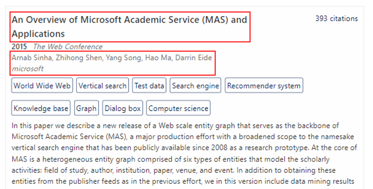

---
title: Schema Design
description: Step by step tutorial to design MAKES schema for custom data
ms.topic: tutorial
ms.date: 10/15/2020
---

# Design schema for filter and search

This tutorial illustrates how to

- Design a MAKES schema for private publications to enable search and smart filters.
- Build a filterable paper list UI (as shown below) using MAKES APIs.


This tutorial is a continuation of [Link private publication records with MAKES entities](tutorial-entity-linking.md) tutorial and depends on its completion.

## Prerequisites

- [Microsoft Academic Knowledge Service (MAKES) subscription](get-started-setup-provisioning.md)
- Completion of [Link private publication records with MAKES entities](tutorial-entity-linking.md) tutorial
- Download [Schema for Linked Sample Library Data](samplePrivateLibraryData.linked.schema.json)

## Design a schema for linked private library data

For any MAKES schema design, we need to determine what entity attributes to include, what types to store entity attributes as, and what operations will the entity attributes support.

In this tutorial, we will build a library application with search and filter capabilities. We will start by desgning a schema and building a custom index to power the app. We will be leverging the linked private library publications from previous tutorial as the input entities for building the custom index. You should have an file named **samplePrivateLibraryData.linked.json** in your working directory from completing [Link private publication records with MAKES entities](tutorial-entity-linking.md) tutorial.

Here's an entity as example from **samplePrivateLibraryData.linked.json**

```json
{
    "OriginalTitle": "Microsoft Academic Graph: When experts are not enough",
    "FullTextUrl": "http://localhost/example-full-text-link-1",
    "Id": 3002924435,
    "logprob": -19.625,
    "DOI": "10.1162/QSS_A_00021",
    "Year": 2020,
    "VenueFullName": "Quantitative Science Studies",
    "CitationCount": 16,
    "EstimatedCitationCount": 16,
    "FieldsOfStudy": [
        {
            "OriginalName": "World Wide Web",
            "Name": "world wide web"
        },
        {
            "OriginalName": "Knowledge graph",
            "Name": "knowledge graph"
        },
        {
            "OriginalName": "Graph",
            "Name": "graph"
        },
        {
            "OriginalName": "Computer science",
            "Name": "computer science"
        }
    ],
    "AuthorAffiliations": [
        {
            "Sequence": 1,
            "OriginalAuthorName": "Kuansan Wang",
            "AuthorName": "kuansan wang",
            "OriginalAffiliationName": "Microsoft Research, Redmond, WA, 98052, USA",
            "AffiliationName": "microsoft"
        },
        {
            "Sequence": 2,
            "OriginalAuthorName": "Zhihong Shen",
            "AuthorName": "zhihong shen",
            "OriginalAffiliationName": "Microsoft Research, Redmond, WA, 98052, USA",
            "AffiliationName": "microsoft"
        },
        {
            "Sequence": 3,
            "OriginalAuthorName": "Chiyuan Huang",
            "AuthorName": "chiyuan huang",
            "OriginalAffiliationName": "Microsoft Research, Redmond, WA, 98052, USA",
            "AffiliationName": "microsoft"
        },
        {
            "Sequence": 4,
            "OriginalAuthorName": "Chieh-Han Wu",
            "AuthorName": "chiehhan wu",
            "OriginalAffiliationName": "Microsoft Research, Redmond, WA, 98052, USA",
            "AffiliationName": "microsoft"
        },
        {
            "Sequence": 5,
            "OriginalAuthorName": "Yuxiao Dong",
            "AuthorName": "yuxiao dong",
            "OriginalAffiliationName": "Microsoft Research, Redmond, WA, 98052, USA",
            "AffiliationName": "microsoft"
        },
        {
            "Sequence": 6,
            "OriginalAuthorName": "Anshul Kanakia",
            "AuthorName": "anshul kanakia",
            "OriginalAffiliationName": "Microsoft Research, Redmond, WA, 98052, USA",
            "AffiliationName": "microsoft"
        }
    ],
    "OriginalAbstract": "An ongoing project explores the extent to which artificial intelligence (AI), specifically in the areas of natural language processing and semantic reasoning, can be exploited to facilitate the stu...",
    "Title": "microsoft academic graph when experts are not enough",
    "TitleWords": [ "microsoft", "academic", "graph", "when", "experts", "are", "not", "enough"],
    "AbstractWords": [ "an", "ongoing", "project", "explores", "the", "extent", "to", "which", "artificial", "intelligence", "ai", "specifically", "in", "areas", "of", "natural", "language", "processing", "and", "semantic", "reasoning", "can", "be", "exploited","facilitate", "stu"]
}
```

After inspecting the data, we can now design a schema for it.

### Display only attributes

The display attributes are attributes that are needed for display only, such as **OriginalTitle** and **OriginalAuthorName** in a **PaperListItem** UI element:



In this case, we can define them as **Blob** type such that KES won't create any index for them.

The following schema elements reflect the display attributes:

```json
{
  "attributes": [
    {"name": "OriginalTitle","type": "blob?"},
    {"name": "OriginalAbstract","type": "blob?"},

    {"name": "VenueFullName","type": "blob?"},

    {"name": "AuthorAffiliations","type": "Composite*"},
    {"name": "AuthorAffiliations.OriginalAuthorName","type": "blob?"},
    {"name": "AuthorAffiliations.OriginalAffiliationName","type": "blob?"},

    {"name": "FieldsOfStudy","type": "Composite*"},
    {"name": "FieldsOfStudy.OriginalName","type": "blob?"},
  ]
}
```

### Filter and search attributes

Filter attributes are attributes that can be used to filter entity data.

We can make our library application support publication search by time and citation count easily by adding numberic filter operations to **Year**, **CitationCount**, and/or **EstimatedCitationCount**.


Depending on the filter UX we want to provide, we can add **equals** and/or **is_between** operations to the filterable numeric attributes. The example application UX only supports bolean based filtering and having only **equals** operation is enough.

The following schema elements from  reflect the filterable numeric attributes:

```json
{
  "attributes": [
    {"name": "Id","type": "int64!","operations": [ "equals" ]},
    {"name": "Year","type": "int32?","operations": [ "equals"]},
    {"name": "CitationCount","type": "int32?","operations": [ "equals"]},
    {"name": "EstimatedCitationCount","type": "int32?","operations": [ "equals"]},
    {"name": "AuthorAffiliations.Sequence","type": "int32?","operations": [ "equals" ]}
  ]
}
```

>[!NOTE]
>Try adding **is_between** to numeric filter attributes and extend the sample code to enable publication year range filter.

For string attributes, we want to select attributes that have common values such as **FieldsOfStudy.Name**. Attribute having common values allows MAKES to generate filter suggestions based on entity statistics using Histogram API.


 For attribute values that may be too noisy, you may opt for the normalized version such as using **AuthorName** instead of **OriginalAuthorName**. For the example library application we need to add **equals** operation to these attributes to support our various text filter experience.

We may also want to select attributes with unique values, such as DOI. This enables fast DOI search and retrieval.

The following schema elements reflect the filterable string attributes:

```json
{
  "attributes": [
    {"name": "DOI","type": "string?","operations": [ "equals", "starts_with" ]},
    {"name": "Title","type": "string?","operations": [ "equals", "starts_with" ]},
    {"name": "TitleWords","type": "string*","operations": [ "equals" ]},
    {"name": "AbstractWords","type": "string*", "operations": [ "equals" ]},
  
    {"name": "AuthorAffiliations","type": "Composite*"},
    {"name": "AuthorAffiliations.AuthorName","type": "string?","operations": [ "equals", "starts_with" ]},
    {"name": "AuthorAffiliations.AffiliationName","type": "string?","operations": [ "equals", "starts_with" ]},

    {"name": "FieldsOfStudy","type": "Composite*"},
    {"name": "FieldsOfStudy.Name","type": "string?","operations": [ "equals", "starts_with" ]},
  ]
}
```

We've include a complete schema for you to compare against. See [Schema for Linked Sample Library Data](samplePrivateLibraryData.linked.schema.json) for the complete schema.

For more information on schema file syntax and supported types/operations, see [Index Schema Files](how-to-index-schema.md).

## Build a custom paper index

Once you're ready with your schema. We can start building a MAKES index for the linked library data.

Since the index we're building is relatively small and simple, we can build this locally on a x64 windows machine. If the index you're building is large or contains more complex operations, use cloud index build to leverage high performing machines in Azure. To learn more, follow [How to create index from MAG](how-to-create-index-from-mag.md)

>[!NOTE]
>Regardless of what you decide to use for production index builds, the best practice is to perform a local index build to validate schema correctness during development to avoid long running failures.

### Validate schema using local index build

1. Copy win-x64 version of kesm.exe to your working directory or include it in your command line PATH variable. 

1. Open up a commandline console, change directory to the root of the conference tutorial resource folder, and build the index with the following command:

    ```cmd
    kesm.exe BuildIndexLocal --SchemaFilePath samplePrivateLibraryData.linked.schema.json --EntitiesFilePath samplePrivateLibraryData.linked.json --OutputIndexFilePath samplePrivateLibraryData.linked.kes --IndexDescription "Linked Private Library Publications"
    ```

>[!NOTE]
> BuildIndexLocal command is only available on win-x64 version of kesm

Validate the index is built according to schema by inspecting the index meta data using the following command:

```cmd
kesm.exe DescribeIndex --IndexFilePath samplePrivateLibraryData.linked.kes
```


### Submit a index job for production workflow

The index we're creating for this tutorial is relatively small and can be built locally. For larger and more complex index, use cloud builds to leverage high performing machines in Azure to build. To learn more, follow [How to create index from MAG](how-to-create-index-from-mag.md)

## Deploy MAKES API Host with a custom index

We are now ready to set up a MAKES API instance with a custom index.

1. Upload the built, custom index to your MAKES storage account. You can do so by using following [Blob Upload from Azure Portal](https://docs.microsoft.com/azure/storage/blobs/storage-quickstart-blobs-portal). If you use cloud index build, you may skip this step.

1. Run CreateHostResources to create a MAKES hosting virtual machine image.

    ```cmd
    kesm.exe CreateHostResources --MakesPackage https://<Makes_Storage_Account_Name>.blob.core.windows.net/makes/<Makes_Release_Version> --HostResourceName <Makes_Host_Resource_Name>
    ```

> [!NOTE]
> If your account is connected to multiple Azure Directories or Azure Subscriptions, you'll also have to specify the **--AzureActiveDirectoryDomainName** and/or **--AzureSubscriptionId** parameters. See [Command Line Tool Reference](reference-makes-command-line-tool.md#common-azure-authentication-parameters) for more details.

1. Run DeployHost command and use the "--MakesIndex" parameter to load the custom linked private library publication index we've built.

    ```cmd
     kesm.exe DeployHost --HostName "<makes_host_instance_name>" --MakesPackage "https://<Makes_Storage_Account_Name>.blob.core.windows.net/makes/<Makes_Release_Version>/"  --MakesHostImageId "<Id_From_Previous_Command_Output>" --MakesIndex "<Custom_Index_Url>"
    ```

For more detailed deployment instructions, See [Create API Instances](get-started-create-api-instances.md#create-makes-hosting-resources)

> [!NOTE]
> Since the index we're hosting is relatively small, you can reduce Azure consumption for the tutorial MAKES host instance by using the "--HostMachineSku" parameter and set the SKU to "Standard_D2_V2".

## Create Client Application with MAKES REST APIs

We now that we have a set of backend MAKES APIs to serve our linked private library publications. The last step is to create the frontend client to showcase the publication filter capability. The client application will retrieve data and generate filters via Evaluate and Histogram APIs.

### Paper list KES Query Expression


We start building our frontend client by crafting a KES query expression to represent the publication list shown on the UI. Since the initial list of papers we want to see is "all papers", the corresponding KES query expression would be "**All()**".

This corresponds to the following code in **<Makes_Instance_Url>/examples/privateLibraryExample/privateLibraryExample.js**

```javascript
/**
 * Client app entry point/ main.
 **/
var app = null;
runable().then(privateLibraryExampleRunable => {
    if (privateLibraryExampleRunable) {
        app = new FilterablePaperList();
        app.setOriginalPaperListExpression("All()");
        mount(document.body, app);
    }
    else {
        let errorEl = el("div.alert alert-danger", { role: "alert" }, "Cannot run Private Library Example. Please check if the correct index/grammar are loaded.");
        mount(document.body, errorEl);
    }
});
```

We will use this expression to fetch paper data in the next step. When filters are applied, we will modify this expression to get the corresponding data.

For more information on KES Query Expressions, see [Structured query expressions](concepts-query-expressions.md)

### Retrieve top papers

We can call Evaluate API with the paper list expression ( Initially set to "**All()**" ) to retrieve paper entities for display.

To get papers using Evaluate API, see **MakesInteractor.GetPapers(paperExpression)** method in **\<Makes_Instance_Url>/examples/privateLibraryExample/makesInteractor.js**:

```javascript
/*
* Gets a list of papers using a KES expression
*/
async GetPapers(paperExpression)
{
    let requestBody = {
            expr: paperExpression,
            attributes: this.paperListItemAttributes,
            count: this.paperListItemCount
        }

    let response = await Promise.resolve($.post(this.GetEvaluateApiEndpoint(), requestBody));
    return response?.entities;
}
```

For more information on Evaluate API, see [Evaluate REST API](reference-post-evaluate.md)

 After retrieving the paper entities from Evaluate API, all is left to do is to translate the entity data to UI elements. The corresponding data transformation logic for paper UI elements can be found in:

- **\<Makes_Instance_Url>/examples/privateLibraryExample/paperListItem.js**
- **\<Makes_Instance_Url>/examples/privateLibraryExample/paperFieldsOfStudyListItem.js**

### Generate filter suggestions  


We can also call Histogram API with the paper list expression to get filter attribute histograms and transform them into filters.

Histogram returns the most probabilistic values for each attributes from the entities specified by the expression. In the context of this tutorial, Histogram API will return the top attribute values from publication entities that have the highest ranks (the publications that the user is most likely looking for). We can use these values for each filter attribute as **filter suggestions**.

To generate filter suggestions using Histogram API, see **MakesInteractor.GetFilters(paperExpression)** method in **\<Makes_Instance_Url>/examples/privateLibraryExample/makesInteractor.js**:

```javascript
    /*
     * Gets a list of filters/filter sections using a KES expression
     */
    async GetFilters(paperExpression)
    {
        let requestBody = {
            expr: paperExpression,
            attributes: this.paperFilterAttributes,
            count: this.paperFilterCount
        }
        let response = await Promise.resolve($.post(this.GetHistogramApiEndpoint(), requestBody));
        return response?.histograms;
    }
```

For more information on Histogram API, see [Histogram REST API](reference-post-histogram.md)

The corresponding data transformation logic for filter UI elements can be found in:

- **\<Makes_Instance_Url>/examples/privateLibraryExample/filterSectionListItem.js**
- **\<Makes_Instance_Url>/examples/privateLibraryExample/filterAttributeListItem.js**

### Handle filter actions

We can apply filters by modifying the paper list expression. To apply a filter, we combine the current paper expression and the target filter expression with a "And" operator.

For example, with a *initial paper expression** being **All()**, to apply a publication year filter to constrain the publications returned to those published in 2019, the *filter expression* will be **Y=2019**, and the final paper list expression will become **And(All(),Y=2019)**.

To handle filter action, see **FilterablePaperList.appendFilter(attributeName, attributeValue)** and **FilterablePaperList.updatePaperList()** method in **\<Makes_Instance_Url>/examples/privateLibraryExample/filterablePaperList.js** for more details.

```javascript
    /*
     * appends a filter and refreshes the paper list.
     */
    async appendFilter(attributeName, attributeValue)
    {
        if (!attributeName)
        {
            console.log("appendFilter: attributeName cannot be null");
            return;
        }
        if (!attributeValue)
        {
            console.log("appendFilter: attributeValue cannot be null");
            return;
        }

        this.pageData.appliedFilterListData.push(new Filter(attributeName, attributeValue));
        await this.updatePaperList();
    }

    /*
     * refreshes the paper list.
     * updates the paper list expression by combing the original paper list expression and applied filters expressions
     */
    async updatePaperList()
    {
        let filterExpressions = this.pageData.appliedFilterListData.map( paperFilter => paperFilter.getKesExpression())
        filterExpressions.push(this.pageData.originalExpression);
        let paperExpression = this.makesInteractor.CreateAndExpression(filterExpressions);
        await this.updatePaperListExpression(paperExpression);
    }
```

### Use sample UI code to see them in action

We've created a sample client app written in javascript along with MAKES. After custom index deployment is complete, you should be able to see the private library example application by visiting: **\<Makes_Instance_Url>/examples/privateLibraryExample/privateLibraryExample.html**
